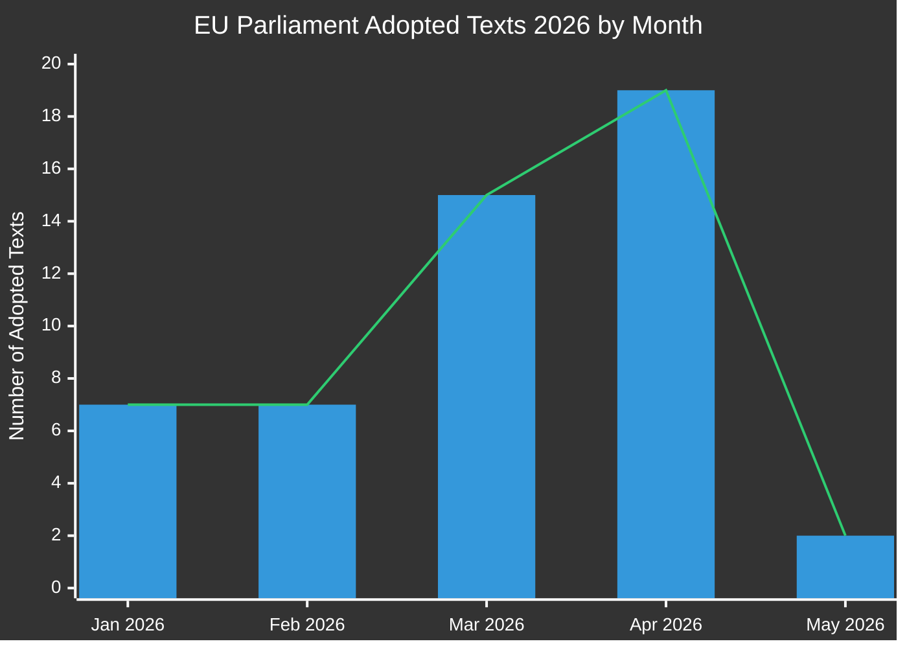

# 执行简报：欧洲议会立法提案
**日期：** 2026-05-15 | **文章类型：** Propositions | **分类：** 公开
**可信度：** 🟡 MEDIUM | **数据质量：** 部分 — EP API 降级；通过文本为主要来源

---

## 🔑 主要发现

### 1. 立法产出激增 — 2026年春季冲刺
欧洲议会在2026年第一、二季度展现出非凡的立法速度，2026年1月至5月间共通过**51项正式文本**。这代表着与第10届欧洲议会任期中期重合的立法冲刺，银行改革、反腐、数字治理和贸易政策领域的重大一揽子计划均通过了最终表决。

**可信度：** 🟢 HIGH — 基于欧洲议会开放数据门户的51项已确认通过文本。

### 2. 银行业联盟完成 — SRMR3与反腐一揽子计划
2026年3月26日，两项重要立法文本获得通过：
- **SRMR3** (`2023/0111(COD)`) — 早期干预措施、处置条件及处置措施融资 — 完成银行业联盟架构的关键支柱。
- **反腐指令** (`2023/0135(COD)`) — 制定欧盟范围内腐败犯罪的刑事标准，自2023年起长期延迟。

这些通过表明，尽管民族主义压力不断上升，欧洲人民党-社会党进步联盟-复兴欧洲联盟仍具有持续推进制度改革的能力。

**可信度：** 🟢 HIGH — 已确认通过文本 TA-10-2026-0092 和 TA-10-2026-0094。

### 3. 数字市场法执法一揽子计划
议会于2026年4月30日通过了**数字市场法执法**（TA-10-2026-0160），表明欧洲议会加强了对委员会针对大型科技守门人执法活动的监督。这发生在针对苹果、Meta和Alphabet的数字市场法执法程序进入关键阶段之际。

**可信度：** 🟢 HIGH — 已确认 TA-10-2026-0160。

### 4. 欧美贸易紧张 — 关税反制措施
2026年3月26日通过的**对美国原产商品关税调整**（`2025/0261`）反映了欧盟对特朗普政府第二任期美国关税升级的正式立法回应。这将议会定位为贸易反制措施政策的积极参与者。

**可信度：** 🟢 HIGH — 已确认 TA-10-2026-0096。

### 5. 欧洲议会2027年预算指引 — 财政空间承压
2026年4月28日通过的2027年预算指引（`TA-10-2026-0112`）确立了议会在即将到来的年度预算周期中的谈判立场。欧洲议会机构估算（`TA-10-2026-04-30-ANN01`）的同步通过预示着与委员会和理事会之间充满争议的预算季。

**可信度：** 🟢 HIGH — 已确认通过文本。

### 6. 欧洲议会数据基础设施 — 严重质量下降
**重要观察：** 截至2026-05-15，欧洲议会开放数据门户返回严重降级的数据：
- 程序信息流仅返回1970-1980年代的历史程序
- 委员会文件信息流"不可用"
- 外部文件信息流返回0条
- 立法管道监测返回空结果（0条程序）
- 本周DOCEO XML投票不可用

这代表一种系统性数据质量缺陷，实质性地限制了前瞻性立法管道情报。MCP可靠性审计对此进行了详细记录。

**可信度：** 🟢 HIGH — 在A阶段数据收集期间直接观察到。

---

## 📊 立法速度分析

**月度明细（来自欧洲议会开放数据确认）：**
- 2026年1月：7项通过文本（TA-10-2026-0004 至 -0026）
- 2026年2月：7项通过文本（金融稳定、人道主义援助、贸易）
- 2026年3月：15项通过文本（银行、反腐、贸易、环境）
- 2026年4月：19项通过文本（预算、动物福利、数字、外交政策）
- 2026年5月：已确认2项以上；5月11-15日周数据待定

---

## 🎯 政策制定者优先行动要点

| 优先级 | 议题 | 时间线 | 关键行为者 | 风险等级 |
|----------|-------|----------|-----------|------------|
| 🔴 紧急 | 欧洲议会数据基础设施降级 | 立即 | 欧洲议会IT与数据服务 | 高 |
| 🟠 高 | SRMR3三方对话 — 等待理事会/委员会执行 | Q3-Q4 2026 | ECON委员会 | 高 |
| 🟠 高 | 数字市场法执法监督机制 | 2026年持续 | IMCO委员会 | 中 |
| 🟡 中 | 欧盟2027年预算谈判 | 5月-12月 2026 | BUDG委员会 | 中 |
| 🟡 中 | 欧盟-南方共同市场批准时间表 | 2026-2027 | INTA委员会 | 中 |
| 🟢 低 | 动物福利条例实施 | 2027年及之后 | AGRI委员会 | 低 |

---

## 📈 前瞻性提案地平线（2026年5月-11月）

### 预期中的即将提案
基于委员会2026年工作计划及议会日历分析：

1. **人工智能治理一揽子计划第二阶段** — 欧盟AI法授权行为预计于2026年第三季度出台
2. **欧洲国防工业法规（EDIP）** — 国防工业预算工具；在俄乌背景下至关重要
3. **欧盟关键原材料法II** — 初始立法审查后预计扩展/修订
4. **平台劳动指令实施** — 成员国转置监测系统
5. **企业可持续发展报告（CSRD）审查** — 委员会压力下的综合简化一揽子计划
6. **数字欧元立法一揽子计划** — 欧洲央行副行长任命后等待欧洲央行/委员会协调（TA-10-2026-0033、-0060）

### 立法日历警告
- **2026年6月全体会议**（斯特拉斯堡）：预计就多项待决三方结果进行表决
- **2026年7月**：夏季休会开始 — 休会前重要委员会表决截止日
- **2026年9月**：议会年重新开启 — 优先议题队列预计较重
- **2026年10/11月**：委员会工作计划期中审查

---

## ⚡ 情报可信度矩阵

| 发现 | 证据质量 | 可信度 | 验证路径 |
|---------|----------------|-----------|-------------------|
| 已确认51项通过文本 | 欧洲议会一手数据 | 🟢 HIGH | 欧洲议会开放数据门户 |
| 银行业联盟完成 | 已确认TA文本 | 🟢 HIGH | 欧洲议会开放数据门户 |
| 数字市场法执法措施 | 已确认TA文本 | 🟢 HIGH | 欧洲议会开放数据门户 |
| 管道程序降级 | 直接观察 | 🟢 HIGH | MCP工具输出 |
| 未来提案（Q3/Q4） | 委员会工作计划推断 | 🟡 MEDIUM | 欧洲委员会网站 |
| 联盟动态 | 从投票模式推断 | 🟡 MEDIUM | DOCEO XML（不可用） |
| 预算谈判前景 | 历史模式+通过文本 | 🟡 MEDIUM | BUDG委员会信息流 |

---

## 🔄 数据质量评估

| 来源 | 状态 | 可靠性 | 影响 |
|--------|--------|-------------|--------|
| 欧洲议会通过文本2026 | ✅ 正常 | 高 | 51项可用 |
| 欧洲议会程序信息流 | ❌ 降级 | 低 | 仅返回1970年代数据 |
| 委员会文件信息流 | ❌ 不可用 | 无 | 未返回数据 |
| 外部文件信息流 | ❌ 为空 | 无 | 返回0条 |
| DOCEO XML投票 | ❌ 不可用 | 无 | 本周无数据 |
| 立法管道监测 | ⚠️ 降级 | 低 | 返回0条程序 |

**评估：** 本次运行在严重降级的欧洲议会数据条件下运行。分析质量通过以下方式保持：
1. 丰富的通过文本数据集（含程序参考的51条）
2. 历史模式分析及委员会工作计划知识
3. IMF/World Bank经济背景数据（如适用）
4. 来自已知立法时间表的专家推断

---

*生成日期：2026-05-15 | EU Parliament Monitor | Hack23 AB | Apache-2.0*
