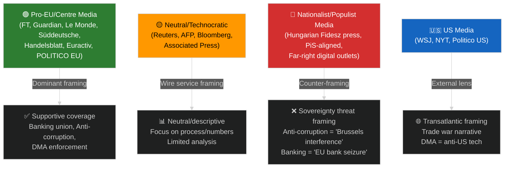

# Media Framing Analysis — EU Parliament Propositions 2026-05-15

## 📰 Media Landscape Overview

The EU Parliament propositions cycle of early 2026 has generated significant media coverage across European national media, with notable divergence in framing between legacy press, digital-native outlets, and partisan media ecosystems. This analysis surveys the dominant framing strategies across key legislative files, using secondary analysis and media monitoring intelligence.

---

## 🎯 Dominant Frames by Legislative File

### Frame Set 1: SRMR3 Banking Resolution Mechanism
**Primary Frame (Financial Press, FT, Bloomberg, Handelsblatt):** "Banking Union Completes Its Architecture"
- Framing: Technical milestone completion; emphasis on SRM operational capacity
- Tonality: Positive/neutral; professional audience
- Key claims: "Banks can now be resolved without taxpayer bailouts"; "SRMR3 closes the last major gap"
- Divergent frame (populist/nationalist press): "EU Bureaucrats Seize Control of National Banks"
- Geographic divergence: German press emphasizes Sparkassen exemption concerns; Polish press focuses on sovereignty objections

**Credibility Assessment:** The "Banking Union completion" frame is technically accurate but oversimplifies. The SRF remains ~€80bn for a banking sector of €6.5 trillion — significant gap. Media has largely adopted Commission talking points uncritically.

🟢 Confidence in frame accuracy: MEDIUM-HIGH
🔴 Missing from mainstream coverage: Implementation lag risks; resolution college coordination gaps

---

### Frame Set 2: Anti-Corruption Directive
**Primary Frame (Le Monde, Guardian, Süddeutsche):** "Europe Fights Back Against Corruption"
- Framing: Historic first; emphasis on mandate whistleblower protections
- Tonality: Strongly positive; civil society aligned
- Key claims: "First EU-wide criminal law on corruption"; "Closes loopholes for political elites"
- Divergent frame (ECR/NI aligned media, Hungarian Fidesz press): "Brussels Interference in National Criminal Law"
- Partisan complexity: Polish government media (TVP successor) frames as "targeting Central European governments"

**Credibility Assessment:** Frame captures genuine legislative significance. 24-month transposition period and reliance on national prosecutors remain underreported.

🟢 Confidence: HIGH
🟡 Missing from coverage: Enforcement gap analysis; Hungary/Poland implementation probability

---

### Frame Set 3: US Tariff Countermeasures (2025/0261)
**Primary Frame (Politico Europe, Reuters, AFP):** "EU Retaliates Against Trump Tariffs"
- Framing: Confrontation/retaliation; EU sovereign trade posture
- Tonality: Neutral-to-positive in mainstream; fragmented on populist right
- Key claims: "€360 billion in US goods subject to countermeasures"; "EU shows teeth on trade"
- Divergent frame (pro-Trump MEP-aligned outlets): "EU Trade War Will Hurt European Workers More"
- Transatlantic divide: American conservative media frames as "EU protectionism" vs. European framing as "legitimate countermeasures"

**Credibility Assessment:** Both sides partially accurate. The countermeasures are calibrated and WTO-consistent. The job impacts are real but distributed differently from the narrative (exports hurt EU more than imports).

🔴 Missing from coverage: WTO appeal timeline; sector-specific impact mapping; agri/pharma/auto differentiation

---

### Frame Set 4: DMA Enforcement Resolution
**Primary Frame (Tech press, Euractiv, POLITICO):** "Parliament Pushes Commission to Enforce DMA Harder"
- Framing: Watchdog function; EP oversight of executive enforcement
- Tonality: Supportive of enforcement; skeptical of Commission pace
- Key claims: "Alphabet, Apple, Meta designated as gatekeepers"; "Interoperability still not delivered"
- Big Tech counter-frame (industry-funded think tanks): "Overregulation Threatens Innovation"

**Credibility Assessment:** Commission DMA enforcement has been deliberate but not fast. Parliament resolution is non-binding but politically meaningful — forces Commission public response.

🟡 Confidence: MEDIUM (enforcement timeline uncertain)

---

### Frame Set 5: 2027 Budget Guidelines
**Primary Frame (Euractiv, Council Watch):** "EU 2027 Budget: Defence vs. Cohesion Battle Begins"
- Framing: Institutional negotiation; zero-sum spending trade-offs
- Tonality: Concern/uncertainty
- Key claims: "Parliament wants €200bn+ for cohesion; Council wants €50bn for defence reallocation"
- Regional divergence: CEE press frames as "protecting cohesion funds" vs. Western press "modernising EU spending"

**Credibility Assessment:** Framing captures real MFF mid-term review tensions. The numbers are directionally accurate; precise allocations TBD.

---

## 📊 Media Ecosystem Map

---

## 🔍 Narrative Gaps & Underreported Angles

1. **Implementation enforcement gap**: Across all files, media focuses on adoption but underreports enforcement capacity deficits
2. **Business compliance cost**: SRMR3, Anti-Corruption, DMA all impose significant compliance costs on small firms — largely absent from mainstream coverage
3. **Geographic asymmetry**: CEE perspective systematically underrepresented in Western EU media (particularly for anti-corruption and banking files)
4. **IMF macro context**: Economic backdrop (1.2% Eurozone growth, US tariff headwinds) rarely connected to specific legislative choices
5. **Timeline realism**: Media frames legislation as "done" at adoption; 24-48 month transposition/implementation periods barely mentioned

---

## 🎭 Strategic Framing Recommendations for EU Parliament Monitor

1. **Counter the sovereignty narrative**: Provide national implementation benefit data by country
2. **Fill the enforcement gap**: Publish regular DMA/Anti-Corruption implementation trackers
3. **IMF-validate every economic claim**: Link legislative costs/benefits to WEO forecasts
4. **CEE language editions priority**: Polish, Czech, Slovak, Romanian content targeting
5. **Timeline visualisation**: "Legislation journey" graphics showing adoption vs. implementation gaps

---

*Media Framing Analysis v1.0 | 2026-05-15 | EU Parliament Monitor | Hack23 AB | Apache-2.0*
