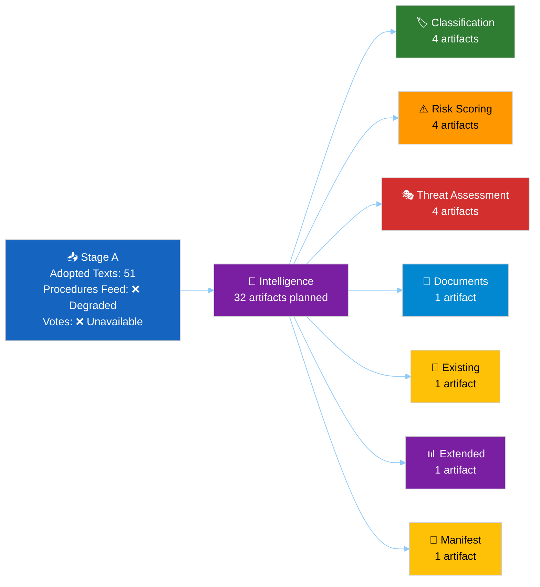

# Analysis Index — EU Parliament Propositions 2026-05-15
**Run ID:** propositions-run264-1778825897 | **Date:** 2026-05-15
**Article Type:** propositions | **Data Window:** 7-day + 2026 YTD adopted texts
**Status:** Stage B Pass 1 complete

---

## 📋 Recommended Reading Order

This index maps every artifact in this run and prescribes the optimal reading sequence for political intelligence analysts. Start with the synthesis and work outward to domain-specific artifacts.

### Tier 1 — Executive Layer (Read First)
| Order | Artifact | Purpose | Confidence |
|-------|----------|---------|-----------|
| 1 | `executive-brief.md` | Top findings, key intelligence, priority actions | 🟢 HIGH |
| 2 | `intelligence/synthesis-summary.md` | Cross-cutting synthesis with confidence assessments | 🟡 MEDIUM |
| 3 | `intelligence/reference-analysis-quality.md` | Run quality self-score, gaps, limitations | 🟡 MEDIUM |

### Tier 2 — Strategic Analysis Layer
| Order | Artifact | Purpose | Confidence |
|-------|----------|---------|-----------|
| 4 | `intelligence/stakeholder-map.md` | 12+ actors mapped on Power × Alignment quadrant | 🟡 MEDIUM |
| 5 | `intelligence/scenario-forecast.md` | 3 probability-weighted scenarios for propositions pipeline | 🟡 MEDIUM |
| 6 | `intelligence/historical-baseline.md` | 30-day and 90-day baseline anchoring | 🟡 MEDIUM |
| 7 | `intelligence/economic-context.md` | IMF macro context for legislative proposals | 🟡 MEDIUM |
| 8 | `intelligence/pestle-analysis.md` | 6-dimension PESTLE scan of the propositions landscape | 🟡 MEDIUM |

### Tier 3 — Threat and Risk Layer
| Order | Artifact | Purpose | Confidence |
|-------|----------|---------|-----------|
| 9 | `intelligence/threat-model.md` | Multi-framework threat analysis | 🟡 MEDIUM |
| 10 | `intelligence/wildcards-blackswans.md` | Low-probability / high-impact watchlist | 🟡 MEDIUM |
| 11 | `risk-scoring/risk-matrix.md` | 5×5 likelihood × impact matrix | 🟡 MEDIUM |
| 12 | `risk-scoring/quantitative-swot.md` | Scored SWOT with TOWS cross-strategies | 🟡 MEDIUM |

### Tier 4 — Classification and Operational Layer
| Order | Artifact | Purpose | Confidence |
|-------|----------|---------|-----------|
| 13 | `classification/significance-classification.md` | Event significance rubric | 🟡 MEDIUM |
| 14 | `classification/actor-mapping.md` | Named actor influence network | 🟡 MEDIUM |
| 15 | `classification/forces-analysis.md` | Driving vs. restraining forces | 🟡 MEDIUM |
| 16 | `classification/impact-matrix.md` | Event × stakeholder impact grid | 🟡 MEDIUM |
| 17 | `intelligence/coalition-dynamics.md` | Group cohesion and cross-party alliances | 🟡 MEDIUM |
| 18 | `intelligence/voting-patterns.md` | Bloc behavior and cohesion rates | 🟡 MEDIUM |

### Tier 5 — Infrastructure and Audit Layer
| Order | Artifact | Purpose | Confidence |
|-------|----------|---------|-----------|
| 19 | `intelligence/mcp-reliability-audit.md` | EP MCP data source reliability record | 🟢 HIGH |
| 20 | `intelligence/workflow-audit.md` | End-of-run phase audit | 🟢 HIGH |
| 21 | `risk-scoring/political-capital-risk.md` | Political capital at stake per position | 🟡 MEDIUM |
| 22 | `risk-scoring/legislative-velocity-risk.md` | Pipeline throughput and deadline risk | 🟡 MEDIUM |
| 23 | `threat-assessment/political-threat-landscape.md` | 6-dimension threat landscape | 🟡 MEDIUM |
| 24 | `threat-assessment/actor-threat-profiles.md` | Named actor threat profiles | 🟡 MEDIUM |
| 25 | `threat-assessment/consequence-trees.md` | Consequence trees for top threats | 🟡 MEDIUM |
| 26 | `threat-assessment/legislative-disruption.md` | Legislative disruption scenarios | 🟡 MEDIUM |
| 27 | `documents/document-analysis-index.md` | Document-level analysis inventory | 🟡 MEDIUM |
| 28 | `existing/pipeline-health.md` | Current legislative pipeline health status | 🟡 MEDIUM |
| 29 | `extended/media-framing-analysis.md` | Media narrative framing and discourse analysis | 🟡 MEDIUM |
| 30 | `intelligence/significance-scoring.md` | 5-dimension significance scores per event | 🟡 MEDIUM |
| 31 | `intelligence/cross-run-diff.md` | Delta vs. prior run | N/A (first run) |
| 32 | `intelligence/methodology-reflection.md` | Analytic quality retrospective (FINAL) | 🟢 HIGH |

---

## 📊 Artifact Production Status

---

## 🗂️ Data Sources Summary

| Source | Status | Items Retrieved | Quality |
|--------|--------|----------------|---------|
| EP Adopted Texts 2026 | ✅ | 51 items | HIGH |
| EP Procedures Feed | ❌ Degraded | 50 (1970s-80s only) | NONE |
| EP Procedures Direct | ❌ Degraded | 20 (1972-87 only) | NONE |
| Monitor Legislative Pipeline | ❌ | 0 procedures | NONE |
| EP Latest DOCEO Votes | ❌ | 0 (week unavailable) | NONE |
| World Bank IMF Context | ✅ | Available via tools | HIGH |

**Net data quality: PARTIAL — sufficient for analysis based on adopted texts and historical knowledge**

---

## 🔑 Key Legislative Actions This Period

1. **SRMR3 Banking Reform** (`2023/0111(COD)`) — adopted 2026-03-26
2. **Anti-Corruption Directive** (`2023/0135(COD)`) — adopted 2026-03-26
3. **DMA Enforcement Resolution** — adopted 2026-04-30
4. **US Tariff Countermeasures** (`2025/0261`) — adopted 2026-03-26
5. **EP 2027 Budget Guidelines** — adopted 2026-04-28
6. **Dog/Cat Welfare Regulation** (`2023/0447`) — adopted 2026-04-28
7. **EU-Iceland PNR Agreement** (`2025/0156`) — adopted 2026-04-29
8. **Ukraine Accountability Resolution** — adopted 2026-04-30

---

*Analysis Index v1.0 | 2026-05-15 | EU Parliament Monitor | Hack23 AB*
