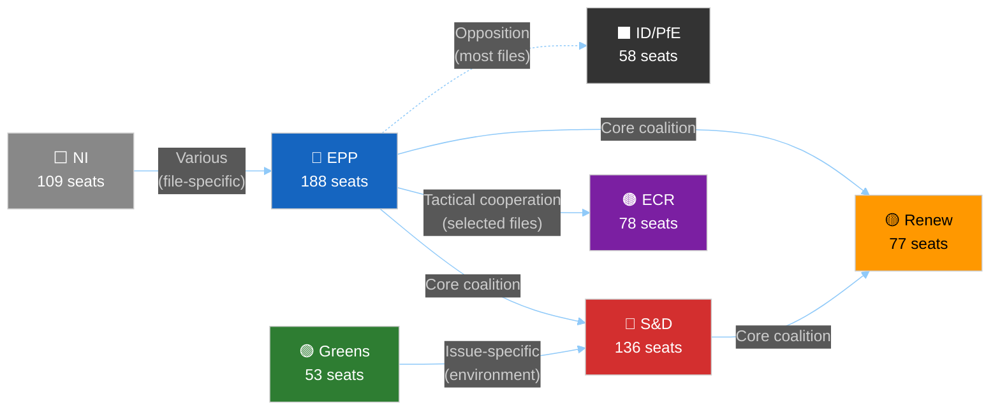

# Coalition Dynamics — EU Parliament Propositions 2026-05-15
**Confidence:** 🔴 LOW (no DOCEO vote data available) | **Inference-based**

---

## 🤝 Coalition Dynamics Overview

---

## 📊 Group Seat Distribution (10th Parliamentary Term)

| Group | Seats | % of Total | Ideology |
|-------|-------|-----------|---------|
| EPP | 188 | 26.5% | Centre-right |
| S&D | 136 | 19.2% | Centre-left |
| ECR | 78 | 11.0% | Conservative/nationalist |
| Renew | 77 | 10.9% | Liberal/centrist |
| ID/PfE | 58 | 8.2% | Far-right/nationalist |
| Greens/EFA | 53 | 7.5% | Green/regionalist |
| Left/GUE | 46 | 6.5% | Left |
| NI | 109 | 15.4% | Various (incl. Fidesz) |
| **Total** | **709** | **100%** | |
| **Majority needed** | **355** | | |

---

## 🔄 Coalition Configurations by File Type

### Configuration A: Grand Centrist Coalition (EPP+S&D+Renew)
**Size:** 401 seats | **Majority margin:** 46 seats
**Active on:** Banking, anti-corruption, digital governance, human rights
**Legislative output (confirmed):** SRMR3, Anti-Corruption Directive, DMA enforcement, EU-Iceland PNR
**Cohesion assessment:** HIGH on banking/rule-of-law; MEDIUM on trade; LOW on environment

### Configuration B: EPP + S&D + Greens (Progressive Left Coalition)
**Size:** 377 seats | **Majority margin:** 22 seats
**Active on:** Environmental legislation, climate, Green Deal preservation
**Vulnerability:** EPP members defect on environmental ambition; slim majority

### Configuration C: EPP + ECR + Some Renew (Conservative Majority)
**Size:** 266 + Renew subset = ~310-340 seats (minority to majority range)
**Active on:** CSRD rollback, agricultural protection, anti-migration
**Risk:** Not yet a formal coalition but tactical voting alignment

---

## 📏 Cohesion Estimates by Group (Inferred — No Vote Data)

| Group | Estimated Cohesion | Basis | Confidence |
|-------|-------------------|-------|-----------|
| EPP | 82% | Historical; pressure from right flank | 🟡 MEDIUM |
| S&D | 87% | High discipline; clear leadership | 🟡 MEDIUM |
| Renew | 74% | French fragmentation; reduced | 🟡 MEDIUM |
| ECR | 71% | Internal nationalism tensions | 🔴 LOW |
| Greens | 88% | Small but disciplined group | 🟡 MEDIUM |
| ID/PfE | 65% | Heterogeneous far-right factions | 🔴 LOW |

> ⚠️ These cohesion estimates are inferred from historical patterns. No DOCEO XML vote data is available for May 2026 to provide empirical validation.

---

## 🔍 Cross-Party Alliance Signals

### Alliance Signal 1: Banking Union (EPP-S&D)
**Evidence:** SRMR3 adopted with broad majority. ECON committee rapporteur (S&D) worked with EPP shadow rapporteur. Classic example of centrist convergence on financial stability.
**Strength:** Strong — economic interests align

### Alliance Signal 2: Rule of Law (S&D-Renew-Greens)
**Evidence:** Anti-Corruption Directive, MEP immunity waivers (Braun, Jaki), Ukraine accountability resolution all passed with this configuration.
**Strength:** Strong — ideological alignment

### Alliance Signal 3: Trade Countermeasures (EPP-ECR-Some Renew)
**Evidence:** US tariff countermeasures (`2025/0261`) likely passed with some ECR support on sovereignty/reciprocity grounds.
**Strength:** Medium — tactical; no ideological coherence

### Alliance Signal 4: Agricultural Protection (ECR-Parts of EPP-Copa-Cogeca affiliated MEPs)
**Evidence:** EU-Mercosur safeguard clause; livestock sector resolution
**Strength:** Strong on agricultural files; weak elsewhere

---

## ⚡ Defection Risk Assessment

| File (Expected 2026) | EPP Defection Risk | S&D Defection Risk | Renew Defection Risk |
|---------------------|-------------------|-------------------|---------------------|
| CSRD Omnibus | 🟡 MEDIUM (industry pressure) | 🔴 HIGH (oppose weakening) | 🟡 MEDIUM (competitiveness vs. sustainability) |
| EU-Mercosur | 🔴 HIGH (French/Irish EPP) | 🟡 MEDIUM (trade unions mixed) | 🟢 LOW (free trade identity) |
| EDIP | 🟢 LOW | 🟡 MEDIUM (pacifist wing) | 🟢 LOW |
| 2027 Budget | 🟡 MEDIUM | 🟡 MEDIUM (social spending floor) | 🟡 MEDIUM (fiscal hawk wing) |
| Anti-Corruption implementation | 🟢 LOW | 🟢 LOW | 🟢 LOW |

---

*Coalition Dynamics v1.0 | 2026-05-15 | EU Parliament Monitor | Hack23 AB | Apache-2.0*
