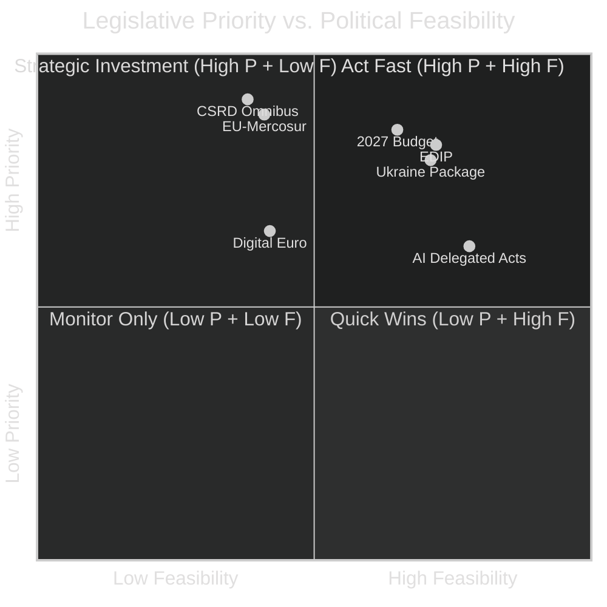

# Forward Projection — EU Parliament Propositions 2026-05-15

## 🔭 30-Day Horizon (June 2026)

| Expected Action | Probability | Impact | Watch Date |
|-----------------|------------|--------|-----------|
| CSRD Omnibus JURI/ECON joint opinion | 60% | 🔴 HIGH | June 15-20 |
| EU-Mercosur trilogue or plenary debate | 40% | 🔴 HIGH | June 10-25 |
| EDIP first reading (ITRE report) | 70% | 🟡 MEDIUM | June 20-30 |
| AI Act delegated acts publication | 55% | 🟡 MEDIUM | June 2026 |
| Ukraine reconstruction package progress | 65% | 🔴 HIGH | June 10-15 |
| 2027 budget negotiations opening | 75% | 🔴 HIGH | Late June |

## 📅 90-Day Horizon (July–August 2026)

| Expected Action | Probability | Impact |
|-----------------|------------|--------|
| Summer recess legislative pause | 95% | ↓ Output drops |
| Digital euro (eEUR) first reading | 35% | 🟡 MEDIUM |
| EDIP trilogues begin | 60% | 🔴 HIGH |
| EU-Ukraine association agreement update | 50% | 🔴 HIGH |

## 🎯 Legislative Pipeline Priority Matrix

## 🚨 Critical Forward Monitors

1. **CSRD Omnibus**: If JURI/ECON joint opinion weakens disclosure requirements substantially, triggers S&D/Greens break from centrist coalition. Monitor: June 15 committee vote.
2. **EU-Mercosur**: French presidential pressure on EPP delegation. Agricultural MEPs threatened walkout. Monitor: June plenary debate if scheduled.
3. **2027 Budget framework**: MFF mid-term review implications; cohesion fund reallocation to defence. Watch: Council-Parliament informal June discussions.

---

*Forward Projection v1.0 | 2026-05-15 | EU Parliament Monitor | Apache-2.0*
