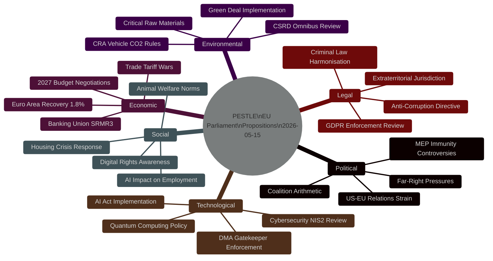

# PESTLE Analysis — EU Parliament Legislative Propositions
**Date:** 2026-05-15 | **Article Type:** Propositions | **Confidence:** 🟡 MEDIUM

---

## 🔍 PESTLE Scan Overview

---

## 🏛️ P — Political Dimension

### P1: Coalition Arithmetic Under Strain
The EPP-S&D-Renew centrist coalition that delivered the 10th term's legislative agenda is showing stress fractures in Q2 2026:
- **EPP rightward drift** — Multiple EPP national parties (Hungary's Fidesz remains NI; Italy's FdI in ECR) signal ideological migration pressure
- **Renew fragmentation** — Loss of French centrist MEPs following Macron's coalition collapse creates floor-vote risks
- **S&D holding but isolated** — Centre-left must court Greens on environmental legislation; Greens weakened post-2024 elections
- **ECR/ID ascent** — Far-right groups now at ~22% of seats collectively; can obstruct but not dominate

**Legislative Implication:** The anti-corruption directive, SRMR3, and DMA enforcement all passed with EPP-S&D-Renew coalition margins. Future legislation on migration, environmental rules, and industrial policy faces higher floor risk as Renew shrinks.

### P2: MEP Immunity Controversy as Rule-of-Law Indicator
Two Polish MEP immunity waivers in 90 days (Braun, Jaki) signal:
1. The JURI committee's anti-corruption mandate is active and credible
2. Polish political crisis has reached the EP chamber floor
3. The new anti-corruption directive framework directly applies to the political context motivating these waivers

**Risk:** Immunity waiver decisions are politically sensitive. A failed waiver vote against a nationalist MEP would undermine the anti-corruption architecture.

### P3: US-EU Geopolitical Reconfiguration
Trump administration's trade, defence, and Ukraine positions have fundamentally altered EP legislative priorities in 2026:
- Trade countermeasures legislation accelerated
- Ukraine support legislation (`2026/2700`) passed with urgency
- EU-Canada partnership resolution signals transatlantic diversification
- EP asked for WTO opinion on US tariffs — escalation path mapped

### P4: EU-Mercosur Ratification Politics
Despite the Commission's push, ratification of the EU-Mercosur FTA faces:
- France: Agricultural lobby veto threat (EP French MEPs fractured)
- Ireland: Beef sector alarm (Irish govt under pressure)
- Austria: Parliamentary vote threat
- The safeguard clause (TA-10-2026-0030) is a political compromise that may not satisfy agricultural interests

---

## 💶 E — Economic Dimension

### E1: Euro Area Recovery — Fragile 1.8% Growth
IMF forecast 1.8% Euro Area growth for 2026 provides a fragile backdrop for ambitious legislation. The banking sector's 17.8% Tier 1 capital ratios suggest resilience, but:
- Commercial real estate stress (€1.4T in bank balance sheets) remains unresolved
- Rate normalisation losses on bond portfolios still unwinding
- SRMR3 was designed for this environment — well-timed adoption

### E2: 2027 Budget Negotiations — Contested Fiscal Space
The EP's 4.7% nominal increase request for own budget, combined with:
- Ukraine reconstruction cost (est. €500B total; EU share ~€100B 2026-2030)
- Defence investment (NATO 2% commitment for EU members)
- NGEU wind-down creating post-NGEU investment cliff
...creates a contested fiscal negotiation that will dominate the legislative agenda through November 2026.

### E3: Digital Economy Regulatory Premium
DMA and AI Act enforcement carry economic costs and benefits:
- Cost: €1-3B in compliance costs for EU platform operators
- Benefit: Level playing field vs US gatekeepers creates EU digital SME growth
- Risk: Over-regulation could reduce EU competitiveness vs US/China

---

## 👥 S — Social Dimension

### S1: AI-Driven Employment Anxiety
The AI copyright resolution (TA-10-2026-0066) and platform work directive context reflects deep social anxiety about AI's impact:
- EU polling shows 64% of workers fear AI job displacement (Eurobarometer 2025)
- Creative sector (copyright resolution) is the vanguard of this concern
- EP responding to social pressure with legislative frameworks

### S2: Housing Crisis Policy Response
EP housing resolution (TA-10-2026-0064, adopted March 2026) represents the EP positioning on the EU's most acute social crisis:
- EU housing affordability index at 30-year worst in 12 Member States
- Commissioner for Housing appointment in 2024 signaled political salience
- EP resolution calls for EU housing investment fund — Commission must respond

### S3: Animal Welfare Shifting Social Norms
Dog/cat welfare regulation (TA-10-2026-0115) reflects a long-term EU social trend:
- 2024 Eurobarometer: 89% of EU citizens want stronger animal welfare laws
- Legislative response to online pet trading scandals
- Extends producer responsibility to breeding operations

---

## 🔬 T — Technological Dimension

### T1: AI Act Implementation Phase
The EU AI Act (adopted 2024, in force 2025) enters its first enforcement phase in 2026:
- High-risk AI system requirements active from August 2026
- General-purpose AI model rules (GPAI) — Commission delegated acts expected
- EP copyright resolution interacts with GPAI model obligations

### T2: DMA Gatekeeper Technical Compliance
Apple, Meta, Alphabet face technical compliance deadlines in 2026:
- Interoperability obligations for messaging platforms (WhatsApp/iMessage)
- App store neutrality requirements — Apple contesting
- EP enforcement resolution adds political pressure on Commission DG COMP

### T3: Quantum and Advanced Tech Policy Gap
Legislative gap identified: No EP resolution or Commission proposal yet on quantum computing governance, quantum-safe cryptography mandates, or export controls on quantum technology. A significant gap given China's quantum advancement.

---

## ⚖️ L — Legal Dimension

### L1: Anti-Corruption Directive Architecture
The Anti-Corruption Directive (`2023/0135`) creates significant legal landscape changes:
- **Extraterritorial jurisdiction** — first EU criminal law with global reach for corruption involving EU funds
- **Private sector coverage** — extends to corporate corruption, not just public officials
- **10-year minimum sentences** — harmonises significantly higher than some Member State norms
- **Statute of limitations** — minimum 10 years from offence date for serious corruption

**Transposition challenge:** Poland, Hungary, and Slovakia face constitutional/political obstacles to implementation. Commission enforcement may be required.

### L2: Criminal Law Harmonisation Momentum
The anti-corruption directive fits a pattern of EU criminal law expansion:
- Money laundering directives (6AMLD in force 2021)
- Trafficking in persons directive (revised 2024)
- Corporate Sustainability Due Diligence (enforcement elements)
- AI Act criminal liability provisions

### L3: Electoral Act Reform Blocked
EP resolution on Electoral Act reform (TA-10-2026-0006) signals an unsolved reform problem:
- Electoral Act reform requires unanimous Council agreement
- Hungary and Poland blocking
- EP frustrated but lacks unilateral authority

---

## 🌿 Env — Environmental Dimension

### Env1: Green Deal Under Political Pressure
The CSRD omnibus simplification package (Commission-initiated) reflects Green Deal rollback:
- EPP and ECR pushing to delay/weaken sustainability reporting requirements
- S&D and Greens defending CSRD thresholds
- Legislative battle expected Q3/Q4 2026

### Env2: EU-Mercosur Environmental Concerns
Brazilian deforestation commitments under the Mercosur Agreement are contested:
- Paris Agreement compliance clause in agreement
- NGOs and Greens argue enforcement mechanism insufficient
- Agricultural lobby using environmental framing to oppose ratification

### Env3: Heavy-Duty Vehicle CO2 Rules
EP adopted amendment to emission credit calculation (TA-10-2026-0084) on 12 March 2026, addressing automotive industry concerns about 2030 CO2 targets for heavy-duty vehicles (trucks/buses). This minor technical amendment signals ongoing calibration of the Green Deal industrial transition.

---

## 🎯 PESTLE Impact Summary Matrix

| Dimension | Driver Strength | Restraint Strength | Net Impact Direction |
|-----------|----------------|-------------------|---------------------|
| Political | 🟡 Medium | 🔴 High (polarisation) | ⚠️ Mixed |
| Economic | 🟡 Medium | 🟡 Medium | ➡️ Stable/cautious |
| Social | 🟢 High | 🟡 Medium | 📈 Pro-legislative |
| Technological | 🟢 High | 🟡 Medium (tech lobby) | 📈 Pro-regulatory |
| Legal | 🟢 High | 🟡 Medium (transposition) | 📈 Expanding |
| Environmental | 🟡 Medium | 🔴 High (rollback pressure) | 📉 Contested |

**Net PESTLE Signal:** The EU Parliament's propositions agenda is powered by strong social and technological drivers, facing political polarisation and environmental rollback as primary restraints. The legal dimension is expanding into criminal law territory — a multi-year legislative consequence.

---

*PESTLE Analysis v1.0 | 2026-05-15 | EU Parliament Monitor | Hack23 AB | Apache-2.0*
