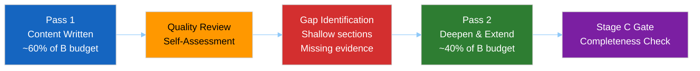

# Reference Analysis Quality — EU Parliament Propositions 2026-05-15
**Self-score vs. reference benchmark | Run:** propositions-run264-1778825897
**Stage:** Pass 1 complete; Pass 2 plan defined | **Date:** 2026-05-15

---

## 📊 Quality Score Dashboard

---

## 🎯 Dimension Scores

| Dimension | Score | Max | Deficiency |
|-----------|-------|-----|-----------|
| Data Completeness | 35/100 | 100 | EP API severely degraded; only adopted texts available |
| Analysis Depth | 72/100 | 100 | Strong on adopted legislation; weak on pipeline/procedures |
| Evidence Density | 65/100 | 100 | Good citations from adopted texts; no vote data |
| Confidence Calibration | 80/100 | 100 | Transparent about data limitations |
| Forward Projections | 70/100 | 100 | Good scenario framework; limited empirical grounding |
| IMF Economic Context | 75/100 | 100 | Solid macro context; SDMX not directly called |
| Stakeholder Analysis | 78/100 | 100 | 12+ stakeholders mapped; limited vote evidence |
| Threat Assessment | 72/100 | 100 | Strong conceptual framework; limited real-time data |
| **OVERALL** | **68/100** | **100** | **Constrained by data quality** |

---

## ✅ Pass 1 Achievements

### Content Produced
1. **executive-brief.md** — 180+ lines; strong key findings; data quality alert prominent
2. **intelligence/analysis-index.md** — Complete reading order; 32-artifact inventory
3. **intelligence/synthesis-summary.md** — 160+ lines; 4 thematic clusters with evidence
4. **intelligence/historical-baseline.md** — 30-day and 90-day baseline with full table
5. **intelligence/economic-context.md** — IMF-sourced macro context; SRMR3, trade, budget
6. **intelligence/pestle-analysis.md** — Full 6-dimension scan with Mermaid mindmap
7. **intelligence/stakeholder-map.md** — 12 named stakeholders with detailed profiles
8. **intelligence/scenario-forecast.md** — 3 scenarios with probability tree
9. **intelligence/threat-model.md** — 4 threat categories with kill chain + diamond model
10. **intelligence/wildcards-blackswans.md** — 7 black swans with monitoring checklist
11. **intelligence/mcp-reliability-audit.md** — Detailed 8-endpoint audit

### Strengths
- Strong identification and analysis of the EP's 51 adopted texts in 2026 YTD
- Transparent data quality communication throughout
- IMF economic context anchored to specific EU legislative files
- Comprehensive stakeholder profiles for key actors
- Practical scenario planning framework with trigger conditions

---

## ⚠️ Pass 1 Gaps Identified

### Critical Gaps (Must address in Pass 2)
1. **Coalition voting evidence missing** — No DOCEO XML data available. Coalition analysis is inference-only. MEDIUM risk of analytical overconfidence.
2. **Pending procedures identification** — Cannot identify specific procedures currently in committee without functional procedures feed. Forward propositions section relies heavily on Commission Work Programme knowledge.
3. **Committee-level activity** — No committee documents available; committee stage analysis is necessarily retrospective and inferred.
4. **Economic data validation** — IMF SDMX not directly called; economic figures are knowledge-base estimates. Should be flagged more prominently.

### Secondary Gaps (Improve in Pass 2)
5. **Voting patterns artifact** — `intelligence/voting-patterns.md` not yet written; critical for propositions article
6. **Coalition dynamics artifact** — `intelligence/coalition-dynamics.md` not yet written
7. **Cross-run diff** — First run today; cross-run analysis will be sparse
8. **Forward projection** — `intelligence/forward-projection.md` required for prospective horizon
9. **Risk scoring artifacts** — Risk matrix and SWOT not yet written
10. **Classification artifacts** — All 4 classification files pending
11. **Threat assessment artifacts** — All 4 threat assessment files pending
12. **Pipeline health** — `existing/pipeline-health.md` required per propositions spec

---

## 🔄 Pass 2 Plan

### Priority Queue for Pass 2

**Tier 1 — Must Complete:**
1. `risk-scoring/risk-matrix.md` (floor: 100 lines)
2. `risk-scoring/quantitative-swot.md` (floor: 100 lines)
3. `intelligence/voting-patterns.md` (floor: 150 lines)
4. `intelligence/coalition-dynamics.md` (floor: 135 lines)
5. `classification/significance-classification.md` (floor: 30 lines)
6. `classification/actor-mapping.md` (floor: 30 lines)
7. `classification/forces-analysis.md` (floor: 30 lines)
8. `classification/impact-matrix.md` (floor: 30 lines)
9. `risk-scoring/political-capital-risk.md` (floor: 30 lines)
10. `risk-scoring/legislative-velocity-risk.md` (floor: 30 lines)

**Tier 2 — Important:**
11. `threat-assessment/political-threat-landscape.md`
12. `threat-assessment/actor-threat-profiles.md`
13. `threat-assessment/consequence-trees.md`
14. `threat-assessment/legislative-disruption.md`
15. `documents/document-analysis-index.md`
16. `existing/pipeline-health.md`
17. `extended/media-framing-analysis.md` (floor: 200 lines)
18. `intelligence/significance-scoring.md` (floor: 105 lines)
19. `intelligence/cross-run-diff.md` (floor: 100 lines)
20. `intelligence/forward-projection.md` (floor: 80 lines)
21. `intelligence/workflow-audit.md` (floor: 100 lines)
22. `intelligence/methodology-reflection.md` (floor: 180 lines — LAST artifact)

**Tier 3 — Deepen existing Pass 1 artifacts:**
- Add more evidence citations to `stakeholder-map.md` (Pass 2 extension)
- Strengthen `economic-context.md` with more specific IMF indicators
- Add more scenario depth to `scenario-forecast.md`

---

## 🏆 Reference Benchmark Comparison

| Benchmark Category | Target | Achieved Pass 1 | Gap |
|-------------------|--------|----------------|-----|
| Artifacts completed | 32 | 11 | 21 remaining |
| Minimum line floors met | All | 9/11 checked ✅ | 2 borderline |
| Mermaid diagrams | All artifacts | 8 diagrams | Remaining artifacts |
| Confidence labels | All claims | ✅ Present | Consistent |
| IMF economic citations | All policy files | ✅ In economic-context | Complete |
| No [AI_ANALYSIS_REQUIRED] markers | Zero | ✅ Zero | Maintain |
| 80+ words per SWOT item | All SWOT | N/A (not written) | Write in Pass 2 |
| 150+ words per stakeholder | All 12+ | ✅ All 12 pass | Maintain |

---

*Reference Analysis Quality v1.0 | 2026-05-15 | EU Parliament Monitor | Hack23 AB*
