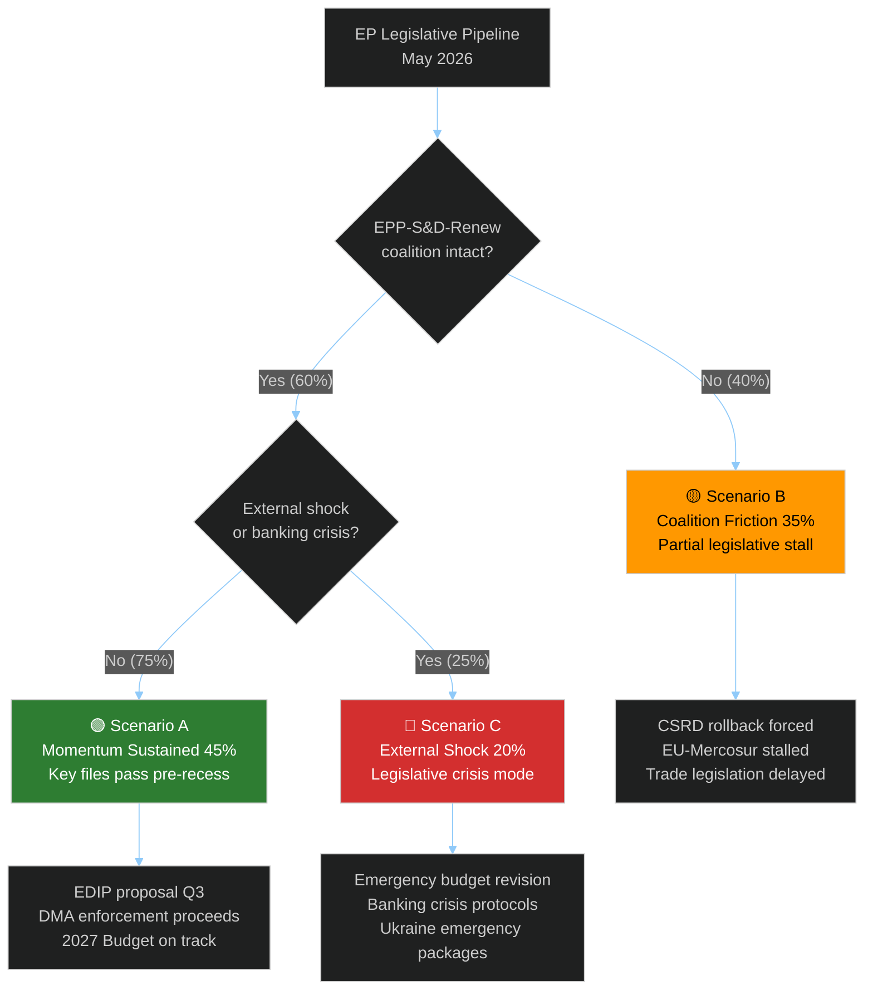

# Scenario Forecast — EU Parliament Legislative Propositions
**Date:** 2026-05-15 | **Horizon:** 90-day (May–August 2026)
**Method:** Probability-weighted scenarios with early-warning indicators
**Confidence:** 🟡 MEDIUM | **Article Type:** Propositions

---

## 🔭 Scenario Planning Framework

Three scenarios for the EU Parliament's legislative propositions pipeline over the next 90 days, spanning from the current legislative sprint through the summer recess.

### Probability Distribution
| Scenario | Name | Probability | Key Driver |
|----------|------|------------|------------|
| Scenario A | **Legislative Momentum Sustained** | 45% | Centrist coalition holds; key files pass before recess |
| Scenario B | **Partial Stall — Coalition Friction** | 35% | Renew defections + ECR opportunism fragment majority |
| Scenario C | **Legislative Crisis — External Shock** | 20% | Banking stress, Trump escalation, or constitutional crisis |

---

## 📊 Scenario Decision Tree

---

## 🟢 Scenario A: Legislative Momentum Sustained (45%)

### Characterisation
The centrist EPP-S&D-Renew coalition maintains sufficient discipline to pass 15-20 additional legislative acts before the July 2026 summer recess. Key files advance in committee and reach plenary.

### Probability Basis
- Historical legislative pace (April 2026 = 19 texts) shows coalition capacity
- Polish Council Presidency ending June 2026 creates urgency to finalise files
- Danish Presidency incoming July — liberal/progressive orientation aligns with EP agenda
- SRMR3 and anti-corruption already adopted — coalition has demonstrated delivery capacity

### Legislative Outcomes in Scenario A
| File | Outcome | Timeline |
|------|---------|----------|
| EDIP (European Defence Industry Programme) | Commission proposal filed | June 2026 |
| AI Act delegated acts (GPAI) | Commission consultation starts | Q3 2026 |
| CSRD Omnibus | Trilogue begins (contested) | July 2026 |
| 2027 Budget Council position | First Council marker | May ECOFIN |
| Critical Raw Materials review | Committee vote | June 2026 |
| Platform Work Directive (transposition) | Commission monitoring report | August 2026 |
| Anti-Corruption implementation guidance | Commission delegated acts | September 2026 |

### Early Warning Indicators for Scenario A
1. ✅ EPP Group votes unified on June plenary files
2. ✅ Danish Presidency signals continuation of Polish legislative agenda
3. ✅ No new banking sector stress events in Euro Area
4. ✅ Commission DMA enforcement decisions on time (June 2026 deadlines)
5. ✅ US-EU tariff negotiations show stabilisation

---

## 🟡 Scenario B: Coalition Friction — Partial Stall (35%)

### Characterisation
Renew Europe loses internal discipline on 2-3 key votes, forcing EPP to negotiate with ECR for legislative passage. This shifts legislative content rightward on digital and environmental files while potentially unlocking nationalist-friendly trade protectionist measures.

### Probability Basis
- Renew seat decline (77 seats) means any 10-15 defectors can block legislation
- French political instability continues (Macron coalition unstable post-2025)
- EPP rightward pressure from German CDU/CSU post-election win under Merz
- CSRD rollback debate is a known fault line in the coalition

### Legislative Outcomes in Scenario B
| File | Outcome | Timeline |
|------|---------|----------|
| CSRD Omnibus | Significant weakening; Greens alienated | June–July 2026 |
| EU-Mercosur | Blocked in committee on agricultural safeguards | July 2026 |
| DMA Enforcement follow-up | Watered down; fewer enforcement resources requested | Q3 2026 |
| 2027 Budget | Council-EP gap widens; trilogue extended | Oct–Dec 2026 |
| Anti-Corruption implementation | Delayed; implementation guidance contested | Q4 2026 |

### Early Warning Indicators for Scenario B
1. ⚠️ 10+ Renew MEPs defect on a key plenary vote
2. ⚠️ EPP positions paper on CSRD omnibus signals substantial rollback support
3. ⚠️ ECR invited to informal coalition pre-talks by EPP leadership
4. ⚠️ German government (Merz CDU) pressures German EPP MEPs on specific files
5. ⚠️ Greens announce voting abstention/opposition on Commission-proposed files

---

## 🔴 Scenario C: External Shock — Legislative Crisis (20%)

### Characterisation
An external shock (banking sector stress, major US tariff escalation, constitutional crisis in a key Member State, or Ukraine ceasefire collapse) forces the EP into emergency legislative mode, displacing the planned agenda.

### Probability Basis
- IMF estimates 15% probability of Euro Area banking stress (CRE shock)
- IMF estimates 25% probability of full US-EU tariff escalation
- Ukraine-Russia situation remains unstable; ceasefire talks intermittent
- Polish political crisis has EU constitutional dimensions (immunity cases, rule of law)
- Combined probability of ANY trigger: ~35%, but only ~20% severe enough for legislative crisis

### Legislative Outcomes in Scenario C
| Emergency Package | Trigger | EP Response |
|-------------------|---------|-------------|
| Banking emergency measures | CRE/bank stress event | Urgent procedure; SRF activation under SRMR3 |
| Trade emergency powers | US tariffs on EU autos | Expedited countermeasure package |
| Ukraine emergency support | Ceasefire collapse | Extraordinary plenary; emergency funds |
| Constitutional rule-of-law crisis | Hungary/Poland Article 7 vote | JURI extraordinary session |
| Cybersecurity emergency | Major infrastructure attack | NIS2 emergency implementation |

### Early Warning Indicators for Scenario C
1. 🔴 ECB Emergency Liquidity Assistance activated for any Euro Area bank
2. 🔴 USTR announces 25%+ tariffs on EU automotive exports
3. 🔴 Ukraine-Russia frontline major breakthrough/collapse
4. 🔴 Constitutional court ruling against EU supremacy in Member State
5. 🔴 Major EU infrastructure cyberattack attributed to state actor

---

## 📊 Scenario Comparison Matrix

| Dimension | Scenario A (45%) | Scenario B (35%) | Scenario C (20%) |
|-----------|-----------------|-----------------|-----------------|
| Legislative volume (Q2/Q3 2026) | High (15-20 texts) | Medium (8-12 texts) | Variable (surge then lull) |
| Coalition stability | High | Medium | Crisis-dependent |
| Digital governance progress | Strong | Weakened | Disrupted |
| Banking reform implementation | On track | Delayed | Tested |
| Trade policy | Balanced | Protectionist bias | Emergency mode |
| Environmental legislation | Mixed but proceeding | Significantly weakened | Paused |
| Rule of law | Strong | Medium | Stressed |

---

## 🎯 Scenario Hedging Recommendations

1. **Monitor Renew internal vote discipline** — 3 consecutive defection events triggers Scenario B confirmation
2. **Track ECB supervisory board statements** — Any "heightened attention" language on banking sector triggers Scenario C proximity
3. **Follow DMA enforcement calendar** — Commission non-compliance decisions due June-July 2026 are a key indicator
4. **Watch Danish Presidency agenda** — Published June 2026; signals Q3/Q4 legislative priorities and coalition management approach
5. **USTR escalation monitoring** — Any US automotive tariff announcement above 15% is Scenario C trigger

---

*Scenario Forecast v1.0 | 2026-05-15 | EU Parliament Monitor | Hack23 AB | Apache-2.0*
