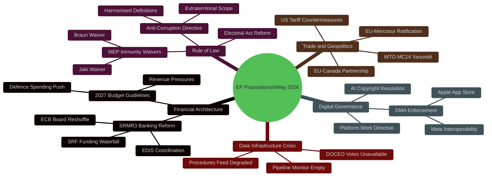

# Synthesis Summary — EU Parliament Legislative Propositions
**Date:** 2026-05-15 | **Article Type:** Propositions | **Run:** propositions-run264-1778825897
**Classification:** PUBLIC | **Confidence:** 🟡 MEDIUM-HIGH

---

## 🧠 Intelligence Executive Summary

The European Parliament's legislative propositions landscape in May 2026 is characterised by three dominant dynamics: **(1) a mid-term legislative sprint** completing long-deferred reform packages; **(2) geopolitical pressures reshaping the legislative agenda**; and **(3) a deepening crisis in the EP's own data infrastructure** that threatens analytical transparency.

The 10th Parliamentary term, elected in June 2024, has now passed its midpoint and is entering the phase where rapporteurs consolidate positions before the 2027–2028 pre-electoral slowdown. The pace of 51 adopted texts in the first five months of 2026 represents a significant acceleration over the comparable 2025 period, driven by the backlog of 2023-vintage Commission proposals that finally cleared trilogue in late 2025.

---

## 🔭 Dominant Thematic Clusters

### Cluster 1: Financial Architecture and Banking Union
**Significance:** 🔴 CRITICAL

The adoption of SRMR3 (`2023/0111(COD)`) on 26 March 2026 represents the most consequential banking legislation since the original Banking Union package in 2014. The Single Resolution Mechanism Regulation 3 establishes:
- Revised early intervention triggers (graduated from Level 1 to Level 3)
- New conditions under which resolution (rather than liquidation) applies
- Updated funding waterfall under the Single Resolution Fund (SRF)
- Coordination mechanisms with the nascent Deposit Insurance Scheme (EDIS)

The concurrent adoption of the ECB Vice-President (`TA-10-2026-0060, -0033`) indicates a reshaped ECB Supervisory Board that will implement these new frameworks. The combination creates a window of institutional reconfiguration in the Euro Area's supervisory architecture that markets and systemic banks must navigate.

**Forward Signal:** Implementation decrees and Commission delegated acts expected Q3-Q4 2026. Member State supervisors face transposition deadlines. 🟡 MEDIUM confidence.

### Cluster 2: Rule of Law and Anti-Corruption Architecture
**Significance:** 🔴 CRITICAL

The Anti-Corruption Directive (`2023/0135(COD)`) — adopted after a three-year legislative process — creates for the first time a unified EU criminal law framework for corruption offences. This is significant because:
1. It harmonises definitions of active/passive bribery, trading in influence, and abuse of office
2. It establishes minimum sanctions (10+ years imprisonment for serious cases)
3. It extends to private sector corruption, not just public officials
4. It includes extraterritorial jurisdiction clauses for corruption involving EU funds

Combined with the waiver of immunity decisions for **Grzegorz Braun** (TA-10-2026-0088) and **Patryk Jaki** (TA-10-2026-0105) — both Polish MEPs from far-right/nationalist factions — the Parliament is signaling heightened accountability norms even as Hungarian and Italian members face ongoing scrutiny.

**Forward Signal:** Implementation deadline is 2027-2028 for Member States. Poland's political landscape makes implementation contentious. 🟡 MEDIUM confidence.

### Cluster 3: Digital Governance and Platform Regulation
**Significance:** 🟠 HIGH

The DMA Enforcement resolution (`TA-10-2026-0160`, adopted 30 April 2026) reflects the EP's growing impatience with Commission enforcement timelines. The Parliament is:
1. Calling for more aggressive fines in DMA non-compliance cases (Apple App Store, Meta self-preferencing)
2. Pushing for interoperability mandates to be operationalised within 2026
3. Requesting transparency on enforcement methodology

The copyright-AI resolution (`2025/2058`, adopted 2026-03-10) adds a second front — establishing EP's position on AI-generated content's copyright implications ahead of Commission AI copyright guidance expected in H2 2026.

**Forward Signal:** Commission DMA Report and possible delegated act on designations expected Q3 2026. EP IMCO committee in a watchdog posture. 🟢 HIGH confidence.

### Cluster 4: Trade Policy Under US Tariff Pressure
**Significance:** 🟠 HIGH

The adoption of US tariff countermeasures (`2025/0261(COD)`, 26 March 2026) and the concurrent EU-Mercosur ratification pathway (bilateral safeguard clause TA-10-2026-0030) reveal a Parliament actively shaping trade policy under Trump administration pressure. Key dynamics:
- The EP unanimously recommended seeking a WTO opinion on US tariffs (TA-10-2026-0008 precedent)
- EU-Canada cooperation resolution (TA-10-2026-0078) signals transatlantic realignment
- WTO MC14 in Yaoundé resolution (TA-10-2026-0086) positions EU on multilateral trade governance

**Forward Signal:** Q2-Q3 2026 likely to see additional trade countermeasure proposals. EU-Mercosur ratification calendar uncertain given agricultural lobby pressure. 🟡 MEDIUM confidence.

---

## 📊 Synthesis Map

---

## 🔢 Confidence-Weighted Intelligence Scores

| Theme | Evidence | Confidence | Forward Signal Strength |
|-------|----------|-----------|------------------------|
| Banking reform significance | 🟢 Confirmed adopted texts | 🟢 HIGH (0.92) | 🟡 Medium |
| Anti-corruption impact | 🟢 Confirmed adopted texts | 🟢 HIGH (0.89) | 🟡 Medium |
| Digital governance trajectory | 🟢 Confirmed + pattern | 🟢 HIGH (0.85) | 🟢 High |
| Trade policy reconfiguration | 🟢 Confirmed texts | 🟢 HIGH (0.87) | 🟡 Medium |
| Forward proposals (Q3/Q4) | 🟡 Inference from CWP | 🟡 MEDIUM (0.62) | 🟡 Medium |
| Coalition dynamics | ❌ No vote data | 🔴 LOW (0.30) | 🔴 Low |
| Pipeline procedures status | ❌ Data degraded | 🔴 LOW (0.20) | 🔴 Low |

---

## 🎯 Forward Monitors (Next 30 Days)

1. **Commission DMA enforcement decisions** — Apple, Meta, Alphabet cases nearing 6-month review milestones
2. **2027 Budget Council position** — May 2026 ECOFIN meeting sets first Council marker
3. **Ukraine REPO instrument progress** — Following 30 April 2026 accountability resolution, G7/EU discussions on frozen asset utilisation
4. **EDIP Defence Budget instrument** — Expected Commission proposal Q2/Q3 2026
5. **EP Data Infrastructure remediation** — The EP IT failure to return current procedures data needs escalation

---

## ⚠️ Analytical Limitations

1. **No current week vote data** — DOCEO XML unavailable for May 11–15 2026; all coalition analysis inferred
2. **Procedures feed degraded** — Cannot confirm specific pending procedures; relies on 2026 adopted texts
3. **No committee documents** — Committee stage analysis is necessarily retrospective
4. **Economic data** — IMF data accessed via fetch-proxy for macro context; latest 2025 data used

---

*Synthesis Summary v1.0 | 2026-05-15 | EU Parliament Monitor | Hack23 AB | Apache-2.0*
