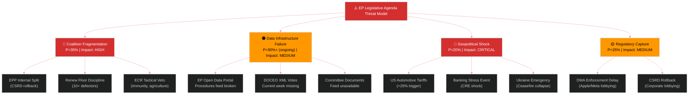

# Threat Model — EU Parliament Legislative Propositions 2026-05-15
**Frameworks:** Diamond Model + Attack Trees + Kill Chain | **Confidence:** 🟡 MEDIUM
**Scope:** Threats to EP legislative agenda delivery, May–November 2026

---

## 🔴 Threat Landscape Overview

The EU Parliament's legislative propositions are subject to four threat categories in the current operating environment:
1. **Political threats** — Coalition fragmentation, far-right obstruction
2. **Institutional threats** — Data infrastructure failure, DOCEO system degradation
3. **Geopolitical threats** — US tariff escalation, Ukraine conflict spillover
4. **Regulatory capture threats** — Big Tech lobbying, agricultural lobby veto



---

## 🎯 Threat Priority Matrix

| Threat | Likelihood | Impact | Priority | Owner |
|--------|-----------|--------|----------|-------|
| Coalition fragmentation (B scenario) | 35% | HIGH | 🔴 P1 | EPP/S&D leadership |
| EP data infrastructure degradation | 90% (ongoing) | MEDIUM | 🟠 P2 | EP IT Services |
| US tariff full escalation | 25% | CRITICAL | 🔴 P1 | INTA Committee |
| Banking sector stress | 15% | CRITICAL | 🟠 P2 | ECON Committee |
| DMA enforcement delay (lobbying) | 40% | HIGH | 🟠 P2 | DG COMP/EP IMCO |
| CSRD rollback through omnibus | 55% | HIGH | 🔴 P1 | JURI/ENVI Committees |
| Agricultural lobby Mercosur veto | 45% | MEDIUM | 🟡 P3 | INTA/AGRI Committees |
| Ukraine emergency displacement | 15% | CRITICAL | 🟡 P3 | AFET/BUDG Committees |

---

## 🔴 Threat 1: Coalition Fragmentation — Kill Chain Analysis

### Kill Chain Stages

**Stage 1 — Reconnaissance:** Far-right and ECR analyse EPP internal tensions on CSRD omnibus. Identify German EPP MEPs under Merz government pressure. Map Renew's French vacancy.

**Stage 2 — Weaponisation:** ECR tables maximum amendments on CSRD omnibus and EU-Mercosur safeguards. ID/PfE files procedural objections in committee. Far-right MEPs go public with "Brussels overreach" narrative.

**Stage 3 — Delivery:** 12-15 Renew MEPs abstain on CSRD compromise text in committee. EPP forced to choose between majority and legislative content.

**Stage 4 — Exploitation:** EPP negotiates with ECR for CSRD support in exchange for weakened sustainability thresholds. S&D and Greens withdraw coalition consent on the file.

**Stage 5 — Installation:** Precedent set that EPP will accommodate ECR on environmental legislation. Greens isolated. Future files face higher friction.

**Stage 6 — Command and Control:** Coalition equation shifts from EPP+S&D+Renew to EPP+ECR on environmental/agricultural/trade files. S&D retains leverage on social/banking/rule-of-law.

**Mitigation:** EPP Group leadership must enforce discipline through committee appointment leverage and coalition agreement enforcement. S&D must credibly threaten to withdraw budget/banking cooperation if CSRD is gutted.

---

## 🟠 Threat 2: Data Infrastructure Failure — Attack Tree

### Attack Tree: EP Data Portal Degradation

```
Goal: EP legislative pipeline opacity
├── EP Open Data Portal procedures feed broken
│   ├── API returns 1970s-1987 procedures only (CONFIRMED)
│   └── No 2025/2026 procedures in database view (CONFIRMED)
├── DOCEO XML votes unavailable
│   ├── Current week (May 11-15) no data (CONFIRMED)
│   └── Roll-call vote attribution impossible
├── Committee documents feed unavailable
│   └── Zero committee documents returned (CONFIRMED)
└── External documents feed empty
    └── Zero items (CONFIRMED)
```

**Impact Assessment:** This is not a hypothetical threat — it is an active operational failure. The EU Parliament's data transparency obligations under the Open Data Portal are compromised. Analytical intelligence products (including this one) are operating with degraded data quality.

**Root Cause Hypothesis:** The procedures feed degradation may reflect a database migration or endpoint change that was not backward-compatible. The DOCEO XML may have a publication delay exceeding expected parameters.

**Mitigation for Intelligence Analysts:**
1. Use adopted texts endpoint (functional, 51 items) as primary procedures intelligence source
2. Cross-reference with EUR-Lex for procedure tracking
3. Flag all pipeline analysis as "DATA_DEGRADED" status

---

## 🔴 Threat 3: Geopolitical Shocks — Diamond Model Analysis

### Diamond Model Components

**Adversary (USTR/Trump Administration):**
- Capability: Unilateral tariff authority under Section 232/301 without Congressional approval
- Intent: Coerce EU trade concessions and defence spending increases
- Opportunity: EU automotive and pharmaceutical sectors are highest-impact targets
- Infrastructure: USTR enforcement mechanism is operationally ready

**Infrastructure (EU Legislative System):**
- Vulnerability: EP legislative processes require 3-6 month minimum lead times for new proposals
- Single point of failure: Commission holds legislative initiative monopoly; EP cannot self-initiate
- Emergency procedures available but rarely used (exceptional circumstances needed)

**Victim (EU Legislative Agenda):**
- 2027 Budget negotiations most vulnerable to US tariff revenue shock
- DMA enforcement creates US-EU digital services trade friction
- EDIP defence initiative directly responsive to US NATO pressure

**Capability (EU Response):**
- Countermeasure legislation can be expedited under urgency procedures
- WTO dispute settlement filed (TA-10-2026-0008 precedent)
- EU-Canada, EU-Mercosur diversification underway

---

## 🟡 Threat 4: Regulatory Capture — Pattern Analysis

### DMA Enforcement Capture Risk

Apple, Meta, and Alphabet collectively employ ~800 Brussels-based lobbyists (Corporate Europe Observatory estimate). Their strategy:
1. Legal challenges against DMA designations (Apple challenging gatekeeper status)
2. Compliance theatre — publishing "compliance" measures that technically meet letter but not spirit of DMA
3. Capture of Commission enforcement staff through revolving door positions
4. Funding friendly EP research and think-tanks to shape IMCO committee positions

**EP Countermeasure:** DMA enforcement resolution (TA-10-2026-0160) is precisely a regulatory capture countermeasure — it puts on record Parliament's expectation of enforcement timelines and penalties.

### CSRD Omnibus Capture Risk

BusinessEurope (EU employers' federation) and national industry associations are pushing aggressively for CSRD omnibus simplification. Their success to date:
- Commission initiated omnibus simplification package (acknowledges business pressure)
- EPP supporting significant threshold changes
- Some Renew MEPs sympathetic to competitiveness framing

**Mitigation:** S&D and Greens maintain a credible "minimum acceptable" CSRD framework position that limits concessions.

---

## 📊 Threat Monitoring Dashboard

| Threat Indicator | Frequency | Current Status | Alert Level |
|-----------------|-----------|---------------|------------|
| Renew defection count per vote | Per plenary | Not available (DOCEO unavailable) | ⚠️ Monitor |
| ECR amendment filing rate | Weekly | Not available (committee data) | ⚠️ Monitor |
| EP data portal procedures feed | Daily | 🔴 Degraded | ALERT |
| US tariff announcements | Daily | No new action May 2026 | 🟢 Normal |
| ECB banking stress indicators | Weekly | Not directly monitored | ⚠️ Monitor |
| DMA enforcement deadline status | Monthly | June 2026 deadline approaching | 🟡 Elevated |

---

*Threat Model v1.0 | 2026-05-15 | EU Parliament Monitor | Hack23 AB | Apache-2.0*
