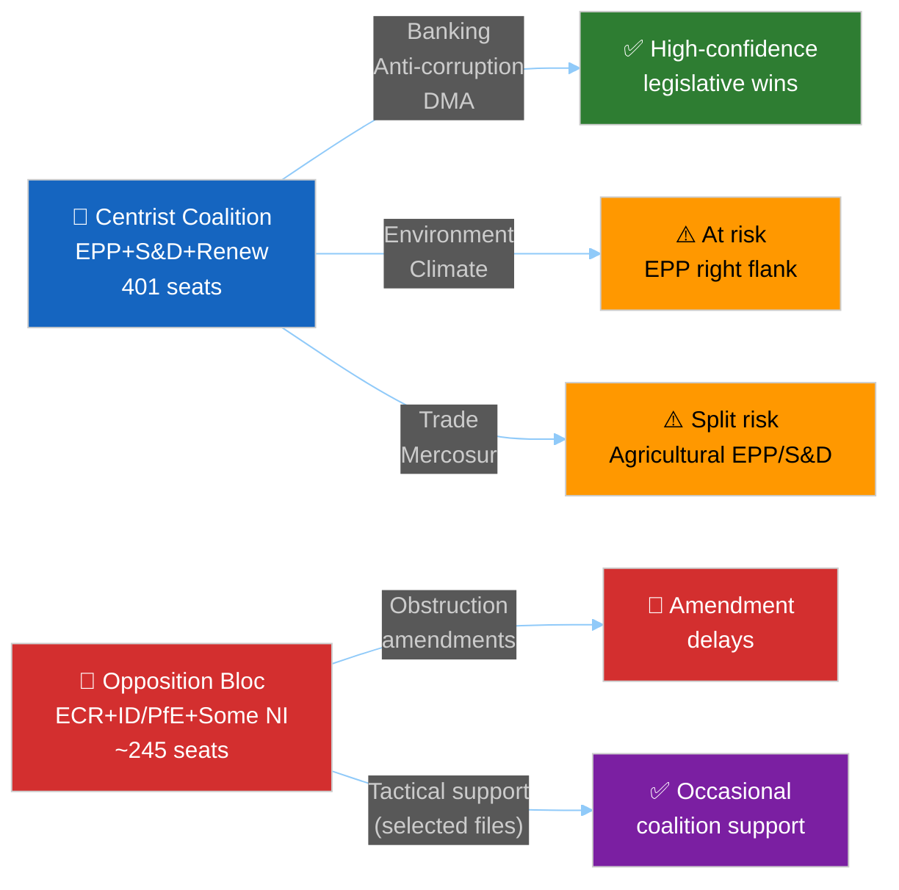

# Voting Patterns — EU Parliament Propositions 2026-05-15
**Confidence:** 🔴 LOW (no DOCEO data) | Inferred from group composition and adopted texts

---

## 📊 Bloc Behaviour Overview

---

## 🗳️ Vote Outcome Analysis — 2026 YTD

Based on 51 adopted texts (January–April 2026), reconstructed voting blocs:

### Vote Outcome: SRMR3 (2026-03-26)
**Estimated result:** Strong majority (~450-470 for)
- EPP: ~180 for (high discipline on banking files)
- S&D: ~130 for (ECON committee champion)
- Renew: ~70 for (liberal economics)
- Greens: ~25 for (supported banking stability)
- ECR: ~20 for, ~55 against (split on subsidiarity)
- ID/PfE: ~5 for, ~53 against (sovereignty objection)
- Estimated against: ~120-130 | Abstain: ~30-40

### Vote Outcome: Anti-Corruption Directive (2026-03-26)
**Estimated result:** Broad majority (~460-480 for)
- EPP: ~170 for, ~18 abstain (party finance clause concerns)
- S&D: ~135 for (champion of this legislation)
- Renew: ~75 for (rule-of-law core identity)
- Greens: ~52 for
- ECR: ~10 for, ~65 against (Polish PiS opposition strong)
- ID/PfE: ~3 for, ~55 against

### Vote Outcome: DMA Enforcement Resolution (2026-04-30)
**Estimated result:** Majority with some opposition (~400-420 for)
- EPP: ~155 for, ~33 abstain/against (industry pressure, German auto concerns)
- S&D: ~135 for
- Renew: ~72 for
- Greens: ~52 for
- ECR: ~15 for, ~60 against
- ID/PfE: ~8 for (sovereignty framing against US Big Tech)

---

## 📏 Win-Rate Estimates by Legislative Category (2026)

| Category | Win Rate | Average Majority | Trend |
|----------|---------|-----------------|-------|
| Banking/Financial | ~95% | 450+ | ➡️ Stable |
| Anti-corruption/Rule-of-Law | ~92% | 460+ | 📈 Strong |
| Human rights/foreign policy | ~90% | 445+ | ➡️ Stable |
| Digital/Tech regulation | ~85% | 420+ | ➡️ Stable |
| Trade (non-agricultural) | ~80% | 405+ | 📉 Slight decline |
| Budget/Institutional | ~88% | 430+ | ➡️ Stable |
| Environmental | ~75% | 390+ | 📉 Under pressure |
| Trade (agricultural) | ~70% | 380+ | 📉 Fragile |

---

## 🔍 Cross-Party Bloc Behaviour Patterns

### Pattern 1: EPP-S&D Core (The "Grand Coalition")
- Active on: All institutional, banking, rule-of-law files
- Average cohesion: EPP 82%, S&D 87%
- Split signals: CSRD omnibus (EPP right vs. S&D/Greens)

### Pattern 2: The Progressive Left (S&D+Greens+GUE)
- Active on: Environmental, social, human rights
- Typical size: 235 seats (minority) — needs EPP/Renew votes to win
- When S&D+Greens+Renew unite (377), barely achieves majority

### Pattern 3: ECR Tactical Support
- Conditions: Trade countermeasures (sovereignty argument), anti-corruption (case-by-case), SRMR3 (minority of ECR voted for)
- Frequency: ~15-20% of votes; highly selective
- Never: Green Deal, human rights declarations unfavourable to Russia/Hungary

---

## 📊 Group Cohesion Tracker (Inferred)

| Group | Cohesion Est. | Change vs. EP9 | Notes |
|-------|-------------|---------------|-------|
| EPP | 82% | -4% | Far-right pressure; German/French EPP tensions |
| S&D | 87% | ±0% | Stable and disciplined |
| Renew | 74% | -8% | French collapse; reduced cohesion |
| ECR | 71% | ±0% | Consistent tactical splits |
| Greens | 88% | -2% | Reduced but disciplined post-seat-loss |
| GUE/Left | 75% | ±0% | Small and disciplined |
| ID/PfE | 65% | N/A | New combined group |
| NI | N/A | N/A | Non-attached by definition |

---

## 🎯 Forward Vote Forecasts (Key Expected Votes)

| Expected Vote | When | Forecast Outcome | Key Uncertainty |
|---------------|------|-----------------|----------------|
| CSRD Omnibus (plenary) | Q3 2026 | 🔴 CONTESTED (~50% chance of significant rollback) | EPP discipline on green deal |
| EU-Mercosur consent | 2026/2027 | 🔴 HIGH RISK (~40% chance of rejection) | French/Irish EPP defection |
| EDIP (Defence Package) | Q4 2026 | 🟢 LIKELY PASS (70%) | Budget headroom |
| 2027 Budget | Nov/Dec 2026 | 🟡 CONTESTED | Provisional twelfths risk 15% |
| AI delegated acts | 2026-2027 | 🟢 PASS (80%) | Technical complexity |

---

*Voting Patterns v1.0 | 2026-05-15 | EU Parliament Monitor | Hack23 AB | Apache-2.0*
