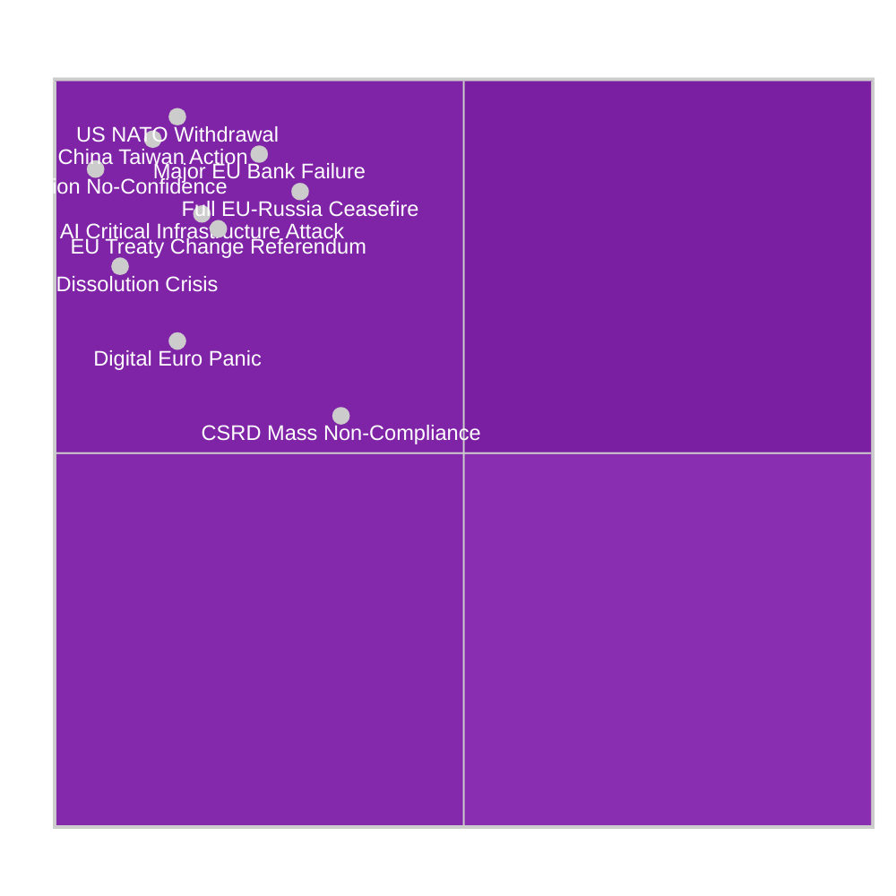

# Wildcards and Black Swans — EU Parliament Propositions 2026-05-15
**Framework:** Low-Probability / High-Impact Watchlist | **Horizon:** 6-18 months
**Probability threshold:** < 10% | **Impact threshold:** HIGH to CRITICAL
**Confidence:** 🟡 MEDIUM

---

## 🎲 Overview

Black swan events for the EU Parliament's legislative agenda are scenarios that are institutionally unmodelled — not in the Commission Work Programme, not in parliamentary budgets, not in OECD/IMF forecasts — but that would fundamentally redirect the legislative propositions pipeline.

---

## 🌊 Black Swan 1: US Withdrawal from NATO (Probability: 3-5%, Impact: CRITICAL)

### Scenario Description
The Trump administration announces conditional or unconditional withdrawal from NATO, fundamentally altering the EU's security architecture and legislative agenda.

### Legislative Impact Chain
1. **Immediate:** Emergency EDIP (European Defence Industry Programme) on fast track — from consultation to plenary in 60 days under urgent procedure
2. **Week 1-4:** EP extraordinary session on European Defence Fund expansion
3. **Month 1-3:** European defence bonds proposal (EP own initiative report)
4. **Month 3-12:** MFF revision to create defence sub-heading beyond current limits
5. **Year 2+:** Permanent European defence treaty modifications

### Trigger Conditions
- Trump campaign speech announcing withdrawal date
- US Congressional resolution limiting NATO commitment
- NATO summit communiqué without US Article 5 reaffirmation

### Current Distance from Trigger: 🟡 MEDIUM-FAR
Intelligence assessment: Trump has threatened NATO withdrawal but has not acted. Key vote in US Congress on NATO commitment would be the leading indicator. 🟡 MEDIUM confidence.

---

## 🏦 Black Swan 2: Major EU Bank Failure (Probability: 7-8%, Impact: CRITICAL)

### Scenario Description
A systemically important Euro Area bank (likely from the German Landesbanken sector, Italian sovereign-debt-exposed banks, or a Nordic real estate bank) requires emergency resolution under SRMR3.

### Legislative Impact Chain
1. **Hour 0-72:** ECB/SRB activate new SRMR3 early intervention framework (just adopted!)
2. **Day 1-7:** EP ECON committee extraordinary hearing; EP co-chairs briefed
3. **Week 1-4:** Emergency use of Single Resolution Fund — first major test of SRMR3
4. **Month 1-3:** Commission proposal for additional EU Deposit Insurance Scheme (EDIS) fast-tracked by crisis pressure
5. **Month 3-12:** MFF revision for banking backstop
6. **Year 1-2:** Capital Markets Union relaunch package

### Intelligence Significance
SRMR3 was adopted 26 March 2026 — less than 2 months before this analysis. If a banking failure occurs in 2026, it will be the first real-world test of the new framework. Success would validate the EP's legislative output; failure would trigger a major reform cycle.

**Trigger Conditions:**
- ECB SSM "failing or likely to fail" determination on a €50B+ assets bank
- Sudden reversal of bank's credit default swap spreads above 200bp
- Central bank emergency liquidity injection above €20B to single institution

---

## 🤖 Black Swan 3: Sovereign AI Model Failure / Cascade (Probability: 4-6%, Impact: HIGH)

### Scenario Description
A major generative AI model deployed by an EU institution or critical infrastructure operator causes a significant failure cascade — false legislative analysis, corrupted government processes, or deliberate manipulation of EU legislative procedures.

### Legislative Impact Chain
1. **Immediate:** AI Act enforcement emergency powers activated
2. **Month 1:** EP extraordinary session on AI governance review
3. **Month 1-3:** Commission delegated acts on AI safety requirements fast-tracked
4. **Month 3-6:** Potential revision of AI Act high-risk classification list
5. **Month 6-12:** EU AI liability framework (under development) accelerated

### Trigger Conditions
- EU institution AI system produces material false output used in legislative decision
- AI-generated disinformation campaign affects EP plenary vote with measurable impact
- Critical infrastructure failure attributed to AI model malfunction

---

## 🗳️ Black Swan 4: EP Constitutional Crisis / Dissolution (Probability: 2-3%, Impact: CRITICAL)

### Scenario Description
A constitutional crisis forces EP elections ahead of schedule, pausing or invalidating the current legislative agenda. Most plausible triggers: EP-Commission deep conflict, Article 7 actions escalating to expulsion votes, or treaty interpretation crisis.

### Scenario Pathways
**Path A (Most likely):** EP passes no-confidence motion against Commission (requires absolute majority — 376 votes). Requires EPP+S&D+ECR alignment against Renew+Greens opposition. Probability: ~2%.

**Path B:** Article 7 vote on Hungary reaches formal suspension, Hungary threatens to leave EU, triggering constitutional uncertainty. Probability: ~1%.

**Path C:** EP and Council deadlock on MFF revision to such an extent that EP refuses to adopt 2027 budget, forcing provisional twelfths and institutional crisis. Probability: ~5%.

### Legislative Impact
- All pending legislation frozen during constitutional resolution
- New elections would reset committee chairmanships and rapporteurships
- Pending trilogue negotiations abandoned; new Parliament must restart

---

## 📡 Black Swan 5: China-Taiwan Military Action (Probability: 5-8%, Impact: CRITICAL)

### Scenario Description
Chinese military action against Taiwan triggers a global supply chain crisis that forces the EU to legislate emergency industrial measures.

### Legislative Impact Chain
1. **Immediate:** Critical Raw Materials Act emergency measures (advanced semiconductor inputs)
2. **Month 1-3:** EU Industrial Emergency Framework proposal
3. **Month 3-6:** CHIPS Act revision; EU Sovereignty Fund fast-tracked
4. **Month 6-12:** Trade diversification from China — legislative package
5. **Year 1-2:** EU Defence and Strategic Autonomy Treaty revision

### EU Legislative Vulnerability Assessment
- 85% of advanced semiconductors for EU use pass through Taiwan
- EU auto industry (TSMC relationship with Intel/Infineon)
- Medical devices semiconductor supply chain
- This is the highest-impact black swan for EU industrial policy

---

## 🌐 Black Swan 6: Full EU-Russia Peace Agreement (Probability: 5-7%, Impact: HIGH)

### Scenario Description
A ceasefire or peace agreement between Russia and Ukraine creates a "peace dividend" discussion that redirects EU legislative priorities away from defence and toward Ukraine reconstruction, normalisation with Russia, and energy re-engagement debates.

### Legislative Impact Chain
1. **Immediate:** Ukraine Reconstruction Fund legislation
2. **Month 1-6:** Review of Russia sanctions regime legislative procedure
3. **Month 6-12:** Energy infrastructure re-engagement (contested)
4. **Year 1-2:** Western Balkans and Eastern Partnership EU accession acceleration
5. **Year 2-5:** Migration flow normalisation (Ukrainian refugees returning)

### Intelligence Note
A genuine peace agreement would be highly contested in the EP. ECR (especially Polish MEPs) would push for strict sanctions maintenance. S&D and Renew would split on reconstruction conditionality. This is a scenario where the EP's normal coalition dynamics would be scrambled significantly.

---

## 🔋 Black Swan 7: European Digital Infrastructure Attack (Probability: 4-6%, Impact: HIGH)

### Scenario Description
A state-attributed cyberattack on EU or Member State critical digital infrastructure (power grids, financial systems, EP IT systems) triggers emergency legislative response.

### Legislative Relevance
The NIS2 Directive (in force 2022-2024 transposition) and CER Directive provide the current framework. A major attack would reveal transposition gaps and trigger:
- Emergency NIS2 amendment under urgent procedure
- Cybersecurity crisis management legislation
- Digital Euro security provisions fast-tracked

---

## 📊 Wildcard Monitoring Checklist

| Black Swan | Lead Indicator | Check Frequency | Current Status |
|-----------|---------------|----------------|---------------|
| US NATO withdrawal | US Congressional vote | Weekly | 🟢 No imminent action |
| EU Bank failure | ECB SSM warnings | Daily | 🟢 No alerts |
| AI cascade failure | Incident reports | Weekly | 🟢 No major incidents |
| EP Constitutional crisis | EP-Commission vote | Monthly | 🟢 No signs |
| China-Taiwan action | Taiwan Strait incidents | Daily | 🟡 Elevated tension |
| EU-Russia peace | Ceasefire talks progress | Daily | 🟡 Intermittent contacts |
| Digital infrastructure attack | CERT-EU alerts | Daily | 🟡 Elevated baseline |

---

## 🎯 Black Swan Preparedness Assessment

**Highest residual risk:** China-Taiwan action and EU bank failure carry the highest combination of probability and institutional unpreparedness for the EP legislative system.

**Best-prepared scenario:** Banking crisis — SRMR3 adopted 26 March 2026, ECON committee has continuous expertise, ECB-SRB coordination protocols in place.

**Least prepared scenario:** US NATO withdrawal — EP has no treaty mechanism to respond to collective defence dissolution; would require expedited Treaty of Lisbon revision or new treaty.

---

*Wildcards and Black Swans v1.0 | 2026-05-15 | EU Parliament Monitor | Hack23 AB | Apache-2.0*
