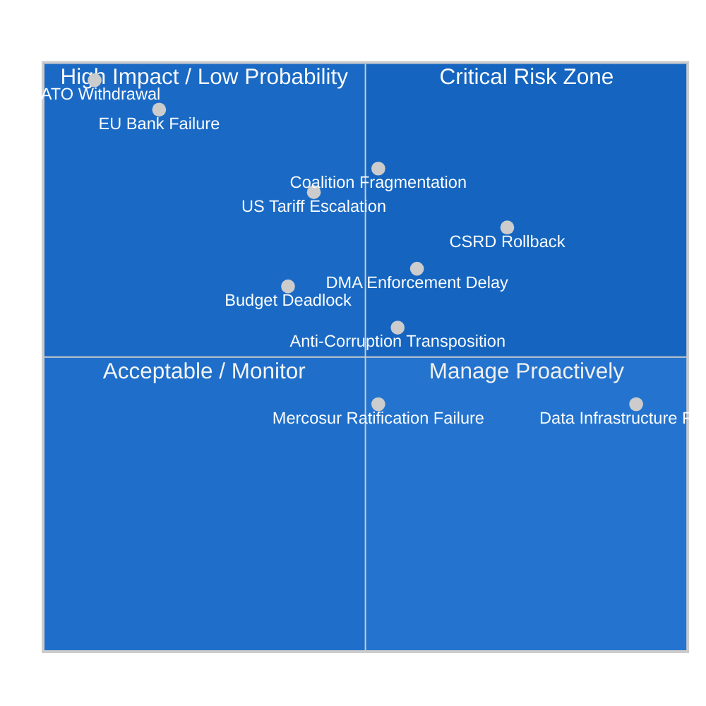

# Risk Matrix — EU Parliament Legislative Propositions 2026-05-15
**Framework:** 5×5 Likelihood × Impact | **Min risks:** ≥5 named | **Date:** 2026-05-15

---

## 📊 5×5 Risk Matrix

---

## 🎯 Named Risk Register

### Risk 1: CSRD Omnibus Regulatory Rollback
**Likelihood:** 4/5 (HIGH) | **Impact:** 4/5 (HIGH) | **Score:** 16/25 🔴

**Description:** The Commission's omnibus simplification package substantially weakens the Corporate Sustainability Reporting Directive, reducing the number of companies required to report from ~50,000 to ~20,000. EPP and Renew support the weakening; S&D and Greens oppose.

**Drivers:**
- Corporate lobbying (BusinessEurope) has successfully shifted Commission position
- EPP under pressure from German industry to reduce compliance burdens
- ECR and ID will vote for any weakening, ensuring passage with split centrists

**Monitoring Triggers:**
- JURI/ENVI committee vote on CSRD omnibus (expected June 2026)
- EPP group position paper publication
- S&D red-line statement on minimum acceptable CSRD scope

**Mitigation:**
- S&D credibly threatens to withdraw coalition cooperation on other files if CSRD gutted below threshold of ~35,000 companies
- MEP advocacy campaign by NGOs and sustainability networks
- Environmental lawyers filing legal challenges to simplification measure

---

### Risk 2: Coalition Fragmentation on Multiple Files
**Likelihood:** 3/5 (MEDIUM) | **Impact:** 5/5 (CRITICAL) | **Score:** 15/25 🔴

**Description:** Renew Europe's reduced seat count (77 vs 102 in 2024) means any 10-15 defectors on a key vote forces EPP to seek ECR support, shifting legislative content rightward. If this happens on 2+ consecutive files, it becomes the new normal.

**Drivers:**
- French political instability continues to fracture French Renew delegation
- German CDU/Merz government pressures German EPP members on industrial policy
- CSRD rollback creates Greens-S&D vs. EPP-Renew split that could cascade

**Monitoring Triggers:**
- Renew MEPs publicly opposing EPP position in media
- EPP-ECR informal working dinner (leaked to press)
- 3 consecutive plenary votes requiring ECR support

---

### Risk 3: US Full Tariff Escalation (Automotive Sector)
**Likelihood:** 3/5 (MEDIUM) | **Impact:** 4/5 (HIGH) | **Score:** 12/25 🟠

**Description:** Trump USTR announces 25%+ tariffs on EU automotive exports, triggering a GDP shock to Germany, Czech Republic, and Slovak Republic industrial regions. EP forced into emergency legislative mode.

**Economic Impact (IMF estimate):** -0.6% to -1.2% German GDP; -0.3% Euro Area GDP

**Monitoring Triggers:**
- USTR Section 232 announcement for EU autos
- G7 summit communiqué lacking US-EU trade consensus
- EU automotive production index declining >5% YoY

---

### Risk 4: DMA Enforcement Procedural Delays
**Likelihood:** 4/5 (HIGH) | **Impact:** 3/5 (MEDIUM) | **Score:** 12/25 🟠

**Description:** Apple and Meta legal challenges against DMA designation decisions delay substantive enforcement by 18-24 months through EU General Court proceedings. This undermines the Parliament's enforcement resolution and creates a legislative credibility gap.

**Drivers:**
- Apple has deep pockets for litigation and strong Brussels legal team
- EU General Court can grant interim relief suspending DMA measures
- Commission may pursue compliance rather than confrontation to avoid appeals

---

### Risk 5: EU Banking Sector Stress Event
**Likelihood:** 2/5 (LOW) | **Impact:** 5/5 (CRITICAL) | **Score:** 10/25 🟠

**Description:** A systemically important Euro Area bank enters distress, testing the newly adopted SRMR3 framework for the first time in a live event. The outcome depends on whether the new rules are properly operationalised.

**Most Vulnerable Institutions:**
- German Landesbanken with CRE exposure
- Italian banks with sovereign bond concentration
- Nordic banks with inflated housing market exposure

**EP Legislative Response Readiness:**
- ECON committee should hold pre-positioned working group on SRMR3 implementation monitoring
- BUDG committee should scenario-plan emergency MFF revision triggers

---

### Risk 6: EP Data Infrastructure Failure (Ongoing)
**Likelihood:** 5/5 (CERTAIN, ongoing) | **Impact:** 2/5 (MEDIUM) | **Score:** 10/25 🟡

**Description:** The EP Open Data Portal procedures feed, committee documents feed, and external documents feed are non-functional, returning degraded or empty data. This is an active ongoing risk that affects analytical transparency and EP accountability.

**Impact:**
- Legislative pipeline intelligence is blind: cannot track which procedures are in which stage
- Civil society monitoring of EP work is degraded
- This analysis operates at materially reduced quality due to this failure

---

### Risk 7: CSRD Transposition Failure in Key Member States
**Likelihood:** 3/5 (MEDIUM) | **Impact:** 3/5 (MEDIUM) | **Score:** 9/25 🟡

**Description:** Even with the omnibus simplification, several Member States (Hungary, Poland, Italy) may miss transposition deadlines or transpose incompletely, requiring Commission infringement proceedings and EP intervention.

---

### Risk 8: 2027 Budget Trilogue Deadlock
**Likelihood:** 3/5 (MEDIUM) | **Impact:** 3/5 (MEDIUM) | **Score:** 9/25 🟡

**Description:** The EP's request for a 4.7% budget increase meets Council opposition determined to stay below inflation. If trilogue extends beyond December 2026, provisional twelfths apply for the first time since 2021.

---

### Risk 9: EU-Mercosur Ratification Failure
**Likelihood:** 3/5 (MEDIUM) | **Impact:** 2/5 (MEDIUM) | **Score:** 6/25 🟡

**Description:** The agricultural lobby successfully defeats EU-Mercosur ratification in key Member States (France, Ireland) or EP committee, requiring the agreement to be renegotiated or abandoned.

---

### Risk 10: Anti-Corruption Directive Transposition Resistance
**Likelihood:** 4/5 (HIGH) | **Impact:** 3/5 (MEDIUM) | **Score:** 12/25 🟠

**Description:** Poland, Hungary, and Slovakia face domestic political obstacles to implementing the Anti-Corruption Directive, particularly the criminal sanctions harmonisation and private sector corruption provisions. Commission must use infringement proceedings.

---

## 📊 Risk Summary

| Risk | Score | Priority | Owner |
|------|-------|----------|-------|
| Coalition Fragmentation | 15/25 | 🔴 P1 | EPP/S&D Conference |
| CSRD Rollback | 16/25 | 🔴 P1 | JURI/ENVI Chairs |
| US Tariff Escalation | 12/25 | 🟠 P2 | INTA Committee |
| DMA Enforcement Delay | 12/25 | 🟠 P2 | IMCO Committee |
| Anti-Corruption Transposition | 12/25 | 🟠 P2 | JURI Committee |
| Banking Stress Event | 10/25 | 🟠 P2 | ECON Committee |
| Data Infrastructure | 10/25 | 🟡 P3 | EP IT Services |
| 2027 Budget Deadlock | 9/25 | 🟡 P3 | BUDG Committee |
| CSRD Transposition Failure | 9/25 | 🟡 P3 | Commission DG JUST |
| Mercosur Ratification Failure | 6/25 | 🟡 P4 | INTA Committee |

---

*Risk Matrix v1.0 | 2026-05-15 | EU Parliament Monitor | Hack23 AB | Apache-2.0*
