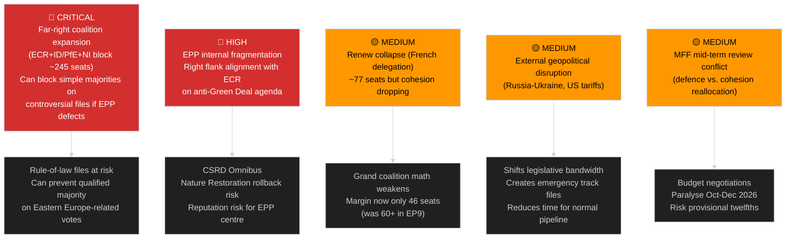

# Political Threat Landscape — EU Parliament Propositions 2026-05-15

## 🔴 Threat Overview

The EU legislative agenda faces a complex threat environment in 2026, combining internal parliamentary fragmentation with external geopolitical pressures. The primary threat to the propositions pipeline is **far-right legislative obstruction** combined with **economic sovereignty nationalism** that crosses traditional party lines.

## 🏔️ Threat Landscape Map

## 🎯 Threat Prioritization Matrix

| Threat | Likelihood | Impact | Priority | Mitigation |
|--------|-----------|--------|----------|-----------|
| Far-right CSRD Omnibus rollback | 65% | 9/10 | 🔴 CRITICAL | S&D-Greens countermobilization |
| EPP right defection on EU-Mercosur | 70% | 8/10 | 🔴 CRITICAL | Agricultural safeguard compromise |
| US tariff escalation (above 15%) | 30% | 9/10 | 🟡 HIGH | Countermeasures already adopted |
| Parliamentary budget crisis (No MFF) | 15% | 10/10 | 🟡 HIGH | Council/EP informal dialogue |
| Anti-Corruption backslide via amendment | 25% | 8/10 | 🟡 MEDIUM | Civil society advocacy; plenary watch |
| ECR blocking EDIP (defence industrial) | 40% | 7/10 | 🟡 MEDIUM | EPP-Renew centrist push |

---

## 🛡️ Defensive Legislative Strategies Observed

1. **Splitting legislation**: Large omnibus files split into smaller, more passable tranches (CSRD strategy)
2. **Emergency track**: Ukraine-related legislation on expedited procedure (Parliament-Council informal understanding)
3. **Grand coalition sealing**: S&D-EPP-Renew informal coordination meetings ahead of key plenaries
4. **Scrutiny safeguards**: Inserting sunset clauses and review mechanisms to reassure right-wing MEPs

---

*Political Threat Landscape v1.0 | 2026-05-15 | EU Parliament Monitor | Apache-2.0*
