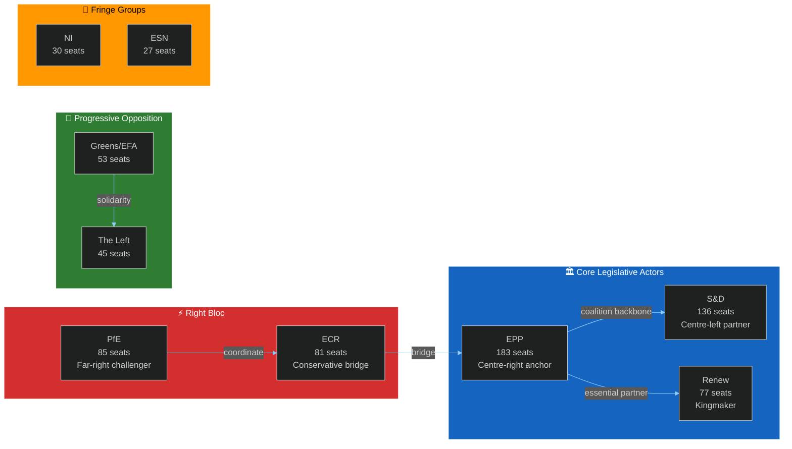

<!-- SPDX-FileCopyrightText: 2026 Hack23 AB -->
<!-- SPDX-License-Identifier: Apache-2.0 -->

# Actor Mapping — EP Week Ahead: 19–22 May 2026

**Date:** 2026-05-15 | **Article Type:** week-ahead | **Admiralty Grade:** B2

---

## 1. Actor Landscape Map

---

## 2. Actor Influence Assessment

| Actor | Influence Tier | Key Lever | Coalition Role |
|-------|--------------|-----------|----------------|
| EPP | Tier 1 — Highest | Agenda-setting; committee chairs | Anchor |
| S&D | Tier 1 — High | Social policy veto; labour rights | Partner |
| Renew | Tier 1 — Pivotal | Swing votes (kingmaker) | Kingmaker |
| PfE | Tier 2 — Challenger | Right-bloc narrative; amendment tactics | Opposition challenger |
| ECR | Tier 2 — Bridge | Economic-right votes; EPP bridge | Conditional ally |
| Greens/EFA | Tier 2 — Specialist | Environmental agenda | Progressive bloc |
| The Left | Tier 3 — Activist | Debate visibility; Rule 132 | Opposition |
| NI | Tier 3 — Marginal | Unpredictable; issue-by-issue | Wildcard |
| ESN | Tier 3 — Fringe | Marginal; nationalist narrative | Fringe |

---

## For Citizens

The European Parliament's 717 elected MEPs represent you from across all 27 EU member states. They're organized into 9 political families (groups) that work like parliamentary parties. This week's plenary sees these groups negotiate and vote on shared EU legislation. The most important dynamic: no single group has a majority, so your representatives MUST cooperate across national and ideological lines. This is what makes the European Parliament uniquely democratic.

---

## Data Sources & Provenance

| Source | Tool | Grade |
|--------|------|-------|
| Group composition | `generate_political_landscape` | A1 |
| Group seat counts | EP Open Data Portal — current MEP records | A1 |

**Generated:** 2026-05-15 | **Classification:** Public
