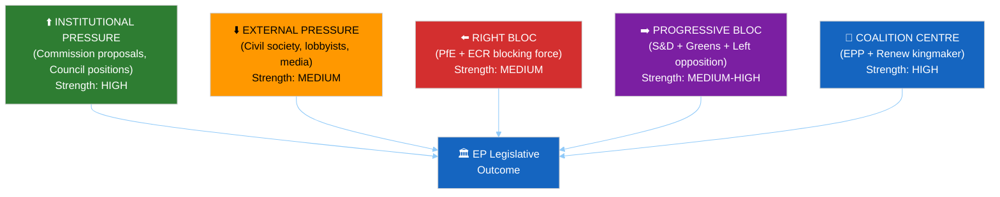

<!-- SPDX-FileCopyrightText: 2026 Hack23 AB -->
<!-- SPDX-License-Identifier: Apache-2.0 -->

# Forces Analysis — EP Week Ahead: 19–22 May 2026

**Date:** 2026-05-15 | **Article Type:** week-ahead | **Admiralty Grade:** B2

---

## 1. Five Forces Analysis (Parliamentary Context)

---

## 2. Force Assessments

**Force 1 — Institutional pressure (Commission + Council): STRONG**
Von der Leyen II Commission actively supports EPP agenda. Council Presidency (Poland, H1 2026) provides trilogue counterparty. Both institutions exert strong alignment pressure toward EPP-led majorities.

**Force 2 — Coalition centre (EPP + Renew): STRONG**
The centre-right to liberal spectrum (183 + 77 = 260 seats) forms the mathematical core. When S&D (136) joins, the grand coalition (396) dominates. This is the primary force determining most legislative outcomes.

**Force 3 — Right bloc challenge (PfE + ECR): MEDIUM**
166 seats combined. Cannot form majority alone. Exerts rightward pressure on EPP through narrative competition and selective amendment tactics. Strength constrained by inability to include EPP in formal right-bloc coordination.

**Force 4 — Progressive bloc opposition (S&D + Greens + Left): MEDIUM-HIGH**
311 seats combined (S&D sometimes in grand coalition, sometimes in progressive bloc). Effective as blocking force on specific issues when mobilized; insufficient for independent majorities.

**Force 5 — External pressure (civil society, lobbying): MEDIUM**
BusinessEurope, ETUC, NGOs, and media shape the pre-vote political environment. Peaks Monday–Tuesday before vote sessions.

---

## For Citizens

Five forces shape what happens in your Parliament this week: institutional momentum (the Commission and Council pushing for agreement), the coalition centre (the EPP-Renew-S&D backbone that must hold), the right-bloc challenge (PfE and ECR testing coalition discipline), the progressive bloc (Greens and Left advocating for social and environmental priorities), and public pressure (civil society organizations and media bringing citizen voices to bear). When these forces align, legislation passes smoothly. When they conflict, you see political drama — and democracy doing its work.

---

**Generated:** 2026-05-15 | **Classification:** Public
