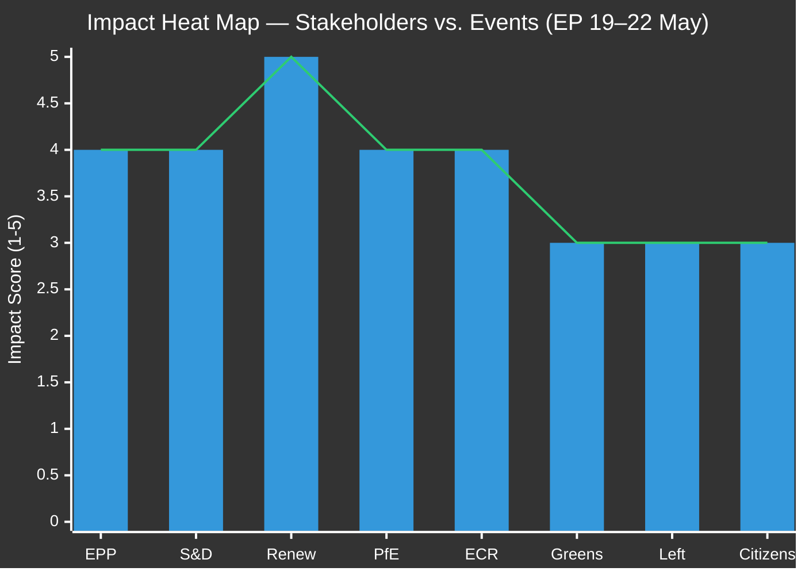

<!-- SPDX-FileCopyrightText: 2026 Hack23 AB -->
<!-- SPDX-License-Identifier: Apache-2.0 -->

# Impact Matrix — EP Week Ahead: 19–22 May 2026

**Date:** 2026-05-15 | **Article Type:** week-ahead | **Admiralty Grade:** B2

---

## Event List

The following key events are scheduled or anticipated for the week of 19–22 May 2026:

1. **E1 — Strasbourg Plenary Day 1 (19 May):** 11 debates + 10 votes; full legislative day
2. **E2 — Strasbourg Plenary Day 2 (20 May):** 13 debates + 8 votes; heaviest debate schedule
3. **E3 — Strasbourg Plenary Day 3 (21 May):** 5 debates + 6 votes + 3 meeting parts
4. **E4 — Strasbourg Plenary Day 4 (22 May):** Final votes, session close
5. **E5 — OJ Publication (expected 16–17 May):** Official Journal releases full agenda
6. **E6 — Coalition discipline signals (19 May AM):** Group leadership press releases
7. **E7 — Potential Rule 132 urgency motion (19 May):** External event trigger possible
8. **E8 — Vote outcomes broadcast (real-time):** EP vote result publication

---

## Stakeholder Impact Analysis

| Stakeholder | E1-E4 (Plenary votes) | E5 (OJ Publication) | E7 (Urgency motion) |
|-------------|----------------------|---------------------|---------------------|
| EPP | HIGH — Agenda leadership tested | HIGH — Confirms priorities | MEDIUM — Joint statement |
| S&D | HIGH — Coalition management | HIGH — Amendment positioning | MEDIUM — May lead resolution |
| Renew | VERY HIGH — Swing votes | HIGH — Pre-vote signaling | LOW |
| PfE/ECR | HIGH — Right-bloc opportunity | HIGH — Counter-narrative launch | LOW |
| Greens/EFA | MEDIUM — Amendment filing | MEDIUM — Environmental items check | HIGH — Human rights motions |
| The Left | MEDIUM — Visibility in debates | MEDIUM | HIGH — Urgency resolutions |
| Citizens | MEDIUM — Affects legislation | LOW | LOW |
| Commission | MEDIUM — Institutional position | HIGH — Monitors vote outcomes | HIGH — Responds to resolutions |

---

## Impact Matrix

| Impact Level | Score | Criteria |
|-------------|-------|---------|
| CRITICAL | 5 | Defines legislative outcome for multiple files |
| HIGH | 4 | Materially affects vote results and coalition positioning |
| MEDIUM | 3 | Provides visibility; affects narrative but not outcomes |
| LOW | 2 | Limited direct consequence |
| MINIMAL | 1 | No material impact expected |

---

## Heat Map Analysis

**CRITICAL impact stakeholders:**
- **Renew Europe (5/5):** The mathematical kingmaker. On any contested vote within 40 seats of the threshold, Renew's 77 votes are determinative. No other group commands this asymmetric leverage.

**HIGH impact stakeholders:**
- **EPP (4/5):** Sets the agenda; leads whipping for centre-right majority
- **S&D (4/5):** Essential coalition partner; cannot be bypassed on most issues
- **PfE (4/5):** Right-bloc catalyst; determines whether right flank challenges emerge
- **ECR (4/5):** Bridging role between EPP and far-right; shapes amendment outcomes

**MEDIUM impact stakeholders:**
- **Greens/EFA (3/5):** Significant on environmental votes; marginal on economic and migration
- **The Left (3/5):** Activist role; influential in debate, rarely decisive in votes
- **Citizens (3/5):** Indirect beneficiaries of all legislative outcomes; direct democracy channel

---

## For Citizens — Plain Language Summary

**What this week means for you:**

This week's European Parliament session (19–22 May) will produce votes on EU legislation affecting your daily life. While we don't yet know the specific items (the full agenda is expected to be published Friday 16 May), here's what you need to know:

- **Your MEPs are working for you** in Strasbourg all week, Monday through Wednesday
- **Majorities require coalition-building** — no single party dominates; your elected representatives must negotiate
- **The swing votes are Renew Europe** — this liberal group of 77 MEPs will cast the decisive votes on any close outcome
- **You can follow along live** at europarl.europa.eu — watch the debates, track votes, find your MEP

**Why it matters:** Every vote this week is a step in creating or amending EU law that will apply in all 27 member states. Trade rules, digital rights, environmental standards, social protections — these come from the Parliament you elected in June 2024.

---

## Data Sources & Provenance

| Source | Tool | Reliability |
|--------|------|-------------|
| Session structure | `get_meeting_foreseen_activities` × 3 | B2 |
| Group composition | `generate_political_landscape` | A1 |
| Stability assessment | `early_warning_system` | B2 |
| Adopted texts context | `get_adopted_texts_feed` | A1 |

**Generated:** 2026-05-15 | **Classification:** Public
