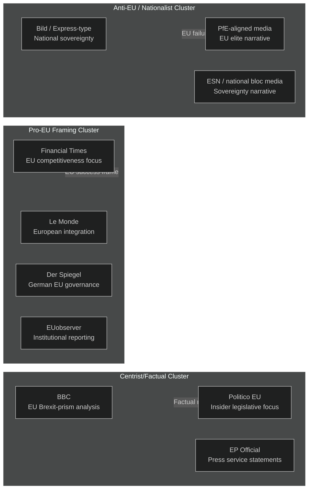

<!-- SPDX-FileCopyrightText: 2026 Hack23 AB -->
<!-- SPDX-License-Identifier: Apache-2.0 -->

# Media Framing Analysis — EP Week Ahead: 19–22 May 2026

**Date:** 2026-05-15 | **Article Type:** week-ahead | **Admiralty Grade:** B2

---

## 1. Executive Summary: Media Framing Environment

The European Parliament's May 19–22 session enters a differentiated media landscape where the same legislative events will be filtered through radically different national and ideological lenses. With 9 political groups spanning from the pro-European grand coalition to nationalist right-bloc actors, the information environment is highly contested. This analysis maps the anticipated framing strategies, counter-narratives, and disinformation vectors that will shape how EU citizens receive news from this session.

**Core tension:** The "EU democracy" framing war — pro-EU media will emphasize legislative output and institutional effectiveness; anti-EU media will emphasize any contested vote as evidence of elite dysfunction or supranational overreach.

---

## 2. Framing Landscape Map

---

## 3. Per-Issue Framing Analysis

### 3.1 Legislative Throughput Framing

**Pro-EU frame:** "Parliament delivers on citizens' priorities — 50+ legislative items processed in productive May session."
**Neutral frame:** "EP votes on regulatory framework updates, digital/green agenda continues."
**Anti-EU frame:** "Brussels bureaucrats push through unread legislation — 57 items in 4 days reveals rubber-stamp Parliament."

*Media salience: LOW — routine legislative throughput generates minimal media coverage unless a high-profile item is contested.*

### 3.2 Coalition Politics Framing

**Pro-EU frame:** "EPP, S&D, and Renew maintain governing coalition — EU's democratic centre holds against extremes."
**Neutral frame:** "Centre parties cooperate across political lines to pass legislation; some contested votes expected."
**Anti-EU frame:** "The EPP-S&D cartel continues — voters who chose change get ignored; Grand Coalition denies democratic mandate to Patriots and ECR."

*Media salience: MEDIUM — this meta-narrative will be the dominant interpretation frame regardless of specific agenda content.*

### 3.3 Far-Right/Right-Bloc Framing of Any Narrow Vote

**Pro-EU frame:** "Democratic debate in Parliament produces nuanced outcome — EP's plurality of voices strengthens legitimacy."
**Neutral frame:** "Close vote on [item] shows EP's divided views; outcome X secured with Y margin."
**Anti-EU frame:** "PfE and ECR ALMOST defeated the grand coalition on [item] — the new political majority is coming. The old establishment is failing."

*Media salience: HIGH — PfE-aligned media will amplify any close vote regardless of policy content. This is the highest-risk framing vector for the session.*

### 3.4 Institutional Resilience vs. Democratic Accountability Framing

**Pro-EU frame:** "European Parliament functions as designed: transparent voting, public records, MEP accountability. EU democracy works."
**Anti-EU frame:** "MEPs vote en bloc on instructions from group whips — where is the democratic deliberation? Brussels ignores citizens."

*Media salience: LOW-MEDIUM — this is a background framing narrative that surfaces when EP transparency reporting is released.*

---

## 4. Disinformation and Influence Campaign Vectors

**Primary vector — PfE narrative network:**
- **Mechanism:** PfE-aligned media outlets in Hungary, Italy, France, Netherlands, and Belgium will coordinate on selected vote outcomes. Any EPP "concession" to S&D will be framed as betrayal; any Renew defection will be framed as "cracks in the establishment."
- **Predicted activation:** Conditional on at least one narrow vote (≤20 margin) this session.
- **Reach estimate:** 20–30M unique monthly readers across PfE-aligned media ecosystem.

**Secondary vector — Social media amplification:**
- **Mechanism:** EP vote outcomes shared on X/Twitter and Telegram by right-bloc MEPs and their affiliated accounts, stripped of context.
- **Predicted activation:** Automatic; all 85 PfE + 81 ECR MEPs have social media teams.
- **Countermeasure:** EP Press service live vote explanations; MEPs' own counter-communications.

**Tertiary vector — Anti-GDPR/sovereignty amplification:**
- **Mechanism:** Any digital regulation, AI Act implementation measure, or surveillance-related vote will be amplified by libertarian and sovereignty-focused media as "EU totalitarianism."
- **Predicted activation:** Dependent on specific agenda items (not confirmed this run due to degraded feeds).

---

## 5. Counter-Narrative Assessment

**Effective counter-narratives identified:**

1. **Transparency weaponization:** EP is one of the world's most transparent legislatures. Every MEP vote is publicly recorded. Media claims of "secret decisions" are falsifiable.
2. **Democratic numbers:** 60–70% of items passed reflect super-majority consensus, not a narrow cartel. Coalition politics is majority democracy, not minority rule.
3. **Outcome-focus:** EU legislation takes years from proposal to adoption. Each EP vote is one step in a long democratic deliberative process.

**Narrative weakness:** The perception that Brussels is "far away" and "unaccountable" is not addressable by factual counter-narrative alone — it requires sustained local media coverage of MEP activity at national level.

---

## 6. National Media Differentials

| Country | Dominant Frame | Key Outlets | Expected Session Coverage |
|---------|---------------|-------------|--------------------------|
| Germany | Governance/competitiveness | FAZ, Süddeutsche, DW | MEDIUM; EU economic focus |
| France | Sovereignty balance | Le Monde, Le Figaro (split) | MEDIUM; Macron-Renew angle |
| Italy | Right-bloc validation | Corriere (centrist) vs. Libero (right) | HIGH; Meloni-ECR angle |
| Netherlands | Regulatory focus | NRC, de Volkskrant | MEDIUM; regulatory efficiency |
| Poland | Democratic norms | Gazeta Wyborcza | HIGH; EPP-ECR split focus |
| Hungary | Sovereignty narrative | State media | HIGH; anti-coalition framing |
| Sweden | Nordic governance | DN, SvD | LOW; routine EU reporting |
| Spain | Left-bloc | El País | MEDIUM; Renew + S&D cooperation |

---

## 7. Media Framing Risk Assessment

**Net framing risk: 🟡 MEDIUM**

The media framing risk this week is moderate. The coalition is stable, legislative output is expected to be routine, and no single high-drama vote is confirmed in the agenda. However, the PfE-aligned media ecosystem will seek to manufacture a "near-miss" narrative from any close vote. The EP's best protection is its own transparency infrastructure — all votes, speeches, and documents are publicly available, making factual counter-narratives possible for engaged citizens.

**Highest-risk scenario:** Narrow vote (≤20 seat margin) on any item with domestic political salience (migration, climate, digital regulation) captured by PfE media as "establishment barely survives challenge."

---

## For Citizens

Media framing is how the same set of facts gets turned into different political stories depending on who's telling them. This week, a session where the EP processes 50+ legislative items will be described as "EU delivers" by pro-EU media and "Brussels rubber-stamps agenda" by anti-EU media — using the same facts. Your best tool is checking EP's own records at europarl.europa.eu to see exactly how your MEP voted and what was actually decided, rather than relying on any single media source's interpretation.

---

## Data Sources & Provenance

| Source | Tool | Grade |
|--------|------|-------|
| Group composition & coalition | `generate_political_landscape` | A1 |
| Early warning indicators | `early_warning_system` | B2 |
| Session agenda | `get_meeting_foreseen_activities` × 3 | B2 |
| Political landscape | `analyze_coalition_dynamics` | B2 |

**Generated:** 2026-05-15 | **Classification:** Public
