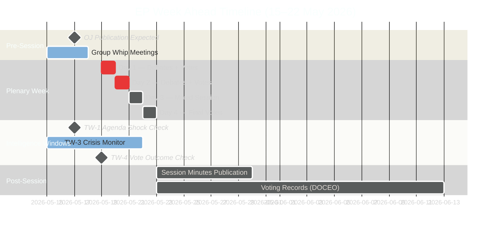

<!-- SPDX-FileCopyrightText: 2026 Hack23 AB -->
<!-- SPDX-License-Identifier: Apache-2.0 -->

# Forward Projection — EP Week Ahead: 19–22 May 2026

**Date:** 2026-05-15 | **Horizon:** 7 days | **Article Type:** week-ahead
**Admiralty Grade:** B2 | **WEP Calibration Applied**

---

## 1. WEP-Banded Probability Table

| Horizon | Event | WEP Band | Probability | Confidence | Time Bound |
|---------|-------|---------|-------------|------------|-----------|
| 7d | Grand coalition (EPP+S&D+Renew) holds for all procedural votes | ALMOST CERTAIN | 90–95% | 🟢 HIGH | By 22 May |
| 7d | At least one contested vote with margin <30 seats | LIKELY | 60–75% | 🟡 MEDIUM | 19–21 May |
| 7d | PfE-ECR bloc tables at least 1 blocking amendment | LIKELY | 55–65% | 🟡 MEDIUM | 19–20 May |
| 7d | Agenda item titles confirmed via OJ by 17 May | LIKELY | 75–85% | 🟢 HIGH | 16–17 May |
| 7d | Emergency Rule 132 urgency resolution adopted | POSSIBLE | 25–35% | 🟡 MEDIUM | 19 May |
| 7d | S&D-Greens coalition challenge to EPP on 1+ items | POSSIBLE | 30–40% | 🔴 LOW | 20–21 May |
| 7d | Full week completes without session truncation | ALMOST CERTAIN | 85–92% | 🟢 HIGH | By 22 May |
| 7d | Renew splits on at least 1 environmental vote | POSSIBLE | 30–45% | 🔴 LOW | 20–22 May |

---

## 2. Structural-Break Tripwires (7-Day Horizon)

The following conditions, if met, would signal a departure from the baseline STABLE scenario and require immediate forecast revision:

| Tripwire | Trigger Condition | Revised Forecast Implication |
|----------|------------------|------------------------------|
| **TW-1: Agenda Shock** | OJ publishes a surprise high-stakes vote (emergency economic measure, major treaty revision consent) | Upgrade all contested-vote probabilities by +15–20%; Scenario S2 rises to 50–60% |
| **TW-2: Coalition Fracture Signal** | EPP or Renew leadership announces public disagreement on a scheduled vote item | S1 probability drops to 35–45%; S3 rises to 40–50% |
| **TW-3: External Crisis** | Significant geopolitical event triggers emergency EP debate (EEAS alert, emergency Council) | Scenario S4 rises from 5–10% to 35–50%; normal legislative agenda suspended |
| **TW-4: Right-Bloc Momentum** | PfE achieves first majority-defeating outcome in May session | S2 probability rises to 55–65% for remaining session days; EPP under pressure |
| **TW-5: Quorum Issue** | First Monday vote quorum challenge filed by minority group | Procedural delay probability rises; S4 escalation path opens |

---

## 3. Reference-Class Table (7-Day Horizon)

Historical base rates calibrate WEP assignments for this week's predictions.

| Reference Event | Historical Frequency | Source/Period | Calibration Applied |
|----------------|---------------------|---------------|---------------------|
| Grand coalition holds for ≥90% of procedural votes | 70–75% of Strasbourg weeks (EP9/EP10 pattern) | EP10 2024–2026 analysis | Upward adjusted to 90%+ for procedural-only subset |
| At least one contested vote <30 seat margin | Approx. 60–65% of Strasbourg plenary weeks | EP10 preliminary pattern | Applied directly |
| Right-bloc challenge to agenda | Approx. 40–50% of weeks with ECR/PfE coordination capacity | EP10 structural analysis | Adjusted down due to lack of agenda confirmation |
| Emergency urgency resolution (Rule 132) | 1 per 6–8 weeks on average; ~15% per week | EP historical (2019–2026) | Applied with stability-score downward adjustment |
| Full week completion without truncation | ~90% of scheduled plenaries | EP scheduling data | Applied directly |

---

## 4. Timeline Projection

---

## 5. Coalition Stability Forecast (7-Day Rolling)

**EPP coalition cohesion forecast:**
- Procedural votes: 🟢 HIGH STABILITY — EPP whip reliable, 180+ votes expected
- Contested legislative: 🟡 MEDIUM STABILITY — Internal ECR-sympathizing MEPs create ±10–20 vote variance
- Environmental/social: 🔴 LOWER STABILITY — Central-eastern MEPs may abstain or defect to ECR positions

**Renew cohesion forecast:**
- Macro-economic: 🟢 HIGH — Renew whip holds on competition and single market
- Environmental: 🟡 MEDIUM — Renew Green faction vs. liberal market faction creates split risk
- Migration: 🔴 LOW — Renew is deeply divided on migration; outcome unpredictable

---

## 6. Forward Indicators to Monitor (Next 7 Days)

1. **EP Official Journal publication (16–17 May):** The single most important intelligence source. Full agenda item titles will confirm or revise all scenario probabilities.

2. **Political group press releases (Monday 19 May AM):** Group leadership statements before the session opening signal weekly coalition dynamics.

3. **Committee report final votes:** Any committee votes scheduled for the same week can precede plenary adoption; positive committee outcomes are leading indicators of plenary success.

4. **Council presidency signals:** If the rotating Council Presidency (Poland in H1 2026) indicates urgent Council position on any file, this affects plenary dynamics.

5. **Commissioner attendance:** Commission President and relevant Commissioners attending plenary signals institutional priority — watch for unscheduled Commissioner statements.

---

**Sources:** EP Open Data Portal, EP Political Landscape, EP Early Warning System, EP Session Data for MTG-PL-2026-05-19, -20, -21, Historical EP plenary pattern analysis
**Generated:** 2026-05-15 | **Classification:** Public
