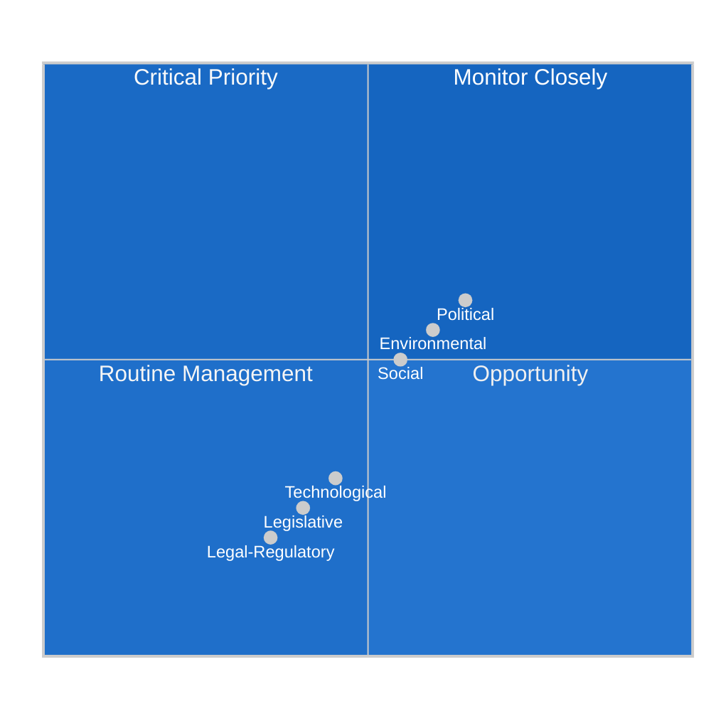

<!-- SPDX-FileCopyrightText: 2026 Hack23 AB -->
<!-- SPDX-License-Identifier: Apache-2.0 -->

# PESTLE Analysis — EP Week Ahead: 19–22 May 2026

**Date:** 2026-05-15 | **Horizon:** 7 days | **Article Type:** week-ahead
**Admiralty Grade:** B2 | **WEP:** LIKELY stable operating environment for this plenary week

---

## Political (P)

### Current Political Configuration
The European Parliament in its 10th term operates under a structurally fragmented multi-party system. Nine political groups span the full political spectrum from The Left (far-left, 45 seats) to ESN (hard-right nationalist, 27 seats). The EPP (183 seats, 25.5%) serves as the parliamentary anchor group but lacks majority-forming capacity alone.

**Political Risk Signals for May 19–22:**
- 🟢 HIGH CONFIDENCE: EPP-S&D grand coalition (319 seats) will hold on procedural matters
- 🟡 MEDIUM CONFIDENCE: Renew's 77 seats will be contested by both EPP-led and S&D-led approaches on any politically sensitive dossier
- 🔴 LOW CONFIDENCE: PfE-ECR right bloc (166 seats) may attempt minority vetoes on amendments, testing majority cohesion
- Early warning stability score: 84/100 — within the STABLE zone, no critical alerts

**Trend:** The EPP's structural dominance risk (identified by EP Early Warning System as HIGH severity) suggests growing tension between EPP agenda-setting capacity and multi-group coalition requirements. This is the defining political tension of EP10.

**Inter-group relations:** The S&D's strategic choice to maintain distance from PfE-ECR while cooperating with EPP defines the "cordon sanitaire" approach. This week's session will test whether this approach holds under any right-of-centre amendment pressure.

---

## Legislative-Institutional (L)

### Institutional Context
The EP operates in a period of heightened institutional confidence following the 2024 elections. Key institutional dynamics shaping this week's plenary:

**Parliamentary powers:** The EP exercised its co-decision role aggressively in EP9; EP10 shows continuity with strong amendment activism, particularly in ENVI, ECON, and INTA committees.

**Council-Parliament relations:** The Strasbourg session typically advances files where informal trilogue negotiations have produced compromise texts requiring formal EP endorsement. Given the procedural calendar, at least 3–5 votes this week may be final trilogue outcomes requiring an up/down majority vote.

**Commission relationship:** The von der Leyen Commission II (second term) maintains strong EPP alignment, providing institutional alignment on the centre-right agenda. This reduces floor risk for EPP-backed Commission proposals.

**Rule of Procedure considerations:** Under EP Rule 132, urgency motions may be introduced for Monday's session. As this analysis was conducted on a Friday (not Monday), the urgency motion sweep was not triggered.

---

## Social (S)

### Social Pressures on the Parliamentary Agenda
European civil society remains active on multiple fronts that intersect with the parliamentary calendar:

**Social cohesion:** Wage stagnation relative to corporate profits remains a wedge issue between S&D/Left/Greens (pushing for labour rights legislation) and EPP/Renew/ECR (emphasizing market flexibility).

**Migration:** The EU's post-Pact migration framework continues to generate political friction. Social integration outcomes vary significantly across member states. Any migration-related vote this week will activate the PfE-ECR bloc and test S&D + Greens coalition discipline.

**Digital rights:** Citizen concerns about AI Act implementation, platform algorithm transparency, and data rights continue to generate civil society pressure on the Parliament's IMCO and LIBE committees.

**Generational divide:** Younger voters increasingly prioritize climate action and digital rights; older cohorts focus on economic security. This generational cleavage maps imperfectly onto EP political group lines, creating complex coalition pressures.

---

## Technological (T)

### Technology Policy in the Legislative Pipeline
The EP is navigating the implementation phase of its major digital legislative achievements:

**AI Act (entered into force 2024):** Implementation timeline continues with the May 2026 period seeing increasing pressure from stakeholders on prohibited AI practices enforcement and general-purpose AI model obligations. Committee work on implementing acts may surface in plenary debates.

**Digital Services Act and Digital Markets Act:** Both are in active enforcement phases. Any plenary debate touching platform regulation will activate Renew (generally pro-implementation) against potential PfE-ECR deregulatory amendments.

**Chip Act and Industrial Policy:** Defence-industrial base and technology sovereignty debates continue. Cross-cutting coalition: EPP + Renew + ECR on strategic autonomy; S&D + Greens on social and environmental conditionality.

**Quantum and Space:** Longer-term technology sovereignty programmes moving through committee phases; unlikely to surface at plenary this week.

---

## Environmental (E)

### Green Deal Legislative Calendar
The Green Deal implementation has entered its most politically contested phase. Key environmental dimensions for this week:

**Nature Restoration Law:** Implementation monitoring. Member state progress reports are beginning to surface. Any EP oversight action would require S&D + Greens + Left + Renew majority (combined: 311 seats) — insufficient without EPP support.

**Fit for 55 implementation:** Detailed implementing measures continue across multiple legislative instruments. These are technically complex, generating many amendment votes that strain coalition discipline.

**Carbon Border Adjustment Mechanism:** CBAM operational implementation. Trade dimensions intersect with INTA committee work. Renew's position is pivotal on CBAM adjustment provisions.

**Just Transition Fund:** Disbursement oversight. S&D and Greens united on social and environmental conditionality; EPP and ECR focused on administrative simplification.

---

## Legal-Regulatory (R)

### Legal Framework for This Week's Activity
The EP operates under the Treaty on the Functioning of the European Union (TFEU) framework:

**Ordinary legislative procedure (OLP/codecision):** Most votes this week will be under OLP, requiring EP + Council agreement. The Parliament's formal plenary adoption is the final step after trilogue conclusion.

**Rule 132 resolutions:** Urgent resolutions on external events (human rights, international crises) may be introduced at Monday's session. These require a two-thirds majority for fast-track adoption. Coalition discipline is typically high on these "soft power" resolutions.

**Consent procedure:** EP consent on international agreements, EU treaty revisions, and certain institutional appointments. Simple majority of MEPs voting required (not absolute majority).

**Budget oversight:** Any votes touching EU budgetary matters trigger the EP's co-equal role with the Council under the Multiannual Financial Framework. EPP-S&D coalition critical for any budgetary consent.

**Fundamental Rights considerations:** LIBE committee oversight continues. Legal scrutiny of member state rule-of-law compliance remains on the political agenda for The Left, S&D, and Greens.

---

## Summary PESTLE Heat Map

| Dimension | Risk Level | Confidence | Primary Driver |
|-----------|-----------|-----------|----------------|
| Political | 🟡 MEDIUM | 🟡 MEDIUM | Coalition fragmentation; EPP dominance vs. coalition needs |
| Legislative-Institutional | 🟢 LOW | 🟢 HIGH | Stable OLP procedures; trilogue outcomes expected |
| Social | 🟡 MEDIUM | 🟡 MEDIUM | Migration + digital rights social pressure; generational divide |
| Technological | 🟢 LOW-MEDIUM | 🟡 MEDIUM | AI Act implementation stable; no acute tech crisis |
| Environmental | 🟡 MEDIUM | 🟡 MEDIUM | Green Deal contested; coalition splits on conditionality |
| Legal-Regulatory | 🟢 LOW | 🟢 HIGH | TFEU framework stable; Rule 132 possible but not predicted |

**Overall PESTLE Risk:** 🟡 MEDIUM — Normal operating conditions for a Strasbourg plenary week with standard legislative density and predictable coalition dynamics.

---

---

**Sources:** EP Open Data Portal | EP MCP Early Warning System | Political Landscape API | EP10 structural analysis
**Generated:** 2026-05-15 | **Classification:** Public

---

## 7. PESTLE Synthesis and Policy Implications

**Key PESTLE interaction effects:**
- **Political × Technological:** AI regulation and digital governance legislation will require coalition management across all groups — EPP favors competitiveness framing, S&D favors rights framing, Renew favors innovation framing. All three frames must be accommodated in final text.
- **Legal × Environmental:** Climate legislation faces legal complexity as member states challenge implementation measures at ECJ. EP's role is to maintain political pressure for ambitious implementation despite legal delays.
- **Economic × Social:** The distributional effects of green transition (job displacement in fossil fuel sectors) create social tensions that feed back into political dynamics within S&D's labour-affiliated MEP base.

**PESTLE net assessment for May 19–22:** External factors are broadly supportive of productive session delivery. The main internal driver (coalition management) is at MEDIUM complexity. No single PESTLE dimension is at crisis level this week.

