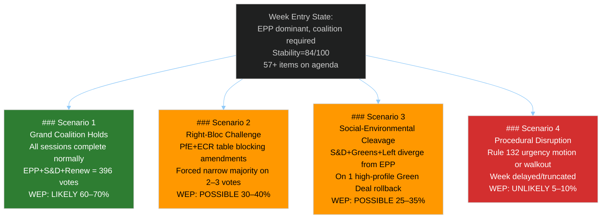

<!-- SPDX-FileCopyrightText: 2026 Hack23 AB -->
<!-- SPDX-License-Identifier: Apache-2.0 -->

# Scenario Forecast — EP Week Ahead: 19–22 May 2026

**Date:** 2026-05-15 | **Horizon:** 7 days | **Article Type:** week-ahead
**Admiralty Grade:** B2 | **WEP Calibration:** Per-scenario probability bands below

---

## 1. Scenario Architecture

---

## Scenario 1 — Grand Coalition Holds (WEP: LIKELY — 60–70%)

**Description:** The EPP-S&D-Renew coalition (396 seats) functions as the dominant majority formation for all or nearly all plenary votes during the May 19–22 session. Minor coalition-building friction exists but does not produce lost votes. The week proceeds as a normal Strasbourg plenary with expected legislative throughput.

**Enabling conditions:**
- EPP leadership successfully whips its 183 MEPs
- S&D and EPP reach informal consensus on vote-day positions for major files
- Renew votes with the grand coalition (consistent with 2024–2025 EP10 pattern)
- No major external geopolitical event disrupts the agenda

**Indicators supporting this scenario:**
- EP Early Warning System stability score: 84/100 (STABLE zone)
- No critical warnings in EP monitoring; 0 critical, 1 high, 2 medium alerts
- Historical pattern: Grand coalition held on approx. 70% of contested EP10 votes (2024–2026 period)
- Commission-EPP alignment reduces defection risk on Commission-backed proposals

**Expected outcomes:**
- 40–50 legislative items pass without controversy
- Adopted texts add to the 2026 pipeline (164 items YTD through April)
- EPP agenda-setting capacity maintained

**Confidence level:** 🟡 MEDIUM — cannot verify specific agenda content; scenario built on structural patterns.

**WEP probability:** LIKELY (60–70%)

---

## Scenario 2 — Right-Bloc Challenge (WEP: POSSIBLE — 30–40%)

**Description:** PfE and ECR coordinate amendment tactics on 2–3 items where EPP's position is internally contested. Right-bloc challenges force narrow majority votes (within 20 seats of the threshold), creating visible legislative tension. Some amendments may pass if ECR MEPs from conservative member states split from EPP whip.

**Enabling conditions:**
- Agenda includes items on migration policy, Green Deal obligations, or regulatory burden
- EPP experiences internal discipline fractures (central-eastern European vs. northern European MEPs)
- ECR provides the bridge between nominal EPP cooperation and functional right-bloc coordination
- PfE successfully frames 1–2 narrative opportunities for European media

**Indicators supporting this scenario:**
- PfE (85) + ECR (81) = 166 seats — the right bloc is structurally positioned for this
- EPP-ECR cooperation on economic deregulation has historical precedent
- Agenda density (57+ items) increases the probability that at least one politically sensitive item surfaces
- Majority fragmentation index: HIGH — elevated risk of narrow margins

**Expected outcomes:**
- 1–3 recorded votes with margin < 30 seats
- EPP leadership responds with stronger discipline communications
- S&D and Renew work together to prevent right-bloc minority from growing

**Counter-signals (reasons this scenario may not materialize):**
- Without published agenda titles, no way to confirm contested items are on the calendar
- EPP leadership is experienced at coalition management in EP10
- Stability score 84/100 suggests overall system is not under acute stress

**Confidence level:** 🔴 LOW-MEDIUM
**WEP probability:** POSSIBLE (30–40%)

---

## Scenario 3 — Social-Environmental Cleavage (WEP: POSSIBLE — 25–35%)

**Description:** S&D and Greens/EFA diverge from EPP on a Green Deal rollback or social rights measure, creating a competitive coalition dynamic. The progressive bloc (S&D 136 + Greens 53 + Left 45 = 234 seats) combines with Renew (77) to generate 311 seats — insufficient alone but capable of narrowing EPP majority margins when EPP + ECR reach for deregulatory outcomes.

**Enabling conditions:**
- A Green Deal implementing measure appears on agenda with EPP-backed deregulatory amendment
- S&D signals it cannot support the EPP position without social safeguards
- Greens and Left provide public narrative pressure
- Renew splits — part votes with EPP, part with S&D-Greens coalition

**Indicators supporting this scenario:**
- EP10 has seen multiple Green Deal political battles (Nature Restoration Law, CBAM, Fit for 55)
- S&D position documents consistently stress social and environmental conditionality
- Greens/EFA leadership vocal on any Green Deal rollback attempts
- Renew's internal diversity creates split-vote situations on regulatory issues

**Expected outcomes:**
- S&D-EPP tensions visible in plenary debates
- Higher public attention to specific vote outcomes
- Potential coalition renegotiation for subsequent sessions

**Counter-signals:**
- S&D ultimately cooperates with EPP to prevent right-bloc from benefiting
- Renew holds together with EPP on economic competitiveness framing

**WEP probability:** POSSIBLE (25–35%)

---

## Scenario 4 — Procedural Disruption (WEP: UNLIKELY — 5–10%)

**Description:** A significant external event (geopolitical crisis, institutional emergency, major human rights development) triggers emergency Rule 132 procedures, disrupts the scheduled agenda, or leads to a political group walkout. The week's legislative outputs are truncated or delayed.

**Enabling conditions:**
- Major geopolitical crisis (Russia-Ukraine escalation, Middle East flare-up, EU member state crisis)
- EP leadership procedural dispute that triggers minority motion
- Unexpected revelation of institutional misconduct (like the Qatargate 2022 shock)
- Technical parliamentary failure (quorum, procedural challenge)

**Historical base rate:** Emergency agenda disruptions occur approximately 3–5 times per year in the EP (averaging one major Rule 132 emergency per 6–8 weeks). At any given week, base rate is approximately 10–15%.

**Downward adjustments:**
- Current EP stability score: 84/100 (STABLE)
- No critical warnings in Early Warning System
- May 2026 geopolitical environment: elevated but not acute crisis signals

**Expected outcomes (if scenario materializes):**
- Emergency resolution adopted (typically 500+ cross-party votes)
- Scheduled legislative items pushed to June 2026 session
- Headline narrative shifts from legislation to geopolitics

**WEP probability:** UNLIKELY (5–10%)

---

## 2. Probability Distribution Summary

| Scenario | WEP Band | Probability | Confidence |
|----------|---------|-------------|------------|
| S1: Grand Coalition Holds | LIKELY | 60–70% | 🟡 MEDIUM |
| S2: Right-Bloc Challenge | POSSIBLE | 30–40% | 🔴 LOW |
| S3: Social-Environmental Cleavage | POSSIBLE | 25–35% | 🔴 LOW |
| S4: Procedural Disruption | UNLIKELY | 5–10% | 🟡 MEDIUM |

*Note: Scenarios are not mutually exclusive. S2 and S3 may co-occur (right-bloc challenge triggers progressive counter-mobilization). Sum exceeds 100% due to non-exclusive scenario design.*

---

## 3. Wildcard Escalation Paths

**Wildcard A — Agenda surprise:** If the OJ (Official Journal) publication (expected Friday 16 May) reveals an unexpected high-profile vote item (e.g., fast-tracked emergency regulation), all scenario probabilities shift toward S2 and S3.

**Wildcard B — Majority coalition breakdown:** If EPP-Renew tensions (flagged by the EP dominant group risk signal) escalate over a specific dossier, the S1 probability drops sharply to 35–45% and S3 rises to 40–50%.

**Wildcard C — External crisis:** Any significant external development (military escalation, major human rights violation by an EU partner) would activate Scenario 4 mechanisms.

---

## 4. Key Decision Points

**KDP-1 (16–17 May):** OJ publication of full plenary agenda. This is the highest-impact intelligence trigger for this analysis. Update all scenario probabilities upon publication.

**KDP-2 (19 May, Monday morning):** Opening session and committee whip communications. Political group press statements Monday morning reveal coalition positions for the week.

**KDP-3 (19–20 May, vote sessions):** First vote results. The margin of the first contested vote reveals coalition cohesion dynamics for the rest of the week.

---

**Sources:** EP Open Data Portal, EP Early Warning System, EP Political Landscape, EP Session Activity Data (MTG-PL-2026-05-19, -20, -21)
**Generated:** 2026-05-15 | **Classification:** Public
