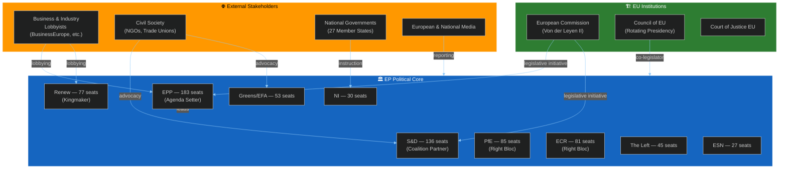

<!-- SPDX-FileCopyrightText: 2026 Hack23 AB -->
<!-- SPDX-License-Identifier: Apache-2.0 -->

# Stakeholder Map — EP Week Ahead: 19–22 May 2026

**Date:** 2026-05-15 | **Horizon:** 7 days | **Article Type:** week-ahead
**Admiralty Grade:** B2 | **Confidence:** 🟡 Medium

---

## 1. Stakeholder Architecture Overview

---

## 2. Primary Stakeholder Profiles

### 2.1 European People's Party (EPP) — 183 seats (25.5%)

**Role:** Agenda-setter and largest political group in EP10. The EPP controls committee chair nominations in proportion to its seat share and leads the negotiations on legislative priorities with the von der Leyen Commission.

**Interests this week:**
- Advance centre-right legislative priorities on digital regulation, industrial competitiveness, and trade
- Maintain coalition cohesion — resist ECR/PfE attempts to pull EPP rightward on migration or rule-of-law
- Protect the EPP-Commission relationship as the institutional backbone of EU governance

**Constraints:**
- Cannot form majority alone (183 of 360 needed = 51% short)
- Vulnerable to S&D defection if EPP shifts too far right on social issues
- Internal tensions between EPP's German CDU/CSU wing (pragmatic) and central-eastern European members (more nationalist-conservative)

**Likely posture this week:** Active coalition management; negotiate with Renew and S&D leadership on vote-day whipping. 🟡 MEDIUM CONFIDENCE in agenda outcomes without specific vote titles.

**Leverage points:** Committee rapporteur appointments, Commission legislative calendar influence, European Council coordination through national governments.

---

### 2.2 Progressive Alliance of Socialists and Democrats (S&D) — 136 seats (19.0%)

**Role:** Principal opposition-in-coalition. The S&D is the EPP's essential coalition partner but maintains distinctive positions on social policy, labour rights, and rule-of-law enforcement.

**Interests this week:**
- Maintain credibility as a distinct political force — not merely EPP's junior partner
- Advance social conditionality provisions in any economic legislation
- Signal commitment to progressive values on migration, environmental justice, and worker protection

**Constraints:**
- 136 seats insufficient for independent agenda-setting
- Must balance cooperation with EPP (strategic necessity) against coalition-building with Greens/Left (ideological alignment)
- National party elections in several member states create internal tensions as MEPs respond to domestic political pressures

**Likely posture:** Strong whipping on social-priority votes; targeted defections from EPP coalition on issues where Greens/Left votes would create progressive majority. 🟡 MEDIUM CONFIDENCE.

**Representative voices:** S&D group leadership, ECON/EMPL committee shadows.

---

### 2.3 Renew Europe — 77 seats (10.7%)

**Role:** Kingmaker and liberal swing group. Renew's 77 votes can deliver or deny majorities. The group's internal diversity (French Macronists, German FDP, Scandinavian liberals) creates policy-specific fractures.

**Interests this week:**
- Protect liberal market values and EU institutional integrity
- Advance digital single market and competitiveness agenda
- Avoid being seen as simply EPP's right flank (distance from PfE/ECR narratives)

**Constraints:**
- Internal divisions between pro-Green and pro-market factions
- National election pressures (especially French members facing domestic Macronist challenges)
- Must maintain credibility as a centrist bridge without being captured by either bloc

**Likely posture:** Issue-by-issue calculation; likely to vote with EPP + S&D on procedural matters, split on regulatory/environmental measures. 🟡 MEDIUM CONFIDENCE in vote predictions.

**Leverage:** Controls balance of majority on approx. 30–40% of contested votes in EP10.

---

### 2.4 Patriots for Europe (PfE) — 85 seats (11.8%)

**Role:** Largest single right-wing group outside the EPP. PfE coordinates the far-right agenda in EP10, led by MEPs aligned with Orbán's Fidesz, Le Pen's RN (France), and Kickl's FPÖ (Austria).

**Interests this week:**
- Advance anti-migration, Eurosceptic sovereignty narrative
- Oppose Green Deal obligations and climate regulation
- Test EPP willingness to shift right on key issues

**Constraints:**
- Excluded from major committee leadership roles
- Cannot form majority without EPP support (unacceptable to EPP currently)
- Internal ideological tensions between nationalist sovereignty (RN) and ethno-nationalist (some central-eastern members)

**Likely posture:** Tabling amendments to force recorded votes on contentious issues; building public narrative even without majority wins. Expect EP procedural objections and minority reports.

---

### 2.5 European Conservatives and Reformists (ECR) — 81 seats (11.3%)

**Role:** Conservative-eurosceptic group with stronger economic orthodoxy credentials than PfE. Includes Poland's Law and Justice-associated MEPs, Italian Brothers of Italy members (PM Meloni's party), and similar national-conservative parties.

**Interests this week:**
- Differentiate from PfE (more "respectable" right)
- Advance deregulation and economic competitiveness agenda
- Position ECR as a potential EPP coalition partner on economic issues

**Constraints:**
- Viewed by S&D and Greens as EPP's rightward pressure point
- Italian MEPs face instruction tensions from Meloni government's pro-EU economic position
- Polish contingent complex post-2024 elections

**Likely posture:** Selective cooperation with EPP on competitiveness; opposition to Green Deal measures. More reliable than PfE for coalition arithmetic purposes.

---

### 2.6 Greens/EFA — 53 seats (7.4%)

**Role:** Green and regionalist alliance. Key on environmental, digital rights, and rule-of-law dossiers. EFA component adds pro-independence regional voices (Scotland, Catalonia, etc.).

**Interests this week:**
- Protect Green Deal acquis from industrial rollback
- Advance biodiversity and climate targets
- Push for stricter AI and digital rights enforcement

**Constraints:**
- 53 seats insufficient for blocking minorities alone
- Historically reluctant to vote with right bloc even tactically
- Post-2024 seat losses weakened bargaining position vs. EP9

**Likely posture:** Activist amendments + visible political statements; coalition with S&D and Left when possible.

---

### 2.7 The Left — 45 seats (6.3%)

**Role:** Far-left and socialist group. Includes GUE/NGL components — Mediterranean left parties, German Die Linke remnants, Nordic socialist parties.

**Interests this week:**
- Labour rights, housing, anti-austerity resolutions
- Rule 132 urgency resolutions on human rights situations
- Opposition to militarization and defence industrial complex budget increases

**Constraints:**
- 45 seats; marginal in majority-building
- Frequently isolated on economic votes when opposing EPP + Renew majority
- Internal tensions between orthodox left and progressive-reformist factions

**Likely posture:** Active in debate; minority votes; used primarily for signal rather than majority-building.

---

### 2.8 European Commission (von der Leyen II)

**Role:** Legislative initiator and institutional partner. The Commission's second-term programme provides the primary legislative calendar for EP10.

**Interests this week:**
- Advance Commission proposals through plenary adoption
- Maintain EPP support for Commissioner priorities
- Manage Council-Parliament tensions on trilogue outcomes

**Relationship to EP:** Strong EPP alignment but formally independent. Commission representatives attend plenary debates and respond to parliamentary questions.

---

### 2.9 National Civil Society Organizations

**Role:** Active lobbying and public interest representation. BusinessEurope, ETUC (trade unions), Climate Action Network, Digital Rights NGOs all maintain Brussels offices and actively engage MEPs ahead of plenary votes.

**Interests this week:** Align with respective legislative priorities. Pre-vote lobbying intensity peaks Monday–Tuesday before Wednesday vote sessions.

---

## 3. Stakeholder Interaction Matrix

| Stakeholder A | Stakeholder B | Relationship | Stability | Notes |
|---------------|---------------|-------------|---------|-------|
| EPP | S&D | Coalition | 🟡 MEDIUM | Essential; not unconditional |
| EPP | Renew | Coalition | 🟡 MEDIUM | Issue-dependent |
| EPP | ECR | Tactical | 🔴 LOW-MEDIUM | Economic issues only |
| EPP | PfE | Arms-length | 🔴 LOW | Officially separate |
| S&D | Greens/EFA | Coalition | 🟢 HIGH | Strong on social/environment |
| S&D | The Left | Tactical | 🟡 MEDIUM | Progressive solidarity |
| PfE | ECR | Competitive | 🟡 MEDIUM | Right-bloc rivalry |
| Commission | EPP | Institutional | 🟢 HIGH | Von der Leyen alignment |

---

## 4. Influence Mapping — Who Decides What

**On contested economic votes:** EPP + Renew (decisive); ECR (swing factor)
**On environmental votes:** EPP (agenda); S&D + Greens = blocking if EPP-defecting ECR joins right
**On migration resolutions:** EPP + ECR + PfE potential (but EPP won't formally join); S&D + Greens + Left + Renew = 308 seats (insufficient alone)
**On Rule 132 urgency:** Cross-party unity typically high; often 500+ votes in favour
**On procedural matters:** Grand coalition (EPP + S&D + Renew = 396) — near certain majority

---

**Sources:** EP Open Data Portal — Political Landscape, MEP Data, Group Composition | Structural analysis of EP10 coalition dynamics
**Generated:** 2026-05-15 | **Classification:** Public
