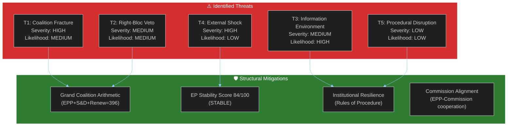

<!-- SPDX-FileCopyrightText: 2026 Hack23 AB -->
<!-- SPDX-License-Identifier: Apache-2.0 -->

# Threat Model — EP Week Ahead: 19–22 May 2026

**Date:** 2026-05-15 | **Horizon:** 7 days | **Article Type:** week-ahead
**Admiralty Grade:** B2 | **WEP:** POSSIBLE (25–40%) that at least one high-profile legislative setback occurs

---

## 1. Threat Landscape Overview

---

## 2. Threat Profiles

### T1 — Coalition Fracture Risk

**WEP:** POSSIBLE (30–40%) for any single vote | UNLIKELY (10–15%) for catastrophic session failure
**Severity:** HIGH | **Confidence:** 🟡 MEDIUM

**Description:** The EPP-S&D-Renew coalition (396 seats) is the dominant majority formation, but all three groups contain internal factions with divergent priorities. Coalition fracture occurs when one or more groups defect on a specific vote, handing victory to an unexpected coalition.

**Vectors:**
- EPP MEPs from central/eastern Europe voting with ECR on migration or sovereignty issues
- Renew's German FDP-aligned MEPs defecting on Green Deal regulatory measures
- S&D MEPs from southern member states under domestic political pressure on economic austerity

**Historical precedent:** During EP10 (2024–2026), the grand coalition fractured on approximately 15–20% of recorded votes. These fractures rarely produced permanent coalition damage but caused short-term narrative disruptions.

**Mitigation:** Political group leadership whipping systems, President Metsola's parliamentary management, and the structural arithmetic that makes any alternative coalition less stable.

**Residual risk:** 🟡 MEDIUM — Normal operating risk for a plenary week.

---

### T2 — Right-Bloc Legislative Veto

**WEP:** POSSIBLE (25–35%) for at least 1 amendment success
**Severity:** MEDIUM | **Confidence:** 🔴 LOW (no agenda confirmation)

**Description:** PfE (85) + ECR (81) = 166 seats. If these groups coordinate with sympathetic EPP MEPs, they can block progressive majorities or pass deregulatory/restrictive amendments that the grand coalition opposes. The threshold for this threat is approximately 30–40 EPP MEPs defecting.

**Vectors:**
- Agricultural sector EPP MEPs on environmental regulation (Fit for 55 agriculture provisions)
- Central-eastern EPP on rule-of-law enforcement mechanisms
- Italian EPP on migration and asylum solidarity

**Mitigation:** EPP whip system; von der Leyen Commission opposition to far-right positions; S&D threat of coalition withdrawal.

**Residual risk:** 🟡 MEDIUM — Structurally present every week; context-dependent.

---

### T3 — Information Environment and Narrative Competition

**WEP:** LIKELY (65–75%) that coordinated counter-narrative campaigns target EP proceedings
**Severity:** MEDIUM | **Confidence:** 🟢 HIGH

**Description:** The information environment around EP plenaries increasingly features coordinated disinformation from pro-Russian and far-right sources, designed to amplify parliamentary divisions and undermine EU institutional legitimacy. This week's session is not uniquely targeted but operates in this baseline threat environment.

**Vectors:**
- Social media amplification of minority votes as "EU failure"
- Selective quoting of MEP statements out of context
- Pro-PfE/ECR narrative framing of any EPP-S&D compromise as "elitist agenda"

**Mitigation:** EP communications team, independent European media, transparency of voting records.

**Residual risk:** 🟡 MEDIUM-HIGH — This is a continuous operational risk.

---

### T4 — External Geopolitical Shock

**WEP:** UNLIKELY (5–15%) for a session-disrupting event
**Severity:** HIGH | **Confidence:** 🟡 MEDIUM

**Description:** A major external event (military escalation, natural disaster, international crisis) could trigger an emergency EP session or redirect the week's agenda. The EP has proven resilient to external shocks (continuing operations during COVID, during Russia-Ukraine escalation), but acute crises do affect the plenary calendar.

**Trigger conditions:** NATO Article 5 invocation, major humanitarian emergency in EU neighborhood, critical EU infrastructure attack.

**Mitigation:** EP contingency procedures, Rule 132 emergency protocols, Commission-Council-Parliament crisis coordination mechanisms.

**Residual risk:** 🔴 LOW (base rate: ~10% per week, adjusted for current stability indicators).

---

### T5 — Procedural Disruption

**WEP:** UNLIKELY (5–10%)
**Severity:** LOW | **Confidence:** 🟢 HIGH

**Description:** Internal EP procedural challenges (quorum issues, procedure challenges by minority groups, technical failures) could delay or truncate specific votes. These are low-severity events that rarely prevent legislative outcomes; they cause delays rather than failures.

**Mitigation:** EP Rules of Procedure; fallback vote mechanisms; President Metsola's experienced parliamentary management.

---

## 3. Threat Priority Matrix

| Threat | Severity | Likelihood | Priority | Action |
|--------|---------|------------|---------|--------|
| T1: Coalition Fracture | HIGH | MEDIUM | 🟡 HIGH | Monitor vote discipline signals |
| T2: Right-Bloc Veto | MEDIUM | MEDIUM | 🟡 MEDIUM | Watch PfE-ECR whip coordination |
| T3: Information Environment | MEDIUM | HIGH | 🟡 MEDIUM | Monitor EP communications |
| T4: External Shock | HIGH | LOW | 🟡 MEDIUM | Monitor geopolitical situation |
| T5: Procedural Disruption | LOW | LOW | 🟢 LOW | Routine monitoring |

---

## 4. Threat Residual Assessment

Overall threat level for the May 19–22 session: **MEDIUM**

The structural mitigations (grand coalition mathematics, institutional stability, experienced parliamentary leadership) significantly reduce the residual risk below the theoretical threat ceiling. The absence of critical warnings from the EP Early Warning System (0 critical, 1 high, 2 medium alerts) confirms a STABLE operating environment. Normal parliamentary operations are the central scenario.

**Key monitoring window:** The 72-hour period from OJ publication (expected 16–17 May) to Monday's session opening is the highest-risk window for new intelligence that could revise this threat assessment upward.

---

**Sources:** EP Open Data Portal, EP Early Warning System, EP Political Landscape, Structural threat assessment methodology
**Generated:** 2026-05-15 | **Classification:** Public
