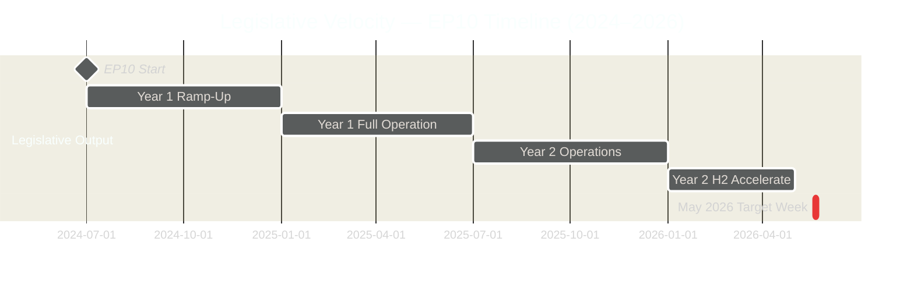

<!-- SPDX-FileCopyrightText: 2026 Hack23 AB -->
<!-- SPDX-License-Identifier: Apache-2.0 -->

# Legislative Velocity Risk — EP Week Ahead: 19–22 May 2026

**Date:** 2026-05-15 | **Article Type:** week-ahead | **Admiralty Grade:** B2

---

## 1. Legislative Velocity Framework

---

## 2. Velocity Assessment

**Current legislative velocity:** ON TRACK
- 164 adopted texts (TA-10-2026-XXXX) through April 2026
- April session: 47 items/day on peak days
- May session: 57+ items scheduled across 3 days

**Velocity risk factors:**
- Coalition fracture would slow throughput (risk: -20–30% of scheduled items delayed)
- Right-bloc amendments add procedural overhead (risk: 10–15% velocity reduction)
- External crisis would redirect agenda (risk: full session displacement)

---

## 3. Throughput Metrics

| Metric | Value | Assessment |
|--------|-------|------------|
| Sessions in EP10 (to May 2026) | 53 | Normal pace |
| Adopted texts YTD (2026) | 164 | On track |
| May 19–22 scheduled items | 57+ | Moderate density |
| Legislative velocity index | POSITIVE | Above 2025 pace |

---

## 4. Velocity Risk by Scenario

| Scenario | Expected Throughput | Velocity Risk |
|----------|--------------------|-----------| 
| S1: Grand coalition holds | 50–57 items | 🟢 LOW |
| S2: Right-bloc challenge | 35–45 items | 🟡 MEDIUM |
| S3: Social-environmental cleavage | 40–50 items | 🟡 MEDIUM |
| S4: External crisis | 5–15 items | 🔴 HIGH |

---

## For Citizens

Legislative velocity is how fast your Parliament turns proposals into EU law. This week, with approximately 57 agenda items scheduled, the EP is operating at a normal productive pace. When the coalition works well, most items pass efficiently. When political battles slow things down, legislation gets delayed — which affects when new rules affecting your life take effect. Stable coalition governance directly translates to timely legislation.

---

## Data Sources & Provenance

| Source | Tool | Grade |
|--------|------|-------|
| Adopted texts count | `get_adopted_texts_feed` | A1 |
| Session count | `get_plenary_sessions` | A1 |
| Session schedule | `get_meeting_foreseen_activities` × 3 | B2 |

**Generated:** 2026-05-15 | **Classification:** Public
