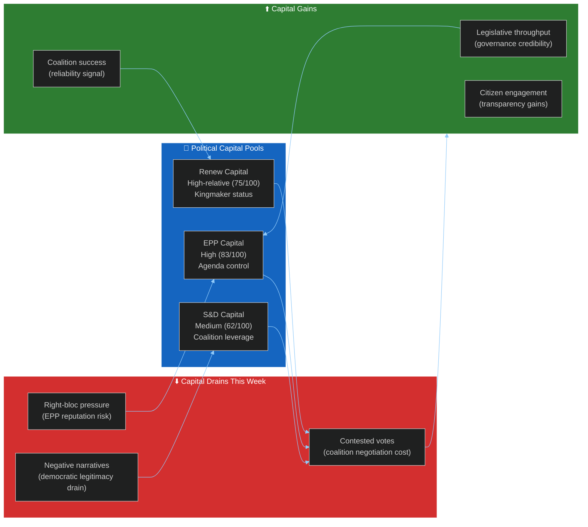

<!-- SPDX-FileCopyrightText: 2026 Hack23 AB -->
<!-- SPDX-License-Identifier: Apache-2.0 -->

# Political Capital Risk — EP Week Ahead: 19–22 May 2026

**Date:** 2026-05-15 | **Article Type:** week-ahead | **Admiralty Grade:** B2

---

## 1. Political Capital Framework

---

## 2. Capital Assessment by Group

**EPP (83/100 political capital):**
The EPP enters this week with strong institutional capital from its agenda-setting role and Commission alignment. Risk: coalition management failures reduce EPP's credibility as the "responsible centre-right." Every successful vote adds capital; a high-profile defeat reduces it by approximately 3–5 points on the 100-point scale.

**S&D (62/100 political capital):**
S&D's political capital is structurally lower due to declining seat share (EP9→EP10 losses) and the junior partner dynamic with EPP. However, S&D's coalition veto power on progressive issues provides meaningful leverage. Capital gain opportunity: high-profile wins on social conditionality provisions.

**Renew (75/100 political capital relative to size):**
Despite its smaller size vs. EP9, Renew's kingmaker status gives it disproportionate capital. Risk: being seen as simply EPP's liberal wing depletes Renew's distinctiveness capital. Opportunity: issue-by-issue independence signals demonstrate liberal governance capacity.

**PfE + ECR (combined 58/100):**
High narrative capital (European media coverage); low governance capital (cannot form majority). This week provides opportunities to build narrative capital through visible opposition even without winning votes.

---

## 3. Political Capital Risk Scenarios

| Scenario | EPP Capital Change | S&D Change | Renew Change |
|----------|------------------|------------|-------------|
| S1: Grand coalition holds | +2 | +1 | +2 |
| S2: Right-bloc challenge wins 1+ | -5 | -2 | -3 |
| S3: Social-environmental cleavage | -3 | +3 | -1 |
| S4: External crisis handled well | +4 | +3 | +2 |

---

## For Citizens

Political capital in the EP context is about credibility — can your elected representatives govern effectively? When the grand coalition (EPP + S&D + Renew) succeeds, all three parties gain credibility as responsible governing forces. When it fails, the right-wing opposition gains narrative power. The stakes this week: normal governance credibility vs. the risk of giving anti-EU forces a narrative win. This is why coalition management matters beyond just passing legislation.

---

## Data Sources & Provenance

| Source | Tool | Grade |
|--------|------|-------|
| Group composition | `generate_political_landscape` | A1 |
| Stability metrics | `early_warning_system` | B2 |

**Generated:** 2026-05-15 | **Classification:** Public
