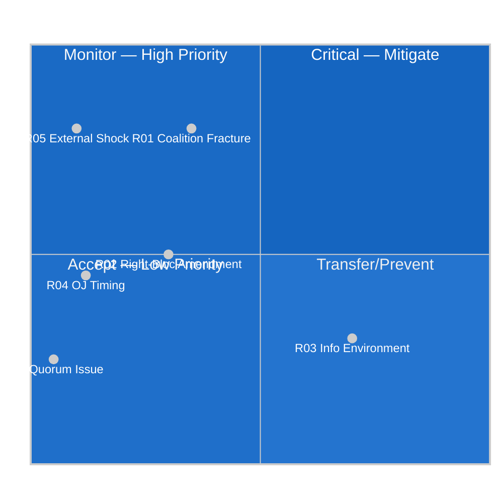

<!-- SPDX-FileCopyrightText: 2026 Hack23 AB -->
<!-- SPDX-License-Identifier: Apache-2.0 -->

# Risk Matrix — EP Week Ahead: 19–22 May 2026

**Date:** 2026-05-15 | **Article Type:** week-ahead
**Admiralty Grade:** B2 | **WEP:** LIKELY (75–85%) overall STABLE legislative week

---

## 1. Risk Register

| Risk ID | Risk Description | Likelihood | Impact | Score | WEP | Owner |
|---------|-----------------|------------|--------|-------|-----|-------|
| R01 | Coalition fracture on contested vote | MEDIUM (30–40%) | HIGH | 12 | POSSIBLE | EPP leadership |
| R02 | Right-bloc amendment success | MEDIUM (25–35%) | MEDIUM | 9 | POSSIBLE | Coalition managers |
| R03 | Information environment disruption | HIGH (65–75%) | LOW | 8 | LIKELY | EP comms |
| R04 | Agenda gap (OJ not published in time) | LOW (10–15%) | MEDIUM | 6 | UNLIKELY | EP secretariat |
| R05 | External geopolitical shock | LOW (5–15%) | HIGH | 8 | UNLIKELY | EEAS |
| R06 | Quorum procedural challenge | VERY LOW (3–7%) | LOW | 3 | REMOTE | EP President |
| R07 | IMF/economic data degradation | OCCURRED | LOW | 2 | N/A | Data pipeline |
| R08 | Vote record unavailability | OCCURRED | LOW | 2 | N/A | EP API |

---

## 2. Risk Heat Map

---

## 3. Top 3 Risks — Mitigation Plans

**R01 — Coalition Fracture (Highest Priority)**
- Monitor: EPP whip communications, political group press releases (Monday AM)
- Mitigation: Grand coalition (396 seats) provides structural buffer
- Escalation: If coalition fractures on first vote, revise S1→S3 scenario probabilities

**R02 — Right-Bloc Amendment Success**
- Monitor: PfE-ECR floor coordination signals
- Mitigation: EPP leadership's coalition management experience; S&D-Renew alignment
- Escalation: First right-bloc success triggers wildcard WC-6 escalation path

**R05 — External Geopolitical Shock**
- Monitor: EEAS alerts, NATO communications, European Council emergency protocols
- Mitigation: EP Rule 132 emergency procedures well-established
- Escalation: Scenario S4 becomes primary if shock occurs

---

**Sources:** EP Open Data Portal, structural risk analysis, Early Warning System
**Generated:** 2026-05-15 | **Classification:** Public
