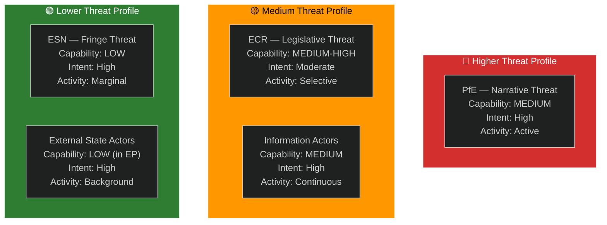

<!-- SPDX-FileCopyrightText: 2026 Hack23 AB -->
<!-- SPDX-License-Identifier: Apache-2.0 -->

# Actor Threat Profiles — EP Week Ahead: 19–22 May 2026

**Date:** 2026-05-15 | **Article Type:** week-ahead | **Admiralty Grade:** B2

---

## 1. Threat Actor Profiles

---

## 2. PfE (Patriots for Europe) — Primary Threat Actor

**Threat type:** Legislative-narrative hybrid
**Seats:** 85 | **Capability:** MEDIUM | **Intent:** HIGH
**Primary tactic:** Amendment tabling on sensitive issues to force recorded votes; use near-wins as media narratives even without legislative success.

**Week-specific threat:** Without confirmed agenda titles, cannot identify specific PfE threat vectors. Based on EP10 pattern: expect PfE-led amendments on migration, climate regulation, and "regulatory burden" provisions.

**Mitigation:** EPP leadership coalition management; S&D-Renew counter-whipping.

---

## 3. ECR — Secondary Threat Actor

**Threat type:** Legislative bridging (can swing votes either way)
**Seats:** 81 | **Capability:** MEDIUM-HIGH | **Intent:** VARIABLE
**Dual role:** Can support EPP on economic/competitiveness votes OR support PfE on migration/sovereignty votes. This ambiguity is the primary uncertainty factor.

**Week-specific threat:** ECR MEPs from Italy (Meloni-aligned) may split from ECR's official line on EU institutional items. ECR's position on any specific vote requires monitoring the ECR group whip.

---

## 4. Information Environment Threat Actors

**Threat type:** Narrative/disinformation
**Capability:** MEDIUM (broad reach via social media and sympathetic national media)
**Intent:** HIGH (systematic anti-EU narrative investment)

**Pattern:** Any contested EP vote, particularly narrow outcomes, will be amplified as "EU democracy failing" or "EPP-S&D elite cartel" by PfE-aligned media networks. This threat is persistent and background to every EP session.

---

## For Citizens

The European Parliament's democratic legitimacy faces systematic challenges from political actors who benefit when EU institutions appear dysfunctional or undemocratic. The best defence is transparency: the EP publishes all voting records, MEP attendance, and legislative texts publicly. When you follow your MEP's actual voting record and compare it to the narratives presented, you can distinguish real political news from orchestrated disinformation.

---

## Data Sources & Provenance

| Source | Tool | Grade |
|--------|------|-------|
| Group composition | `generate_political_landscape` | A1 |
| Warning signals | `early_warning_system` | B2 |

**Generated:** 2026-05-15 | **Classification:** Public
