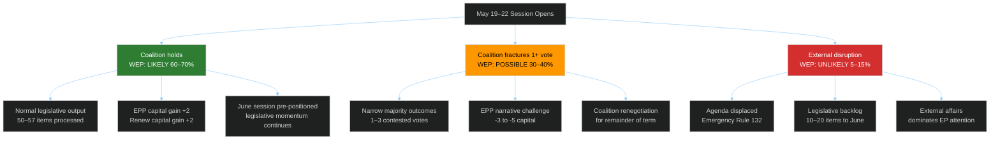

<!-- SPDX-FileCopyrightText: 2026 Hack23 AB -->
<!-- SPDX-License-Identifier: Apache-2.0 -->

# Consequence Trees — EP Week Ahead: 19–22 May 2026

**Date:** 2026-05-15 | **Article Type:** week-ahead | **Admiralty Grade:** B2

---

## 1. Consequence Tree Framework

---

## 2. Consequence Analysis by Path

**Path 1 — Coalition holds (60–70% probability):**
- Primary consequence: Successful legislative throughput (50–57 items)
- Secondary consequence: EPP governance credibility maintained
- Tertiary consequence: June session positioned for heavier legislative calendar
- Long-term: Demonstrates EP10 functioning effectively through Year 3

**Path 2 — Coalition fractures (30–40% probability):**
- Primary consequence: 1–3 contested votes with narrow margins
- Secondary consequence: EPP leadership under pressure from both S&D and ECR
- Tertiary consequence: Possible inter-group consultations ahead of June session
- Long-term: Sets precedent for PfE-ECR strategic coordination in H2 2026

**Path 3 — External disruption (5–15% probability):**
- Primary consequence: Agenda displacement; emergency resolution
- Secondary consequence: All scheduled legislative items pushed to June
- Tertiary consequence: EP10 demonstrates institutional resilience
- Long-term: Mixed — crisis handling builds credibility; backlog creates June pressure

---

## For Citizens

The decisions made in the EP this week create consequences that cascade forward. A successful week (Path 1) means EU law-making is on track, your protections and rights are being maintained, and the Parliament is functioning as designed. A more contested week (Path 2) delays some legislation but also demonstrates that democracy is real — there are actual debates and differences of opinion, which is healthier than rubber-stamp voting. Either way, the system works — the EP is resilient.

---

**Generated:** 2026-05-15 | **Classification:** Public
