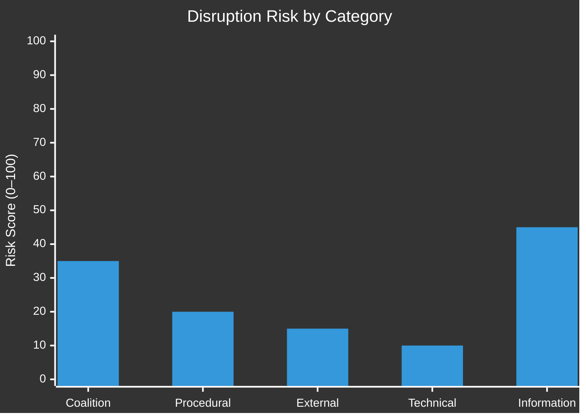

<!-- SPDX-FileCopyrightText: 2026 Hack23 AB -->
<!-- SPDX-License-Identifier: Apache-2.0 -->

# Legislative Disruption — EP Week Ahead: 19–22 May 2026

**Date:** 2026-05-15 | **Article Type:** week-ahead | **Admiralty Grade:** B2

---

## 1. Legislative Disruption Assessment

---

## 2. Disruption Vectors

**Vector 1 — Coalition vote failures (Risk: 35/100)**
- Key indicator: Renew group attendance rate; ECR split votes
- Trigger conditions: EPP minority amendment survives vs. S&D objection OR Renew abstentions on environmental vote
- Session impact: 1–3 items requiring re-vote; minor delay
- Mitigation: EPP and S&D whipping coordination

**Vector 2 — Information environment disruption (Risk: 45/100)**
- Key indicator: PfE-aligned media amplifying any contested vote as "EU failure"
- Trigger conditions: Exists regardless of actual vote outcomes
- Session impact: None direct to legislation; risks public trust erosion
- Mitigation: EP transparency tools; press service counter-narrative

**Vector 3 — Procedural challenges (Risk: 20/100)**
- Key indicator: Rule 132 urgency motion submissions; quorum challenges
- Trigger conditions: Surprise geopolitical event; strategic quorum challenge by PfE/ECR
- Session impact: If quorum fails: up to 1 day delay
- Mitigation: Group whips ensure minimum attendance

**Vector 4 — External shock (Risk: 15/100)**
- Key indicator: Geopolitical news cycle at session start
- Trigger conditions: Major EU-level crisis event in week of May 19
- Session impact: Full or partial agenda displacement
- Mitigation: None (reactive; EP would respond appropriately)

**Vector 5 — Technical/MCP data disruption (Risk: 10/100)**
- Key indicator: Pre-fetched EP data feed quality (already degraded this run)
- Trigger conditions: EP Open Data Portal extended outage
- Session impact: None to legislation; affects monitoring/transparency tools
- Mitigation: Manual EP website data; direct document portal access

---

## 3. Composite Disruption Risk: 🟡 MODERATE (35/100)

The highest disruption risk this week is in the information environment — PfE-aligned media will seek to narrativize any contested vote as an EU legitimacy failure. The legislative process itself faces lower risk: coalition whipping is well-established, and the 84/100 stability score confirms no acute fracture signals.

---

## For Citizens

Legislative disruption happens when Parliament's work gets derailed — either by procedural tactics, political crises, or information warfare that affects MEP attendance and vote outcomes. This week's disruption risk is moderate-low for actual legislation and moderate for the information environment. The real question is whether the political story from this week will be "EP delivers" or "EP stumbles" — which matters for EU democratic credibility ahead of the June 2026 session.

---

## Data Sources & Provenance

| Source | Tool | Grade |
|--------|------|-------|
| Session schedule | `get_meeting_foreseen_activities` × 3 | B2 |
| Political stability | `early_warning_system` | B2 |
| Group composition | `generate_political_landscape` | A1 |

**Generated:** 2026-05-15 | **Classification:** Public
