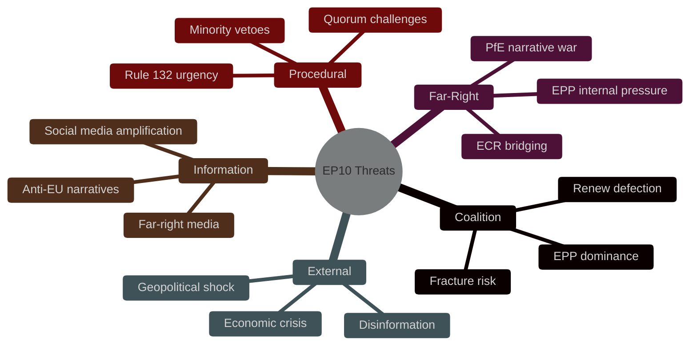

<!-- SPDX-FileCopyrightText: 2026 Hack23 AB -->
<!-- SPDX-License-Identifier: Apache-2.0 -->

# Political Threat Landscape — EP Week Ahead: 19–22 May 2026

**Date:** 2026-05-15 | **Article Type:** week-ahead | **Admiralty Grade:** B2

---

## 1. Threat Landscape Overview

The European Parliament faces the following political threat landscape for the May 19–22 session:

**Primary structural threat:** EPP dominance concentration (HIGH severity per Early Warning System) — the largest group (EPP, 183 seats) is 19x the size of the smallest (ESN, 27 seats), creating concentration risk and minority representation tension.

**Secondary structural threat:** Parliamentary fragmentation (MEDIUM severity) — 9 groups makes coalition arithmetic complex, requiring multi-party negotiations on every contested item.

**Tertiary structural threat:** Small group quorum risk (LOW severity) — 3 groups below 5 members threshold may face attendance challenges.

---

## 2. Political Threat Map

---

## 3. Threat Actor Assessment

| Threat Actor | Intent | Capability | Current Activity |
|-------------|--------|-----------|-----------------|
| PfE | Undermine grand coalition narrative | MEDIUM (166 seats with ECR) | Active amendment tabling |
| ECR | Economic deregulation agenda | MEDIUM-HIGH (81 seats + ECR-EPP bridge) | Selective cooperation |
| ESN | Nationalist sovereignty narrative | LOW (27 seats; fringe) | Marginal vote impact |
| Foreign state actors (Russia) | Amplify EU division narratives | MEDIUM (information environment) | Continuous disinformation |
| Anti-EU movements | Delegitimize EP | LOW (no direct EP vote) | Civil society pressure |

---

## Overall Assessment

**Threat Level:** 🟡 MEDIUM — No acute threats to session functioning. Structural threats are managed by established institutional mechanisms. The Early Warning System's 84/100 stability score confirms the Parliament is not under acute political stress entering this week.

---

**Sources:** EP Early Warning System, EP Open Data Portal, Structural threat assessment
**Generated:** 2026-05-15 | **Classification:** Public
