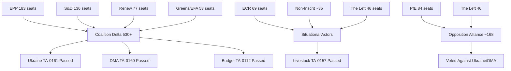

<!-- SPDX-FileCopyrightText: 2026 Hack23 AB -->
<!-- SPDX-License-Identifier: Apache-2.0 -->

# Actor Mapping — European Parliament April 2026 Plenary
**Date:** 2026-05-16 | **Grade:** B2

## Actor Network Overview

## Primary Institutional Actors

### European Parliament Political Groups

| Group | Seats | Leader Profile | April 2026 Position |
|-------|-------|---------------|---------------------|
| EPP (European People's Party) | 183 | Roberta Metsola (President) | Pro-Ukraine, Pro-DMA enforcement, Budget centrist |
| S&D (Socialists & Democrats) | 136 | Iratxe García Pérez | Pro-Ukraine, Pro-DMA, Social investment in budget |
| Renew Europe | 77 | Valerie Hayer | Pro-DMA (core constituency), Pro-Ukraine, Markets-liberal |
| ECR (Conservatives & Reformists) | 69 | Raffaele Fitto | Split on Ukraine, Anti-DMA, Eurosceptic-light |
| Greens/EFA | 53 | Terry Reintke/Bas Eickhout | Pro-Ukraine, Climate floor in budget, Chat Control concerns |
| PfE (Patriots for Europe) | 84 | Viktor Orbán's bloc | Anti-Ukraine aid, Anti-DMA, Farm lobby alignment |
| The Left | 46 | Martin Schirdewan | Pro-Ukraine (solidarity), Anti-DMA (market bias), Chat Control dissent |
| Non-Inscrit | ~35 | No collective leadership | Fragmented; issue-by-issue |

## External State Actors

| Actor | Role | April 2026 Relevance | Influence Mode |
|-------|------|---------------------|----------------|
| Ukraine | Subject of TA-0161; aid recipient | Direct beneficiary of accountability framework | Diplomatic engagement; MFA conditionality |
| Armenia | Subject of TA-0162; geopolitical pivot | EP declaration validates EU integration aspiration | Lobbying; Eastern Partnership mechanisms |
| Russia | Adversary state | Seeks to undermine Ukraine support; IW operations | Information operations; energy pressure (residual) |
| United States | Trade partner/rival | DMA enforcement tension; tariff regime | USTR diplomatic pressure; Big Tech lobbying |
| China | Mentioned in livestock/trade context | Belt & Road agri competition; DMA implications | Trade negotiations |

## Corporate and Industry Actors

| Actor | Sector | April 2026 Stake | Strategy |
|-------|--------|-----------------|---------|
| Apple | Digital/Tech | DMA primary target; interoperability mandates | Compliance + litigation; lobbying Renew/EPP |
| Google | Digital/Tech | DMA search/Play Store enforcement | Compliance commitments + appeals |
| Meta | Digital/Tech | DMA/DSA overlap; Chat Control data access | Privacy framing + child safety coalition |
| European Farmers' Union (Copa-Cogeca) | Agriculture | Livestock TA-0157 directly | "Balance" language advocacy; EP petition |
| BEUC (European Consumer Organisation) | Consumer | DMA enforcement, online exploitation | Strong enforcement advocacy |

## Civil Society Actors

| Actor | Mandate | April 2026 Position |
|-------|---------|---------------------|
| European Movement International | EU integration | Supports all April 2026 majority outcomes |
| ECRE (Refugee Council) | Migration | Monitoring Armenia/Ukraine humanitarian dimensions |
| EDRi (Digital Rights) | Digital rights | Opposing Chat Control mass surveillance dimensions |
| Transparency International | Anti-corruption | Supporting Ukraine accountability framework |
| Greenpeace EU | Environment | Criticizing livestock sustainability compromise as insufficient |

## Actor Power-Interest Matrix

**High Power, High Interest:** EPP, S&D, Renew (Coalition Delta — determined outcomes)
**High Power, Medium Interest:** ECR (swing role on non-geopolitical issues)
**Medium Power, High Interest:** Greens/EFA (agenda-setting despite seat decline), Big Tech companies
**Low Power, High Interest:** Armenia, Ukrainian civil society, digital rights NGOs
**High Power, Low Interest on specific files:** PfE (opposes broadly but not strategically engaged)
