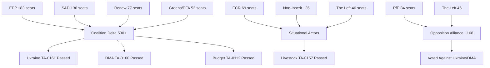

<!-- SPDX-FileCopyrightText: 2026 Hack23 AB -->
<!-- SPDX-License-Identifier: Apache-2.0 -->

# Actor Mapping — European Parliament April 2026 Plenary
**Date:** 2026-05-16 | **Grade:** B2

## Actor Network Overview

## Primary Institutional Actors

### European Parliament Political Groups

| Group | Seats | Leader Profile | April 2026 Position |
|-------|-------|---------------|---------------------|
| EPP (European People's Party) | 183 | Roberta Metsola (President) | Pro-Ukraine, Pro-DMA enforcement, Budget centrist |
| S&D (Socialists & Democrats) | 136 | Iratxe García Pérez | Pro-Ukraine, Pro-DMA, Social investment in budget |
| Renew Europe | 77 | Valerie Hayer | Pro-DMA (core constituency), Pro-Ukraine, Markets-liberal |
| ECR (Conservatives & Reformists) | 69 | Raffaele Fitto | Split on Ukraine, Anti-DMA, Eurosceptic-light |
| Greens/EFA | 53 | Terry Reintke/Bas Eickhout | Pro-Ukraine, Climate floor in budget, Chat Control concerns |
| PfE (Patriots for Europe) | 84 | Viktor Orbán's bloc | Anti-Ukraine aid, Anti-DMA, Farm lobby alignment |
| The Left | 46 | Martin Schirdewan | Pro-Ukraine (solidarity), Anti-DMA (market bias), Chat Control dissent |
| Non-Inscrit | ~35 | No collective leadership | Fragmented; issue-by-issue |

## External State Actors

| Actor | Role | April 2026 Relevance | Influence Mode |
|-------|------|---------------------|----------------|
| Ukraine | Subject of TA-0161; aid recipient | Direct beneficiary of accountability framework | Diplomatic engagement; MFA conditionality |
| Armenia | Subject of TA-0162; geopolitical pivot | EP declaration validates EU integration aspiration | Lobbying; Eastern Partnership mechanisms |
| Russia | Adversary state | Seeks to undermine Ukraine support; IW operations | Information operations; energy pressure (residual) |
| United States | Trade partner/rival | DMA enforcement tension; tariff regime | USTR diplomatic pressure; Big Tech lobbying |
| China | Mentioned in livestock/trade context | Belt & Road agri competition; DMA implications | Trade negotiations |

## Corporate and Industry Actors

| Actor | Sector | April 2026 Stake | Strategy |
|-------|--------|-----------------|---------|
| Apple | Digital/Tech | DMA primary target; interoperability mandates | Compliance + litigation; lobbying Renew/EPP |
| Google | Digital/Tech | DMA search/Play Store enforcement | Compliance commitments + appeals |
| Meta | Digital/Tech | DMA/DSA overlap; Chat Control data access | Privacy framing + child safety coalition |
| European Farmers' Union (Copa-Cogeca) | Agriculture | Livestock TA-0157 directly | "Balance" language advocacy; EP petition |
| BEUC (European Consumer Organisation) | Consumer | DMA enforcement, online exploitation | Strong enforcement advocacy |

## Civil Society Actors

| Actor | Mandate | April 2026 Position |
|-------|---------|---------------------|
| European Movement International | EU integration | Supports all April 2026 majority outcomes |
| ECRE (Refugee Council) | Migration | Monitoring Armenia/Ukraine humanitarian dimensions |
| EDRi (Digital Rights) | Digital rights | Opposing Chat Control mass surveillance dimensions |
| Transparency International | Anti-corruption | Supporting Ukraine accountability framework |
| Greenpeace EU | Environment | Criticizing livestock sustainability compromise as insufficient |

## Actor Power-Interest Matrix

**High Power, High Interest:** EPP, S&D, Renew (Coalition Delta — determined outcomes)
**High Power, Medium Interest:** ECR (swing role on non-geopolitical issues)
**Medium Power, High Interest:** Greens/EFA (agenda-setting despite seat decline), Big Tech companies
**Low Power, High Interest:** Armenia, Ukrainian civil society, digital rights NGOs
**High Power, Low Interest on specific files:** PfE (opposes broadly but not strategically engaged)

## Actor Roster — Comprehensive Listing

All named actors identified in the April 2026 EU Parliament legislative cycle:

**Parliamentary Group Leaders:**
- Roberta Metsola (EPP, Malta) — EP President; procedural authority, agenda management
- Iratxe García Pérez (S&D, Spain) — Group leader; socialist coalition anchor
- Valerie Hayer (Renew Europe, France) — Liberal market perspective, DMA champion
- Terry Reintke (Greens/EFA, Germany) — Climate accountability, Chat Control opposition
- Raffaele Fitto (ECR, Italy) — Deputy Commission President; dual EPP-ECR bridge
- Jordan Bardella (PfE, France) — Orbán alignment; anti-Ukraine, anti-DMA voice

**Key Committee Rapporteurs (April 2026 texts):**
- IMCO Committee (DMA lead, TA-0160): Rapporteur identity not publicly confirmed
- AFET Committee (Ukraine TA-0161): Foreign Affairs committee principal
- BUDG Committee (Budget TA-0112): Budget committee rapporteur
- LIBE Committee (Online Exploitation TA-0163): Civil liberties rapporteur
- JURI Committee (Jaki immunity TA-0105): Legal affairs rapporteur

**External Government Actors:**
- Volodymyr Zelensky (Ukraine President) — primary MFA beneficiary
- Pashinyan (Armenia PM) — CEPA II ratification beneficiary
- Viktor Orbán (Hungary PM) — PfE anchor; EP institutional adversary

## Influence × Position Grid

Influence measured on 1-10 scale; position on -5 (strongly against mainstream) to +5 (strongly for).

| Actor | Influence Score | Position Score | Quadrant |
|-------|----------------|----------------|---------|
| EPP Group | 9 | +4 | High Influence, Strongly Pro |
| S&D Group | 8 | +4 | High Influence, Strongly Pro |
| Renew Europe | 7 | +3 | High Influence, Moderately Pro |
| EU Commission | 9 | +3 | High Influence, Supportive |
| PfE Group | 6 | -4 | Medium Influence, Strongly Against |
| ECR Group | 6 | -1 | Medium Influence, Mildly Against |
| Greens/EFA | 5 | +4 | Medium Influence, Strongly Pro |
| Ukraine Government | 5 | +5 | Medium External Influence, Maximally Pro |
| US Big Tech | 5 | -3 | Medium External, Against DMA |
| Copa-Cogeca | 4 | +1 | Sector Influence, Conditionally Pro |
| EDRi (Digital Rights) | 2 | -2 | Low Influence, Against Chat Control |
| Armenia Government | 2 | +5 | Low External Influence, Strongly Pro |

## Alliance & Tension Network

**Stable Alliance: Coalition Delta (530+ seats)**
EPP ↔ S&D ↔ Renew ↔ Greens/EFA on geopolitical/digital issues. Stable through Q2 2026.
Structural anchors: EPP-S&D bilateral understanding on EU major institutional decisions;
Renew's liberal market stance aligns with EPP business wing on DMA enforcement.

**Informal Alignment: Conservative Agricultural Alliance**
EPP agricultural wing ↔ ECR ↔ PfE on farm policy dossiers (livestock, CAP). Not a formal
coalition; issue-specific convergence that undermines cordon sanitaire on agriculture votes.

**Tension Lines Within Coalition Delta:**
- EPP vs Greens: climate ambition floor (budget guidelines, agricultural targets)
- S&D vs Renew: social spending floors vs fiscal discipline
- EPP vs The Left: DMA enforcement approach (regulation vs market competition)

**External Tension: EU vs US Tech Companies**
EP institutional position (DMA enforcement) vs US corporate actors (Apple, Google, Meta).
Tension mediated through USTR diplomatic pressure on Commission.

## Top‑3 Power Brokers — Profiles

**Power Broker 1: EPP Group (183 seats, President controls plenary)**
EPP's dominance in EP10 (25.5% seats) means it controls committee chairs, plenary agenda,
and the EP Presidency. Roberta Metsola as President has used this position to accelerate
the EP's geopolitical engagement. EPP's internal debate between "CDU mainstream" (pro-Ukraine,
pro-DMA enforcement) and "regional nationalists" (Hungary, Italy, Slovakia EPP members)
is the primary internal fracture risk. EPP kept its distance from PfE/ECR on April 2026 votes.

**Power Broker 2: European Commission (DG COMP, EEAS, DG AGRI)**
The Commission retains the legislative initiative monopoly and enforcement authority. April 2026
EP resolutions provide political backing for Commission actions but do not legally compel them.
DG COMP's enforcement calendar for DMA will be the decisive variable for whether Parliament's
political investment in TA-0160 translates into real market change. EEAS controls the
Ukraine Support Instrument disbursement mechanism that TA-0161 addresses.

**Power Broker 3: S&D Group (136 seats, social coalition anchor)**
S&D is the necessary coalition partner for any EP majority. Without S&D, EPP needs ECR/PfE
(which EPP formally refuses). S&D's positions on social spending in budget guidelines, worker
protections in digital platform regulation, and humanitarian considerations in Ukraine policy
set the left boundary of Coalition Delta. S&D's internal discipline (85%+ group cohesion)
is higher than the group's ideological diversity would suggest.

## Information‑Flow Map

Legislative intelligence flows in the EP through formal and informal channels:

**Formal channels:**
- Committee rapporteur reports → plenary debate → voting list
- EPRS (Parliamentary Research Service) briefings → MEP preparation
- Commission explanatory memoranda → legislative initiation

**Informal channels:**
- Group political advisors ↔ MEP leaders (daily coordination)
- National party headquarters ↔ MEP delegation leadership
- Big Tech government affairs teams ↔ EPP/Renew political staff

**Intelligence gaps in this analysis:**
- MEP-level vote intentions (roll-call data has 4-week lag)
- Committee amendment patterns (EPRS records not real-time)
- Internal group negotiation positions (not publicly disclosed)

## Reader Briefing

**For citizens:** The European Parliament works through political groups that form shifting
coalitions. The April 2026 session was dominated by a stable centre coalition (EPP+S&D+Renew
plus usually Greens) that had 530+ seats — well above the 360 majority threshold. This
coalition decided on Ukraine support, digital regulation, and the budget direction.
The far-right opposition (PfE with 84 seats + ECR with 69 seats) could not block these outcomes.

**For business:** The key power brokers are the EPP (sets the economic regulatory tone),
the Commission (controls enforcement timing and scope), and the US Big Tech companies (the
primary regulated entities). Understanding EPP's internal business-wing vs nationalist-wing
tension is essential for anticipating DMA enforcement intensity.

**For policymakers:** The actor mapping reveals that external state actors (Ukraine, Armenia)
have high interest but limited direct influence. Their leverage comes through narrative and
moral authority, not procedural power. The Commission's structural position as sole holder
of legislative initiative means EP actor maps always feed back to Commission implementation
capacity as the binding constraint.

Admiralty Grade: B2 — Source reliable (EP political landscape data); assessment probably true.
