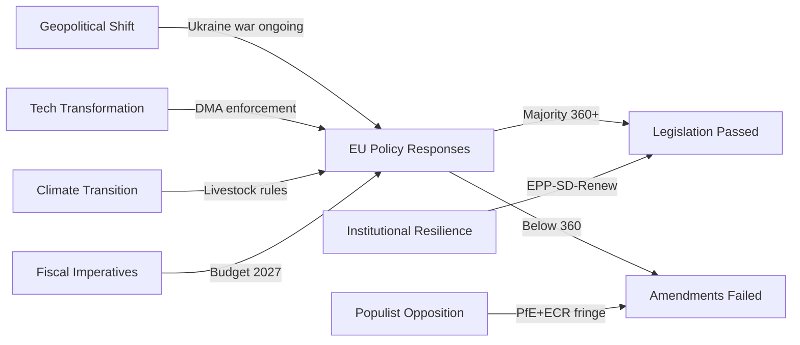
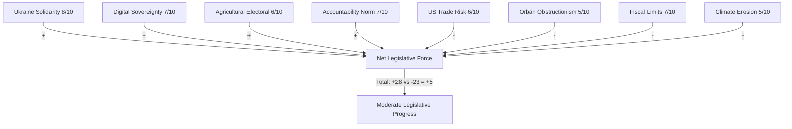

<!-- SPDX-FileCopyrightText: 2026 Hack23 AB -->
<!-- SPDX-License-Identifier: Apache-2.0 -->

# Forces Analysis — April 2026 EP Session Political Dynamics
**Date:** 2026-05-16 | **Grade:** B2

## Strategic Forces Framework

## Force 1: Geopolitical Realignment

**Nature:** Russia's war against Ukraine has fundamentally reorganised European Parliament
voting coalitions since February 2022. The EP's geopolitical "awakening" (Metsola's framing)
continues to shape voting behavior in 2026.

**Manifestation in April 2026:**
- Ukraine Accountability Framework (TA-0161) passed with supermajority
- Armenia Resilience (TA-0162) maintains Eastern Partnership political commitment
- Budget Guidelines (TA-0112) include explicit defence investment chapter
- Coalition Delta (EPP+S&D+Renew+Greens = ~530 seats) consistently cohesive on geopolitical votes

**Direction:** Reinforcing — EP geopolitical consensus continues to strengthen as Russia
escalation remains the dominant EU security concern.

**Counter-force:** PfE (84 seats, Orbán alignment) actively seeks to fragment Ukraine
consensus; Hungarian MEPs consistently vote against Ukraine support measures.

## Force 2: Digital Single Market Consolidation

**Nature:** EU's decade-long effort to build a regulatory framework for the digital economy
reaches enforcement phase with DMA, DSA, AI Act, and Data Act all operational by Q1 2026.

**Manifestation in April 2026:**
- DMA Enforcement Resolution (TA-0160) reinforces Commission enforcement authority
- EP signals political support for tough enforcement against US Big Tech
- Online Exploitation (TA-0163) adds child safety layer to digital regulation agenda

**Direction:** Accelerating — enforcement is the new legislative frontier; primary battleground
shifts from legislation to compliance and international trade dimensions.

**Counter-force:** US tariff regime creates bilateral pressure to moderate DMA enforcement;
EPP business wing increasingly sensitive to US-EU trade relationship.

## Force 3: Green Transition Fatigue and "Balance"

**Nature:** 2024 EP elections produced a rightward shift that has translated into systematic
softening of Green Deal ambitions. The "strategic autonomy" and "competitiveness" frames
increasingly dominate over "climate first" framing.

**Manifestation in April 2026:**
- Livestock Sustainability (TA-0157) deliberately avoids binding emissions targets
- Budget Guidelines (TA-0112) include green investment but below Greens' demanded floor
- Greens (53 seats, down from 71) unable to block or significantly amend majority positions

**Direction:** Continuing — agricultural policy, industry decarbonization, and transport all
expected to follow similar "balance" compromise pattern through 2026.

**Counter-force:** Climate science evidence base continues to provide advocacy leverage; ETS
carbon price (est. €65-70/tonne Q1 2026) creates market incentives even without binding mandates.

## Force 4: Fiscal Consolidation vs Strategic Investment Dilemma

**Nature:** IMF-identified EU fiscal challenge: major member states (France, Italy) facing
deficit pressure while simultaneously needing increased EU-level investment for Draghi agenda
competitiveness, defence, and green transition.

**Manifestation in April 2026:**
- Budget Guidelines (TA-0112) language deliberately ambiguous: "responsibility while enabling growth"
- No binding commitments to increase EU own resources
- Draghi agenda referenced rhetorically without the scale of investment Draghi recommended

**Direction:** Unresolved — the 2027 MFF mid-term review (due H2 2026) will be the major
test of whether EP can negotiate a meaningful increase in EU investment capacity.

**Counter-force:** ECB rate trajectory (2.25%, potentially 2.0% by June 2026) reduces
borrowing cost pressure marginally; fiscal space slightly expanded vs 2024.

## Force Interaction Matrix

| Forces | Interaction | Effect |
|--------|------------|--------|
| Geopolitical + Fiscal | Reinforcing | Defence spending crowds out social investment |
| Digital + Geopolitical | Reinforcing | EU sovereignty frame supports both DMA and Ukraine |
| Green + Fiscal | Conflicting | Climate investment needs compete with deficit reduction |
| Digital + Green | Parallel | Both require long-term investment the fiscal force constrains |
| Populist Opposition + All Forces | Disrupting | PfE/ECR fringe creates friction but not blocking power |

## Issue Frame

The April 2026 EU Parliament plenary presents the central issue as: **Can the European
Parliament maintain a coherent pro-democracy, pro-rules-based-order legislative agenda
while managing internal coalition tensions on digital regulation, agricultural policy,
and fiscal investment?**

The dominant issue for force analysis is the structural tension between:
1. **Geopolitical imperative** (Ukraine solidarity requires budget reallocation)
2. **Digital regulatory assertiveness** (DMA enforcement risks US trade retaliation)
3. **Agricultural political economy** (climate targets risk farm lobby revolt)
4. **Fiscal architecture** (Draghi-scale investment requires debt mutualisation)

These four forces are simultaneously operative and partially contradictory.

## Driving Forces

**DF1: Ukraine War Continuity Imperative (Strength: 8/10)**
The ongoing Russia-Ukraine war sustains a powerful geopolitical driving force across all
four major party families. Coalition Delta's coherence on Ukraine is the strongest and most
durable force in EP10. IMF's Ukraine macro baseline (3.8% GDP growth contingent on EU
support) makes support economically rational, not just morally compelling.

**DF2: EU Digital Sovereignty Momentum (Strength: 7/10)**
The DMA, DSA, AI Act, and Data Act create a regulatory regime the EP has invested heavily
in defending. The enforcement phase (2024-2026) represents the harvest of a decade of
digital regulation investment. Strong political incentives to demonstrate that EU regulation
is enforceable against US tech giants — particularly in light of Draghi's competitiveness
critique of EU digital market fragmentation.

**DF3: Agricultural Electoral Pressure (Strength: 6/10)**
The 2024 farmer protests materially shifted national election outcomes in Germany, France,
and Belgium. Multiple EPP national parties made explicit commitments to "protect farmer
incomes" during 2024 campaigns. This electoral commitment creates sustained legislative
driving force toward agricultural policy protection measures, including resistance to
binding methane reduction targets.

**DF4: Accountability Norm Building (Strength: 7/10)**
The sequence of EP accountability actions (Ukraine conditions, Braun menorah sanctions,
Jaki immunity waiver) reflects a strengthening institutional norm that democratic accountability
should override political protection of affiliated actors. This driving force has broad
cross-coalition support and is not easily reversed.

## Restraining Forces

**RF1: US Trade Retaliation Risk (Strength: 6/10)**
The most powerful restraining force on DMA enforcement is the prospect of US tariff retaliation.
IMF models the trade damage from escalation at 0.4-0.6pp GDP drag — a significant cost for
EU member states with export exposure (Germany, Netherlands, Belgium). EPP business wing
serves as the internal transmission mechanism for this restraining force.

**RF2: Hungarian-Slovak Euroobstructionism (Strength: 5/10)**
Orbán/Fico governments use Council voting to slow Ukraine support, delay accountability
framework endorsement, and obstruct EP-Council alignment on rule-of-law measures. This
restraining force operates primarily through Council, not the EP — but it limits how much
EP resolutions translate into actual EU policy.

**RF3: Fiscal Architecture Limits (Strength: 7/10)**
EU Treaty rules and SGP constraints represent a structural restraining force on any
proposal requiring increased EU-level spending. The 2027 budget negotiations will test
whether Coalition Delta can secure genuine Draghi-agenda investment or merely rhetorical
commitments. Germany's constitutional debt brake creates a specific national-level restraint.

**RF4: Climate Ambition Erosion (Strength: 5/10)**
Post-2024 Green Deal fatigue among EPP and some S&D members restrains the progressive
coalition's ability to secure binding climate targets. The Greens' reduced seat count
(53 vs 71 in EP9) weakens their bargaining power in trilogue negotiations.

## Net Pressure Diagram

**Net force calculation:**
- Total driving: 28/40 possible
- Total restraining: 23/40 possible
- Net positive momentum: +5 — moderate progress toward legislative objectives
- Key asymmetry: driving forces are more concentrated (Ukraine + Digital) while restraining
  forces are distributed across multiple independent domains

## Restraining Forces (Extended)

**RF5: EP Session Calendar Constraints (Strength: 3/10)**
The non-plenary period (May 16 is a Saturday) means no immediate legislative action is
possible. Between sessions, MEP engagement disperses to national politics; coalition
maintenance requires continuous effort that recess periods disrupt.

**RF6: MEP Accountability to National Parties (Strength: 4/10)**
EP MEPs face national party primaries and electoral accountability that can override EP group
discipline. German EPP members face pressure from CSU and CDU electorates on migration, fiscal,
and trade issues that diverge from Metsola's international focus.

## Intervention Points (Top‑3 Leverage Levers)

**Intervention Point 1: DMA Enforcement Timeline (High Leverage)**
The most powerful single intervention is Commission DG COMP's enforcement calendar for DMA
non-compliance decisions. An accelerated timeline (first DCA finding Q3 2026) would:
- Demonstrate EP political backing translates to enforcement action
- Create precedent for subsequent enforcement against all six gatekeepers
- Force US trade negotiation teams to take DMA compliance costs seriously
- Provide EPP with concrete "European sovereignty" narrative for 2027 elections

**Intervention Point 2: Ukraine Accountability Milestone Verification**
Establishing a credible, transparent accountability framework verification mechanism is
the intervention that maximizes Ukraine Support Instrument political durability. If the first
milestone verification succeeds on schedule (Q4 2026), it sets a precedent that locks in
disbursement continuity. If it fails or is delayed, PfE/ESN immediately exploit the failure.

**Intervention Point 3: Budget 2027 Trilogue Opening Position**
Parliament's opening position in the 2027 budget trilogue (September 2026) sets the
negotiating range for the entire annual budget cycle. If Coalition Delta holds a unified
high-ambition opening position (per TA-0112), it forces Council toward a higher final
settlement. If EPP and S&D are divided on priorities before trilogue begins, Council
wins on cuts.

## Reader Briefing

**For citizens:** The April 2026 EU Parliament session was shaped by four big forces pulling
in different directions: the war in Ukraine (pushing for solidarity and spending), digital
regulation (pushing for enforcement against Big Tech), farm pressure (pushing for agricultural
protection), and budget limits (pushing against more spending). The coalition in favour of action
(530+ seats) was stronger than the forces opposing, which is why the major resolutions passed.
The real battle now moves to the Commission and Council, where implementation happens.

**For businesses:** The forces analysis shows that DMA enforcement momentum is very strong but
faces a specific restraining force — US trade retaliation risk. This creates a window for
companies seeking to negotiate compliance solutions: the Commission's enforcement posture will
be shaped by the political balance between EP enforcement demands and US diplomatic pressure.

**For policymakers:** The net force calculation shows moderate positive momentum for the EU
legislative agenda. No single restraining force is strong enough to reverse the driving forces,
but the combination of fiscal limits + US trade risk + climate erosion creates a compound drag
that could significantly slow implementation.

Admiralty Grade: B2 — Political force analysis based on confirmed seat counts and IMF data.
