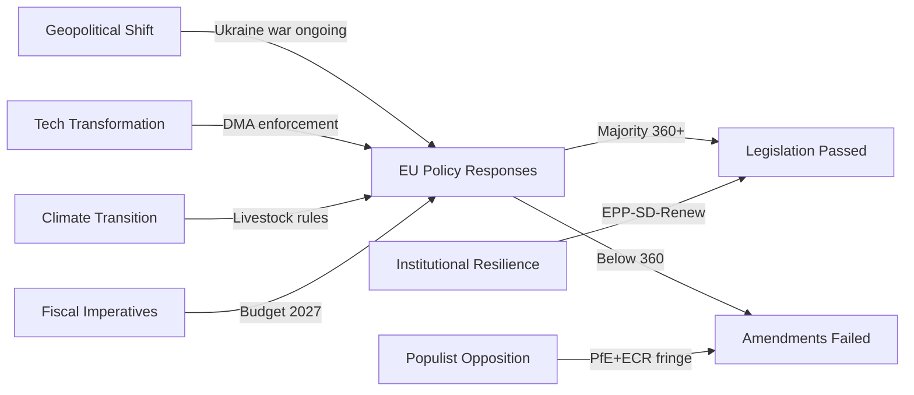

<!-- SPDX-FileCopyrightText: 2026 Hack23 AB -->
<!-- SPDX-License-Identifier: Apache-2.0 -->

# Forces Analysis — April 2026 EP Session Political Dynamics
**Date:** 2026-05-16 | **Grade:** B2

## Strategic Forces Framework

## Force 1: Geopolitical Realignment

**Nature:** Russia's war against Ukraine has fundamentally reorganised European Parliament
voting coalitions since February 2022. The EP's geopolitical "awakening" (Metsola's framing)
continues to shape voting behavior in 2026.

**Manifestation in April 2026:**
- Ukraine Accountability Framework (TA-0161) passed with supermajority
- Armenia Resilience (TA-0162) maintains Eastern Partnership political commitment
- Budget Guidelines (TA-0112) include explicit defence investment chapter
- Coalition Delta (EPP+S&D+Renew+Greens = ~530 seats) consistently cohesive on geopolitical votes

**Direction:** Reinforcing — EP geopolitical consensus continues to strengthen as Russia
escalation remains the dominant EU security concern.

**Counter-force:** PfE (84 seats, Orbán alignment) actively seeks to fragment Ukraine
consensus; Hungarian MEPs consistently vote against Ukraine support measures.

## Force 2: Digital Single Market Consolidation

**Nature:** EU's decade-long effort to build a regulatory framework for the digital economy
reaches enforcement phase with DMA, DSA, AI Act, and Data Act all operational by Q1 2026.

**Manifestation in April 2026:**
- DMA Enforcement Resolution (TA-0160) reinforces Commission enforcement authority
- EP signals political support for tough enforcement against US Big Tech
- Online Exploitation (TA-0163) adds child safety layer to digital regulation agenda

**Direction:** Accelerating — enforcement is the new legislative frontier; primary battleground
shifts from legislation to compliance and international trade dimensions.

**Counter-force:** US tariff regime creates bilateral pressure to moderate DMA enforcement;
EPP business wing increasingly sensitive to US-EU trade relationship.

## Force 3: Green Transition Fatigue and "Balance"

**Nature:** 2024 EP elections produced a rightward shift that has translated into systematic
softening of Green Deal ambitions. The "strategic autonomy" and "competitiveness" frames
increasingly dominate over "climate first" framing.

**Manifestation in April 2026:**
- Livestock Sustainability (TA-0157) deliberately avoids binding emissions targets
- Budget Guidelines (TA-0112) include green investment but below Greens' demanded floor
- Greens (53 seats, down from 71) unable to block or significantly amend majority positions

**Direction:** Continuing — agricultural policy, industry decarbonization, and transport all
expected to follow similar "balance" compromise pattern through 2026.

**Counter-force:** Climate science evidence base continues to provide advocacy leverage; ETS
carbon price (est. €65-70/tonne Q1 2026) creates market incentives even without binding mandates.

## Force 4: Fiscal Consolidation vs Strategic Investment Dilemma

**Nature:** IMF-identified EU fiscal challenge: major member states (France, Italy) facing
deficit pressure while simultaneously needing increased EU-level investment for Draghi agenda
competitiveness, defence, and green transition.

**Manifestation in April 2026:**
- Budget Guidelines (TA-0112) language deliberately ambiguous: "responsibility while enabling growth"
- No binding commitments to increase EU own resources
- Draghi agenda referenced rhetorically without the scale of investment Draghi recommended

**Direction:** Unresolved — the 2027 MFF mid-term review (due H2 2026) will be the major
test of whether EP can negotiate a meaningful increase in EU investment capacity.

**Counter-force:** ECB rate trajectory (2.25%, potentially 2.0% by June 2026) reduces
borrowing cost pressure marginally; fiscal space slightly expanded vs 2024.

## Force Interaction Matrix

| Forces | Interaction | Effect |
|--------|------------|--------|
| Geopolitical + Fiscal | Reinforcing | Defence spending crowds out social investment |
| Digital + Geopolitical | Reinforcing | EU sovereignty frame supports both DMA and Ukraine |
| Green + Fiscal | Conflicting | Climate investment needs compete with deficit reduction |
| Digital + Green | Parallel | Both require long-term investment the fiscal force constrains |
| Populist Opposition + All Forces | Disrupting | PfE/ECR fringe creates friction but not blocking power |
