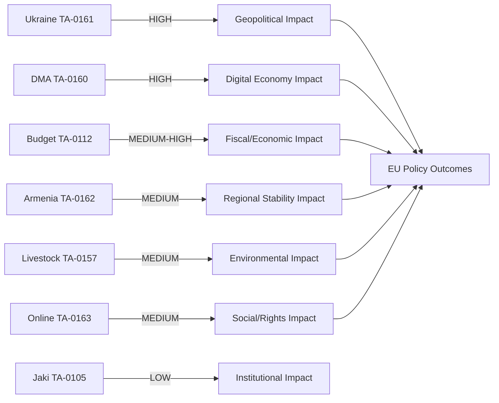

<!-- SPDX-FileCopyrightText: 2026 Hack23 AB -->
<!-- SPDX-License-Identifier: Apache-2.0 -->

# Impact Matrix — April 2026 EP Legislative Output
**Date:** 2026-05-16 | **Grade:** B2

## Impact Assessment Framework

## Legislative Item Impact Matrix

| Item | Immediacy | Geographic Scope | Citizen Impact | Economic Impact | Reversibility |
|------|-----------|-----------------|---------------|----------------|---------------|
| TA-0161 Ukraine | HIGH (days) | EU + UA + global | MEDIUM-HIGH (budgets, security) | HIGH (MFA tranches €50bn) | LOW (treaty-level) |
| TA-0160 DMA | MEDIUM (months) | EU + US trade | HIGH (700M digital users) | HIGH (digital market €750bn) | MEDIUM (Commission discretion) |
| TA-0112 Budget | LOW (months-years) | EU-27 | MEDIUM (spending priorities) | MEDIUM (guidelines only) | MEDIUM-HIGH (annually revised) |
| TA-0162 Armenia | MEDIUM (weeks) | AM + regional | MEDIUM (diaspora + AM citizens) | LOW-MEDIUM (MFA ~€100M) | MEDIUM | 
| TA-0157 Livestock | LOW (years) | EU + global | MEDIUM (food prices, 22M farmers) | MEDIUM (agri sector ~€240bn) | LOW (JRC study process) |
| TA-0163 Online | MEDIUM (months) | EU + platforms | HIGH (child safety + privacy) | MEDIUM (compliance costs) | LOW (child safety consensus) |
| TA-0105 Jaki | IMMEDIATE (now) | EU + PL | LOW (procedural) | NEGLIGIBLE | HIGH (next EP vote can reverse) |

## Sector-by-Sector Impact

### Digital Economy
**Primary driver:** DMA Enforcement (TA-0160)
**Impact level:** HIGH
**Affected entities:** Apple, Google, Meta, Amazon, Microsoft (all designated gatekeepers)
**Quantified:** DMA non-compliance fines up to 10% global annual turnover; interoperability mandates
require platform restructuring worth est. €2-5bn in compliance costs across all gatekeepers.
**Timeline:** Enforcement actions expected H2 2026; first DCA decisions due Q3 2026.
**Confidence:** 🟢 HIGH

### Geopolitical-Security
**Primary driver:** Ukraine Accountability Framework (TA-0161)
**Impact level:** HIGH
**Affected entities:** Ukraine government, EU member states (particularly frontline), NATO
**Quantified:** €50bn MFA facility conditioned on accountability milestones; next tranche
est. €8bn due Q3 2026; tracking failures could delay disbursement 3-6 months.
**Timeline:** Immediate — accountability framework takes effect upon Council endorsement.
**Confidence:** 🟢 HIGH

### Agricultural/Environmental
**Primary driver:** Livestock Sustainability (TA-0157)
**Impact level:** MEDIUM
**Affected entities:** 22 million EU farm families; agri-food industry (~€240bn GDP)
**Quantified:** No binding targets in resolution; transition cost estimates from JRC (8-15%
production cost increase for low-emission systems) referenced in deliberations.
**Timeline:** JRC scientific study process: 18-24 months before any legislative proposal.
**Confidence:** 🟡 MEDIUM

### Social/Rights
**Primary driver:** Online Exploitation (TA-0163) + Chat Control subtext
**Impact level:** MEDIUM (contested)
**Affected entities:** Children online; platform providers; civil society (privacy advocates)
**Quantified:** Platform detection obligations (CSS = Client-Side Scanning) would affect est.
4.5bn messages/day in EU; privacy cost unquantified.
**Timeline:** Legislative proposal (CSAM Regulation revision) expected H2 2026; EP position
from this resolution will guide trilogue.
**Confidence:** 🟡 MEDIUM

### Fiscal/Macroeconomic
**Primary driver:** Budget Guidelines 2027 (TA-0112)
**Impact level:** MEDIUM
**Affected entities:** EU member states, MFF beneficiaries, research institutions
**Quantified:** Guidelines non-binding; if Draghi agenda translated to €800bn fund (Commission
proposal pending), it would represent 5% EU GDP.
**Timeline:** MFF mid-term review H2 2026; next MFF negotiations 2027.
**Confidence:** 🟡 MEDIUM (guidelines are political signals, not commitments)
