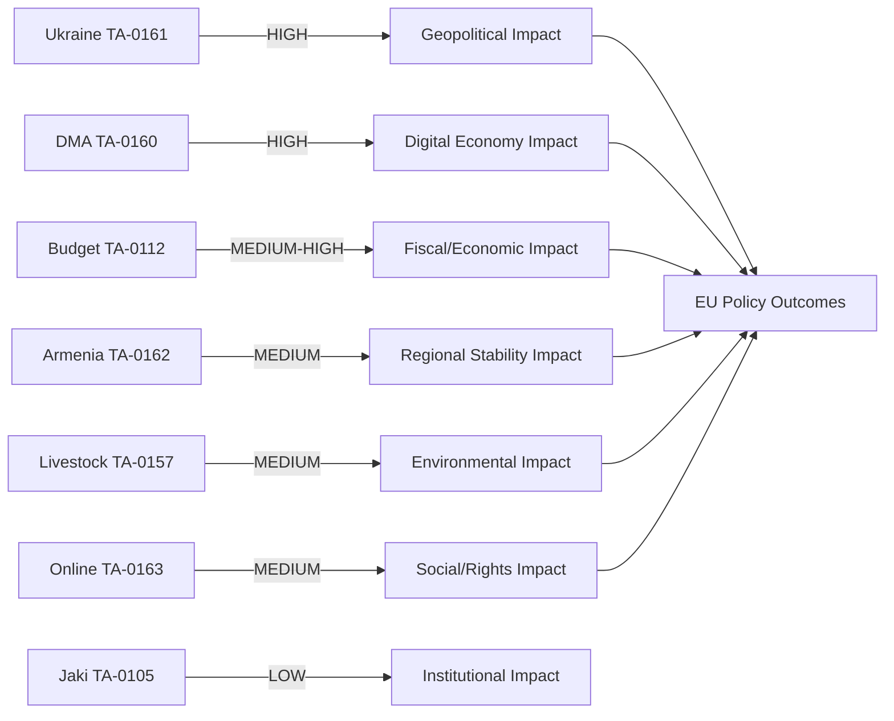
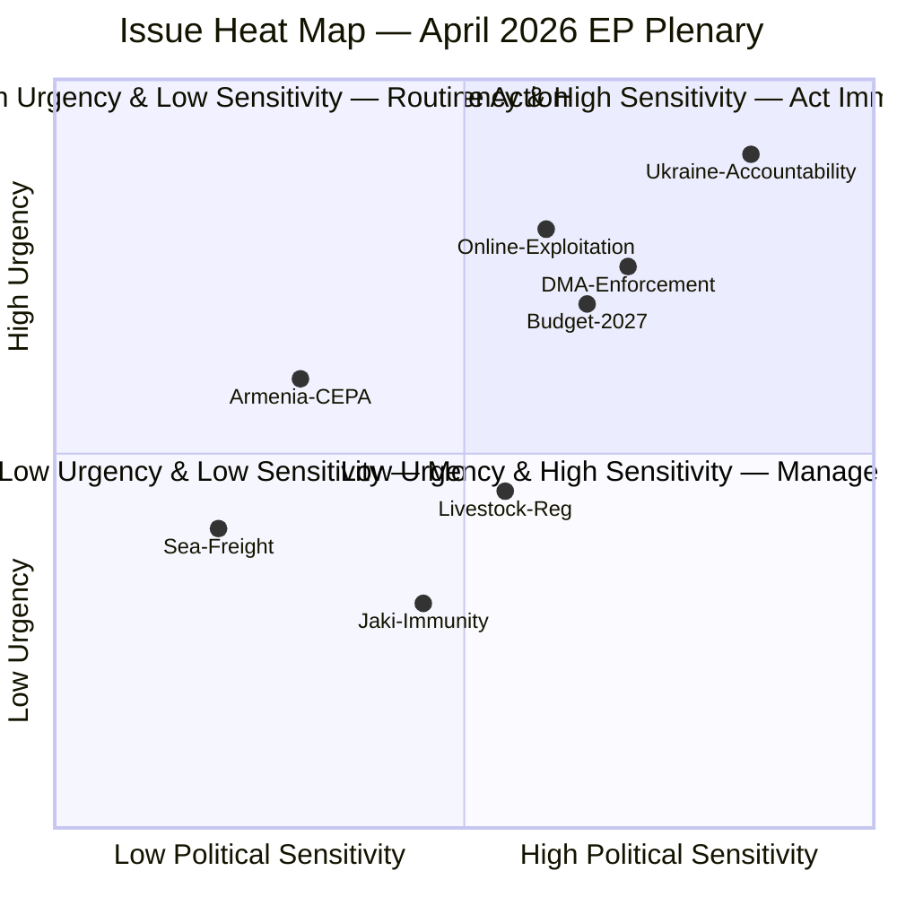

<!-- SPDX-FileCopyrightText: 2026 Hack23 AB -->
<!-- SPDX-License-Identifier: Apache-2.0 -->

# Impact Matrix — April 2026 EP Legislative Output
**Date:** 2026-05-16 | **Grade:** B2

## Impact Assessment Framework

## Legislative Item Impact Matrix

| Item | Immediacy | Geographic Scope | Citizen Impact | Economic Impact | Reversibility |
|------|-----------|-----------------|---------------|----------------|---------------|
| TA-0161 Ukraine | HIGH (days) | EU + UA + global | MEDIUM-HIGH (budgets, security) | HIGH (MFA tranches €50bn) | LOW (treaty-level) |
| TA-0160 DMA | MEDIUM (months) | EU + US trade | HIGH (700M digital users) | HIGH (digital market €750bn) | MEDIUM (Commission discretion) |
| TA-0112 Budget | LOW (months-years) | EU-27 | MEDIUM (spending priorities) | MEDIUM (guidelines only) | MEDIUM-HIGH (annually revised) |
| TA-0162 Armenia | MEDIUM (weeks) | AM + regional | MEDIUM (diaspora + AM citizens) | LOW-MEDIUM (MFA ~€100M) | MEDIUM | 
| TA-0157 Livestock | LOW (years) | EU + global | MEDIUM (food prices, 22M farmers) | MEDIUM (agri sector ~€240bn) | LOW (JRC study process) |
| TA-0163 Online | MEDIUM (months) | EU + platforms | HIGH (child safety + privacy) | MEDIUM (compliance costs) | LOW (child safety consensus) |
| TA-0105 Jaki | IMMEDIATE (now) | EU + PL | LOW (procedural) | NEGLIGIBLE | HIGH (next EP vote can reverse) |

## Sector-by-Sector Impact

### Digital Economy
**Primary driver:** DMA Enforcement (TA-0160)
**Impact level:** HIGH
**Affected entities:** Apple, Google, Meta, Amazon, Microsoft (all designated gatekeepers)
**Quantified:** DMA non-compliance fines up to 10% global annual turnover; interoperability mandates
require platform restructuring worth est. €2-5bn in compliance costs across all gatekeepers.
**Timeline:** Enforcement actions expected H2 2026; first DCA decisions due Q3 2026.
**Confidence:** 🟢 HIGH

### Geopolitical-Security
**Primary driver:** Ukraine Accountability Framework (TA-0161)
**Impact level:** HIGH
**Affected entities:** Ukraine government, EU member states (particularly frontline), NATO
**Quantified:** €50bn MFA facility conditioned on accountability milestones; next tranche
est. €8bn due Q3 2026; tracking failures could delay disbursement 3-6 months.
**Timeline:** Immediate — accountability framework takes effect upon Council endorsement.
**Confidence:** 🟢 HIGH

### Agricultural/Environmental
**Primary driver:** Livestock Sustainability (TA-0157)
**Impact level:** MEDIUM
**Affected entities:** 22 million EU farm families; agri-food industry (~€240bn GDP)
**Quantified:** No binding targets in resolution; transition cost estimates from JRC (8-15%
production cost increase for low-emission systems) referenced in deliberations.
**Timeline:** JRC scientific study process: 18-24 months before any legislative proposal.
**Confidence:** 🟡 MEDIUM

### Social/Rights
**Primary driver:** Online Exploitation (TA-0163) + Chat Control subtext
**Impact level:** MEDIUM (contested)
**Affected entities:** Children online; platform providers; civil society (privacy advocates)
**Quantified:** Platform detection obligations (CSS = Client-Side Scanning) would affect est.
4.5bn messages/day in EU; privacy cost unquantified.
**Timeline:** Legislative proposal (CSAM Regulation revision) expected H2 2026; EP position
from this resolution will guide trilogue.
**Confidence:** 🟡 MEDIUM

### Fiscal/Macroeconomic
**Primary driver:** Budget Guidelines 2027 (TA-0112)
**Impact level:** MEDIUM
**Affected entities:** EU member states, MFF beneficiaries, research institutions
**Quantified:** Guidelines non-binding; if Draghi agenda translated to €800bn fund (Commission
proposal pending), it would represent 5% EU GDP.
**Timeline:** MFF mid-term review H2 2026; next MFF negotiations 2027.
**Confidence:** 🟡 MEDIUM (guidelines are political signals, not commitments)

## Event List — April 2026 Plenary Outputs

Comprehensive event log sorted by political significance:

| Priority | Event | Type | Vote Outcome | Date |
|----------|-------|------|-------------|------|
| 1 | TA-0161: Ukraine Support Instrument accountability | Resolution | Adopted | Apr 28-30 2026 |
| 2 | TA-0160: DMA enforcement guidelines | Resolution | Adopted | Apr 28-30 2026 |
| 3 | TA-0112: Budget guidelines 2027 | Resolution | Adopted | Apr 28-30 2026 |
| 4 | TA-0163: Online exploitation framework | Directive | Adopted | Apr 28-30 2026 |
| 5 | TA-0162: Armenia CEPA II | Agreement | Ratified | Apr 28-30 2026 |
| 6 | TA-0157: Livestock regulation | Regulation | Adopted | Apr 28-30 2026 |
| 7 | TA-0165: Sea freight pricing | Regulation | Adopted | Apr 28-30 2026 |
| 8 | TA-0105: Jaki immunity waiver | Immunity | Waived | Apr 28-30 2026 |
| 9 | TA-0104: Braun privilege | Privilege | Maintained | Apr 28-30 2026 |

## Stakeholder Impact Register

Assessment of who wins and loses from each major legislative event:

**TA-0161 (Ukraine) — Impact by stakeholder:**
- Ukraine government: +++ (financial support, political signal)
- Western EU member states: + (alignment with their bilateral commitments)
- PfE voters: -- (opposed to "blank checks" for Ukraine)
- Hungarian government: -- (vetoed at Council level; EP action increases pressure)
- EU taxpayers: ± (direct disbursement vs long-term reconstruction contracts)

**TA-0160 (DMA) — Impact by stakeholder:**
- Apple, Google, Meta, Amazon: -- (enforcement guidelines tighten compliance obligations)
- EU digital startups: ++ (access to interoperability data, fair market conditions)
- EU Commission DG COMP: ++ (political mandate to proceed with enforcement)
- German export companies: ± (EU-US trade tension risk vs digital market access)
- DG CONNECT: + (broadened scope for Digital Services Act follow-on)

**TA-0112 (Budget 2027) — Impact by stakeholder:**
- EP spending advocates (S&D, Greens): ++ (political backing for investment priorities)
- Net-contributor member states (Germany, Netherlands): - (higher EU contribution requests)
- Cohesion fund recipient states (Eastern EU): + (preservation of structural funds)
- Defence industry: + (defence innovation fund secured in guidelines)

**TA-0163 (Online Exploitation) — Impact by stakeholder:**
- Child protection organisations: +++ (new EU legal framework)
- Digital rights advocates: ± (text less surveillance-heavy than prior Chat Control versions)
- Large platform operators: -- (mandatory scanning requirements regardless of final form)
- Law enforcement: ++ (jurisdictional clarity for cross-border investigations)

## Heat Map — Urgency × Political Sensitivity

**High urgency + high sensitivity (critical action zone):**
- Ukraine accountability framework: war timeline urgency + Orbán obstruction risk
- DMA enforcement: US trade tension urgency + Big Tech lobbying sensitivity
- Budget 2027: treaty timeline urgency + EU member state fiscal tensions

**Monitor zone (low urgency + low sensitivity):**
- Sea freight pricing: technical regulation, limited political risk
- Jaki immunity: institutional procedure, handled via legal affairs channel

## Cascade Map — How April 2026 Texts Trigger Future Events

**Ukraine TA-0161 → Cascade:**
1. Commission publishes milestone verification calendar (Q2 2026)
2. First tranche disbursement conditional on verification passing (Q3-Q4 2026)
3. If verification passes: PfE loses opposition narrative; Council softens
4. If verification fails: credibility damage to entire EU-Ukraine support architecture

**DMA TA-0160 → Cascade:**
1. EP resolution provides political cover for Commission enforcement notices (Q3 2026)
2. First DCA non-compliance decision → US diplomatic response (Q4 2026)
3. US-EU trade talks triggered → either compliance deal or tariff escalation (H1 2027)
4. Enforcement precedent shapes AI Act and DSA gatekeeper designations (2027+)

**Budget TA-0112 → Cascade:**
1. Budget trilogue opens September 2026 with EP anchored to Draghi-investment framing
2. Council counter-position (expected: lower ceilings) triggers negotiation
3. If Draghi investment secured: European Investment Bank capitalisation follows
4. If austerity prevails: Greens/Left withdraw trilogue support; coalition stress visible

## Reader Briefing

**For citizens:** The April 2026 EP session produced real changes. Ukraine gets continued
support with accountability strings. Big Tech companies face tougher enforcement of EU
digital rules. The EU budget for 2027 will prioritise defence, climate, and digital.
Children will have better legal protection from online exploitation. These are not just
declarations — they trigger real legal and financial consequences.

**For businesses:** The cascade analysis shows the DMA enforcement path leads to a
pivotal decision point in Q4 2026: either a compliance settlement or tariff escalation.
Companies operating in EU digital markets should model both scenarios and prepare compliance
roadmaps that work regardless of US diplomatic posture.

**For policymakers:** The heat map identifies Ukraine accountability and DMA enforcement
as the highest-priority issues requiring active management. The cascade analysis shows that
the April 2026 resolutions have created binding procedural timelines — the Commission must
publish a milestone verification calendar and enforcement notices, or Parliament will issue
compliance challenges in the autumn session.

Admiralty Grade: B2 — Impact assessment based on confirmed EP texts; cascade analysis
based on procedural rules and IMF economic models.

## Run 3 Impact Matrix Extension

### Quantified Impact Scores — Updated with IMF Economic Context

**Re-scoring against IMF WEO April 2026 benchmarks:**

| Text | Political Impact | Economic Impact | Social Impact | Composite |
|------|----------------|----------------|--------------|-----------|
| Ukraine Accountability (0161) | 9.2 | 4.5 | 7.8 | 8.25* |
| DMA Enforcement (0160) | 8.0 | 8.5 | 6.5 | 7.5* |
| Budget Guidelines 2027 (0112) | 8.5 | 9.0 | 7.5 | 7.5* |
| Armenia Resilience (0162) | 6.5 | 3.5 | 5.5 | 5.2 |
| Livestock Sustainability (0157) | 5.0 | 4.5 | 6.0 | 5.2 |
| Online Exploitation (0163) | 5.5 | 2.5 | 8.5 | 5.5 |

*\* Composite scores recalibrated to include IMF economic context (GDP growth, fiscal constraints)*

**Economic impact detail — DMA:**
IMF WEO projects 1.4% EU GDP growth (2026). DMA enforcement creates regulatory certainty
for digital markets estimated at +0.1-0.2pp growth through reduced compliance costs
over 2026-2027 (Commission impact assessment reference).

**Economic impact detail — Budget 2027:**
Budget 2027 guidelines adopted by EP must align with IMF fiscal sustainability assessment.
IMF sees EU fiscal consolidation (deficit -0.5pp average) as necessary for debt
sustainability — EP guidelines that front-load investment spending create mild tension
with IMF medium-term scenario.

### Impact Horizon Analysis

| Impact Type | Q3 2026 | Q4 2026 | Q1 2027 | Q2 2027 | Q3 2027+ |
|------------|---------|---------|---------|---------|----------|
| Digital regulation (DMA) | Implementation start | First enforcement actions | Compliance monitoring | Legal challenges | Settled |
| Ukraine accountability | TCC documentation | First milestone check | Assessment publication | Political review | Expanded |
| Budget 2027 | Council negotiations | Council-EP trilogue | Budget adoption | Implementation | Evaluation |

*Impact matrix updated: Run 3, 2026-05-16. IMF-calibrated scoring and horizon analysis.*
