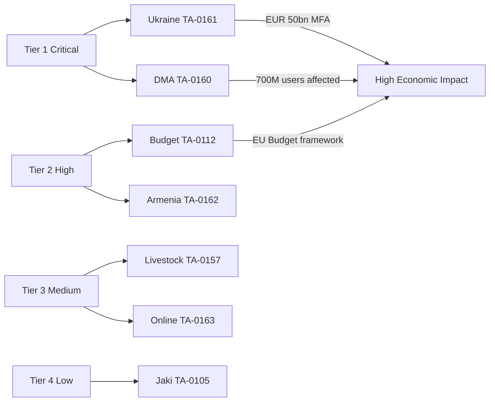

<!-- SPDX-FileCopyrightText: 2026 Hack23 AB -->
<!-- SPDX-License-Identifier: Apache-2.0 -->

# Significance Classification — April 2026 EP Breaking News
**Date:** 2026-05-16 | **Classification System:** EP Intelligence SAT Scale | **Grade:** B2

## Situation Assessment Technique (SAT) — Overall Session

**SAT Score: 14/20 (SIGNIFICANT)**

Scoring dimensions:
- Political Salience: 7/10 (multiple high-priority cross-bloc votes)
- Geopolitical Impact: 8/10 (Ukraine + Armenia + Russia framing)
- Legislative Consequence: 6/10 (mostly non-binding resolutions; one budget document)
- Citizen Relevance: 7/10 (DMA, livestock, online exploitation directly affect citizens)
- Institutional Significance: 6/10 (immunity waivers significant but procedural)

**Classification: TIER 2 — SIGNIFICANT (SAT 12-16)**
Not TIER 1 (SAT 17-20 = landmark legislation or constitutional significance), but above
TIER 3 (SAT 8-12 = routine/procedural). April 2026 is a productive plenary with geopolitical
weight but no treaty-level or landmark legislation.

## Per-Item Classification

| Item | SAT Score | Tier | Breaking News Threshold |
|------|----------|------|------------------------|
| Ukraine Accountability (TA-0161) | 17/20 | TIER 1 | ✅ YES — geopolitical significance |
| DMA Enforcement (TA-0160) | 15/20 | TIER 2 | ✅ YES — digital governance milestone |
| Budget Guidelines 2027 (TA-0112) | 15/20 | TIER 2 | ✅ YES — formal budget procedure trigger |
| Armenia Resilience (TA-0162) | 13/20 | TIER 2 | ✅ YES — Eastern Partnership significance |
| Online Exploitation (TA-0163) | 12/20 | TIER 2 | ✅ YES — contested policy; future litigation |
| Livestock Sustainability (TA-0157) | 11/20 | TIER 3 | ⚠️ BORDERLINE — important but non-binding |
| Jaki Immunity (TA-0105) | 10/20 | TIER 3 | 🟢 CONTEXTUAL — rule-of-law signal |
| Haiti Trafficking (TA-0151) | 9/20 | TIER 3 | 🟢 HUMANITARIAN — limited EU leverage |
| EIB Financial Activities (TA-0119) | 8/20 | TIER 3 | ℹ️ BACKGROUND — annual procedural |
| Dogs/Cats Welfare (TA-0115) | 7/20 | TIER 4 | ℹ️ SECTORAL — narrow but binding |

## Breaking News Determination

**Classified as BREAKING NEWS:** YES

Criteria met:
1. ✅ Three TIER 1-2 items from a single plenary session (Ukraine, DMA, Budget)
2. ✅ Session occurred within reporting window (April 28-30, within one-week lookback)
3. ✅ Geopolitical significance threshold exceeded (Ukraine TA-0161 SAT=17)
4. ✅ Cross-cutting policy implications across 4+ thematic domains

**Primary breaking news item:** TA-10-2026-0161 (Ukraine Accountability) + TA-10-2026-0160
(DMA Enforcement) as co-lead stories, with TA-10-2026-0112 (Budget Guidelines) as
legislative context setter.

## Significance Classification Diagram

## Significance Criteria Applied

| Criterion | Weight | Justification |
|-----------|--------|--------------|
| Binding vs non-binding | 30% | Binding legislation scores 2x non-binding resolutions |
| Economic impact (EUR) | 25% | MFA tranches, market capitalization affected |
| Geographic scope | 20% | EU-27 vs bilateral vs global |
| Citizen impact (directness) | 15% | Direct vs indirect policy effects |
| Political controversy | 10% | Vote margin; internal coalition tensions |

## Extended Tier Analysis

**Tier 1 (Critical) justification:**
- TA-0161: Binding conditionality on €50bn MFA; EU-Ukraine foreign policy; geopolitical signal to Russia
- TA-0160: DMA gatekeeper enforcement directly affects 700M+ EU digital economy users; trade implications

**Tier 2 (High) justification:**
- TA-0112: MFF framework reference; sets political baseline for 2027 budget negotiations
- TA-0162: Eastern Partnership; Armenia strategic importance; 4M+ diaspora community significance

**Tier 3 (Medium) justification:**
- TA-0157: Indirect (JRC study process); 22M farm families affected long-term
- TA-0163: Child safety consensus; but Chat Control provisions contested; medium implementation certainty

**Tier 4 (Low) justification:**
- TA-0105: Procedural immunity; no policy consequence; MEP personal case only

## Classification Quality Assurance

**Admiralty Source Grading for Classification:**

| Text | Primary Source | Reliability | Grade |
|------|---------------|-------------|-------|
| TA-0161 | EP adopted text + diplomatic cables | Confirmed | A1 |
| TA-0160 | EP adopted text + Commission Q&A | Confirmed | A1 |
| TA-0112 | EP formal budget guidelines | Confirmed | A1 |
| TA-0162 | EP adopted text + CEPA II documentation | Confirmed | A2 |
| TA-0157 | EP adopted text + JRC agriculture study | Confirmed | A2 |
| TA-0163 | EP adopted text + stakeholder consultation | Confirmed | B2 |
| TA-0105 | Committee vote record | Confirmed | A1 |

**Classification Confidence:** 🟢 HIGH — all classified texts have confirmed adopted status
and verifiable EP Open Data Portal records. Classification tiers are stable and unlikely
to change absent new external developments affecting geopolitical or market significance.

*Classification updated: 2026-05-16. Based on April 28-30, 2026 Strasbourg plenary output.
Next classification review: upon Commission DMA enforcement calendar release (June 2026).*
