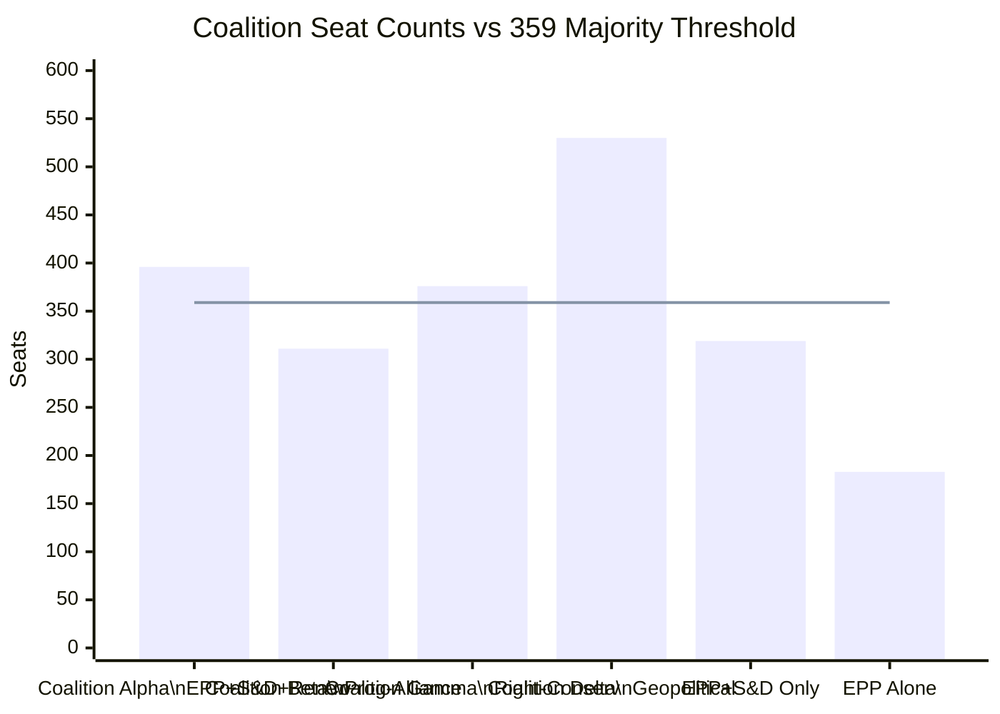

<!-- SPDX-FileCopyrightText: 2026 Hack23 AB -->
<!-- SPDX-License-Identifier: Apache-2.0 -->

# Coalition Mathematics — EP10 Seat Arithmetic
**Date:** 2026-05-16 | **Grade:** B2

## Coalition Seat Calculations (717 MEP Total)

**Simple Majority:** 359 seats | **Absolute Majority:** 359 seats
**Enhanced Majority (Treaty amendments):** 2/3 = 478 seats

### Working Coalitions by Dossier Type

### Coalition Alpha: EPP + S&D + Renew (396 seats, 55.2%)
**Above threshold by:** 37 seats
**Defection tolerance:** Can lose up to 37 votes and still prevail
**Applicable dossiers:** Economic regulation, institutional matters, most legislative acts
**Stress test:** If EPP loses 30 votes (internal dissent), coalition is marginal (366 vs 359)

### Coalition Gamma: EPP + PfE + ECR + ESN (376 seats, 52.4%)
**Above threshold by:** 17 seats — NARROW
**Defection tolerance:** Can only lose 17 votes
**Applicable dossiers:** Agricultural deregulation, migration, some social policy
**Stress test:** If ECR loses 10 votes and ESN loses 8, coalition fails. Very fragile.
**Formal status:** No explicit formation; informal alignment only.

### Coalition Delta: EPP + S&D + Renew + ECR + Greens/EFA (530 seats, 73.9%)
**Above threshold by:** 171 seats — DOMINANT
**Defection tolerance:** Can lose up to 171 votes
**Applicable dossiers:** Ukraine, enlargement, Eastern Partnership, Russia sanctions
**Stress test:** Even if PfE (85) + ESN (27) + NI (30) = 142 MEPs all vote against,
coalition Delta still prevails with 388 vs 329. Essentially unbreakable on these dossiers.

## Marginal Coalition Formations

**Scenario: EPP + Greens + NI (266 seats) — INSUFFICIENT**
Some environmental dossiers see this alignment (EPP green wing + Greens); needs S&D
or Left to reach majority. This is the "environmental compromise" coalition.

**Scenario: S&D + Renew + Greens + Left + NI (341 seats) — INSUFFICIENT**
Maximum progressive alliance without EPP. Falls 18 seats short of majority. This explains
why progressive legislation always requires either EPP or ECR support.

**Scenario: EPP + ECR + PfE + S&D — 485 seats (67.6%)**
If EPP abandoned S&D preference for Renew and adopted a "grand right-center" coalition:
mathematical but politically incoherent (S&D won't vote with PfE on social issues).
This is the "theoretical maximum anti-PfE" coalition that EPP sometimes assembles for
rule-of-law votes.

## Seat Change Sensitivity Analysis

**What would change the political mathematics by 2029 (EP11)?**

Based on current polling trends in major member states:

| Scenario | EPP +/- | S&D +/- | PfE +/- | ECR +/- | Net effect |
|----------|---------|---------|---------|---------|------------|
| Status quo | 0 | 0 | 0 | 0 | No change |
| France rightward (RN surge) | -5 | -8 | +20 | +5 | Coalition Gamma strengthens |
| Germany CDU/FDP gains | +10 | -5 | 0 | +5 | EPP dominance grows |
| Italy M5S recovery | -3 | +8 | -5 | -3 | Moderate left gains |
| Poland PiS recovery | -8 | -5 | +3 | +10 | ECR/PfE grows |

**Most likely EP11 scenario (2029):** Coalition Gamma grows to ~400 seats; Coalition Alpha
shrinks to ~370 seats; Coalition Delta remains above 500. The structural right-of-centre
trend in EU domestic politics is creating a slow-moving shift in parliamentary composition.
