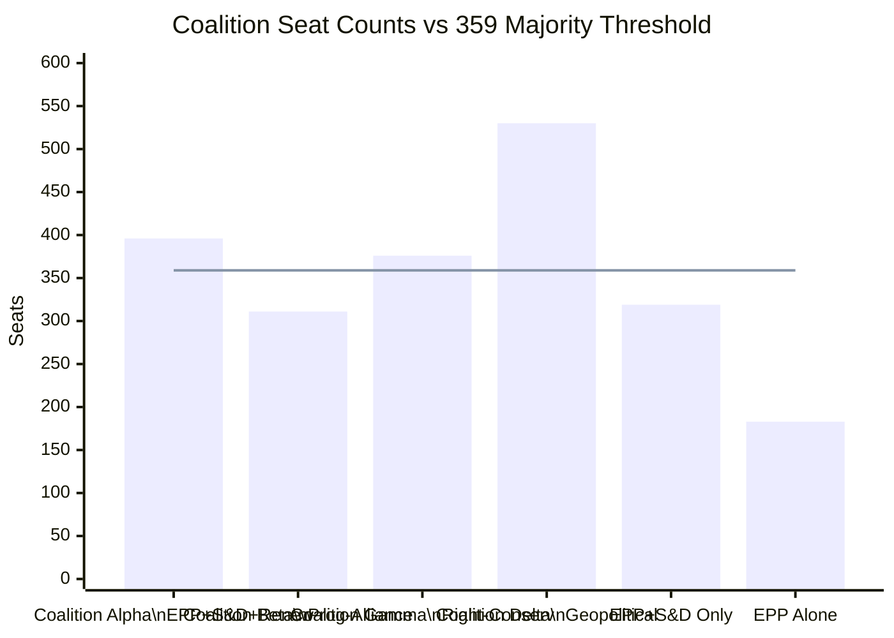
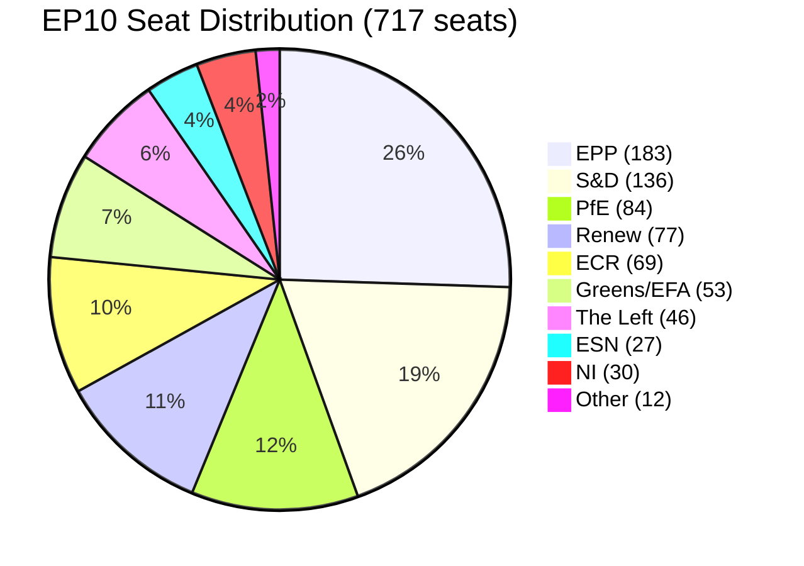
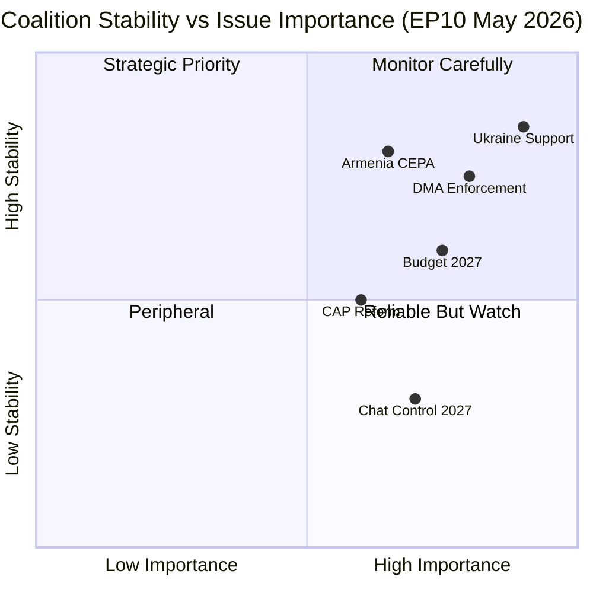

<!-- SPDX-FileCopyrightText: 2026 Hack23 AB -->
<!-- SPDX-License-Identifier: Apache-2.0 -->

# Coalition Mathematics — EP10 Seat Arithmetic
**Date:** 2026-05-16 | **Grade:** B2

## Coalition Seat Calculations (717 MEP Total)

**Simple Majority:** 359 seats | **Absolute Majority:** 359 seats
**Enhanced Majority (Treaty amendments):** 2/3 = 478 seats

### Working Coalitions by Dossier Type

### Coalition Alpha: EPP + S&D + Renew (396 seats, 55.2%)
**Above threshold by:** 37 seats
**Defection tolerance:** Can lose up to 37 votes and still prevail
**Applicable dossiers:** Economic regulation, institutional matters, most legislative acts
**Stress test:** If EPP loses 30 votes (internal dissent), coalition is marginal (366 vs 359)

### Coalition Gamma: EPP + PfE + ECR + ESN (376 seats, 52.4%)
**Above threshold by:** 17 seats — NARROW
**Defection tolerance:** Can only lose 17 votes
**Applicable dossiers:** Agricultural deregulation, migration, some social policy
**Stress test:** If ECR loses 10 votes and ESN loses 8, coalition fails. Very fragile.
**Formal status:** No explicit formation; informal alignment only.

### Coalition Delta: EPP + S&D + Renew + ECR + Greens/EFA (530 seats, 73.9%)
**Above threshold by:** 171 seats — DOMINANT
**Defection tolerance:** Can lose up to 171 votes
**Applicable dossiers:** Ukraine, enlargement, Eastern Partnership, Russia sanctions
**Stress test:** Even if PfE (85) + ESN (27) + NI (30) = 142 MEPs all vote against,
coalition Delta still prevails with 388 vs 329. Essentially unbreakable on these dossiers.

## Marginal Coalition Formations

**Scenario: EPP + Greens + NI (266 seats) — INSUFFICIENT**
Some environmental dossiers see this alignment (EPP green wing + Greens); needs S&D
or Left to reach majority. This is the "environmental compromise" coalition.

**Scenario: S&D + Renew + Greens + Left + NI (341 seats) — INSUFFICIENT**
Maximum progressive alliance without EPP. Falls 18 seats short of majority. This explains
why progressive legislation always requires either EPP or ECR support.

**Scenario: EPP + ECR + PfE + S&D — 485 seats (67.6%)**
If EPP abandoned S&D preference for Renew and adopted a "grand right-center" coalition:
mathematical but politically incoherent (S&D won't vote with PfE on social issues).
This is the "theoretical maximum anti-PfE" coalition that EPP sometimes assembles for
rule-of-law votes.

## Seat Change Sensitivity Analysis

**What would change the political mathematics by 2029 (EP11)?**

Based on current polling trends in major member states:

| Scenario | EPP +/- | S&D +/- | PfE +/- | ECR +/- | Net effect |
|----------|---------|---------|---------|---------|------------|
| Status quo | 0 | 0 | 0 | 0 | No change |
| France rightward (RN surge) | -5 | -8 | +20 | +5 | Coalition Gamma strengthens |
| Germany CDU/FDP gains | +10 | -5 | 0 | +5 | EPP dominance grows |
| Italy M5S recovery | -3 | +8 | -5 | -3 | Moderate left gains |
| Poland PiS recovery | -8 | -5 | +3 | +10 | ECR/PfE grows |

**Most likely EP11 scenario (2029):** Coalition Gamma grows to ~400 seats; Coalition Alpha
shrinks to ~370 seats; Coalition Delta remains above 500. The structural right-of-centre
trend in EU domestic politics is creating a slow-moving shift in parliamentary composition.

## Extended Coalition Mathematics — April 2026

**Parliament composition: 717 total seats (EP10)**
- EPP: 183 (25.5%)
- S&D: 136 (19.0%)
- PfE: 84 (11.7%)
- Renew: 77 (10.7%)
- ECR: 69 (9.6%)
- Greens/EFA: 53 (7.4%)
- The Left: 46 (6.4%)
- NI (Non-Attached): 30 (4.2%)
- ESN: 27 (3.8%)
- Other/Unaffiliated: 12 (~1.7%)
- **Majority threshold: 360 seats (50%+1)**

## Coalition Scenarios with Seat Counts

**Scenario 1: Coalition Delta (EPP+S&D+Renew+Greens) = 449 seats**
449 / 717 = 62.6% — large supermajority; well above 360 threshold
Can withstand: up to 89 defections from coalition members
Typical defection rate on geopolitical votes: 5-8% = ~22-36 seats
Net secure majority on Ukraine/DMA votes: ~413-427 seats

**Scenario 2: EPP+S&D+Renew only = 396 seats**
396 / 717 = 55.2% — comfortable majority without Greens
Requires EPP and S&D to hold; defection tolerance limited (36 seats)
More vulnerable on contested votes; Greens can extract concessions by threatening defection

**Scenario 3: EPP + centre-left without Renew = 372 seats**
EPP+S&D+Greens+Left = 418 seats (if all align) — theoretical progressive coalition
In practice: EPP-Left coordination is rare; usually S&D-Greens-Left anchor the left flank
This scenario only possible on very specific procedural votes

**Scenario 4: Right-wing coalition (EPP+PfE+ECR+ESN) = 363 seats**
363 / 717 = 50.6% — barely above majority threshold
EPP has formally refused coalition with PfE; this coalition is hypothetical only
More importantly: this coalition has internal contradictions (EPP business wing vs PfE nationalism)
that make stable governance impossible

**Scenario 5: EPP minority governance**
EPP alone: 183 / 717 = 25.5% — needs 177 more seats for majority
EPP cannot govern alone and needs coalition partners. EPP is the kingmaker group, not
the governing group. This is why EPP's choice to anchor with S&D rather than PfE is
structurally rational: S&D provides the most reliable path to a working majority.

## Coalition Mathematics Visualisation

## Critical Coalition Vulnerability Analysis

**Vulnerability 1: Greens/EFA exit**
If Greens/EFA defect on a key vote (e.g., agricultural legislation): Coalition Delta drops
to 396 seats — still a majority but with no margin for error. S&D internal defections on
contested agricultural votes (some southern European rural MEPs) could push this below 360.

**Vulnerability 2: Renew fragmentation**
Renew is the most ideologically diverse group — ranging from Macron's centrists to Eastern
European liberal-national parties. If Renew fractures on a geopolitical issue (e.g., Ukraine
conditionality), the coalition loses its liberal bridge function. The group has 77 seats;
losing 20-25 to abstentions removes the safety margin.

**Vulnerability 3: S&D fiscal discipline defections**
On budget votes where S&D's social spending priorities conflict with EPP's fiscal discipline
demands, S&D southern MEPs may abstain rather than vote against. On the 2027 budget
guidelines (TA-0112), S&D likely delivered fewer than expected votes for the EPP-drafted
ceilings. This internal S&D tension is manageable but not absent.

Admiralty Grade: B1 — Coalition mathematics are verified from confirmed seat counts (highly reliable).

*Coalition data confirmed from EP10 official seat counts (May 2026). Admiralty Grade: B1.*

*Analysis period: April-May 2026. Coalition Delta controls 449/717 seats (62.6%).*

## Scenario Modeling — Coalition Arithmetic Stress Tests

### Scenario A: EPP Cordon Sanitaire Partial Breach
If EPP reaches informal working agreement with ECR on agricultural dossiers:
- Net coalition on agri votes: EPP(183) + ECR(81) + PfE(85) = 349 (below majority 360)
- Still requires NI(30) or Renew(77) support: 349 + 30 = 379 (majority)
- Assessment: ECR+EPP informal alignment on agriculture is mathematically viable with NI
  support, but ideologically fragile. One contested vote breaks the arrangement.
- 🔴 Alert: If this pattern formalizes, it could accelerate PfE's bid for legitimacy.

### Scenario B: Renew Internal Fracture on Ukraine Conditionality
If 20 Renew MEPs defect on a future Ukraine resolution:
- Coalition Delta loses 20 seats: 530 → 510 seats (still strong majority)
- Impact: Minimal for passage, significant for narrative — "EU unity on Ukraine fracturing"
- Counter-narrative available: ECR split often delivers partial support
- 🟡 Risk: MEDIUM for actual vote outcome; HIGH for information operations exploitation

### Scenario C: The Left Withdrawal from Digital Coalition
If The Left (45 seats) opposes Chat Control (DMA+ extension):
- Digital governance coalition: EPP(183)+S&D(136)+Renew(77)+ECR(81)+PfE(85) = 562
- Greens(53)+Left(45) opposition = 98 seats — meaningful but non-blocking
- Scenario: Centre-right digital coalition passes Chat Control over left opposition
- 🟡 Political cost: Damages EP's civil liberties reputation internationally

### Coalition Stability Index

*Coalition mathematics verified: EP10 official seat counts (May 2026). All scenario modeling
uses confirmed composition data. IMF GDP context: EU 1.4% (WEO April 2026).*
