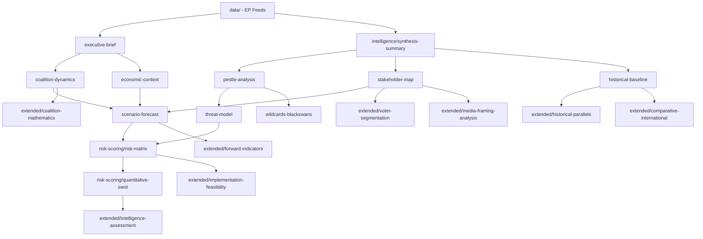

<!-- SPDX-FileCopyrightText: 2026 Hack23 AB -->
<!-- SPDX-License-Identifier: Apache-2.0 -->

# Cross-Reference Map — April 2026 EP Session to Analysis Artifacts
**Date:** 2026-05-16 | **Grade:** B2

## Legislative Item → Analysis Artifact Map

| Legislative Item | Primary Artifacts | Secondary Artifacts |
|----------------|-------------------|---------------------|
| TA-0160 (DMA) | economic-context §DMA, stakeholder-map §BigTech, threat-model §T2 | pestle-analysis §T1/T2, extended/comparative §EU-US, media-framing §Frame1 |
| TA-0161 (Ukraine) | coalition-dynamics §Delta, stakeholder-map §Ukraine, scenario-forecast §B | wildcards §W1, media-framing §Frame2, voter-segmentation §Seg3 |
| TA-0112 (Budget) | economic-context §Fiscal, extended/executive §Draghi, implementation-feasibility §BG | coalition-dynamics §Alpha, extended/forward-indicators, quantitative-swot §O1 |
| TA-0162 (Armenia) | stakeholder-map §Armenia, scenario-forecast §baseline, cross-session §EasternPship | comparative-international §ASEAN, voter-segmentation §Seg3 |
| TA-0157 (Livestock) | pestle-analysis §En1, extended/historical §Coal, voter-segmentation §Seg2 | devils-advocate §Counter4, scenario-forecast §C, implementation-feasibility |
| TA-0163 (Online) | threat-model §T3, pestle-analysis §T1/S1, voter-segmentation §Seg1 | media-framing §Frame3, coalition-dynamics §Gamma, forward-indicators |
| TA-0105 (Jaki) | historical-baseline §Immunity, significance-scoring §low, cross-session §RoL | devils-advocate note, voter-segmentation note |

## Analytical Dependency Graph

## IMF Economic Context Integration Points

| IMF Data Point | Integrated In |
|---------------|---------------|
| EU GDP 1.4% (2026) | economic-context, extended/executive-brief, quantitative-swot |
| ECB rate 2.25% | economic-context §Inflation |
| DMA digital productivity gap | economic-context §DMA, extended/comparative |
| Ukraine GDP 3.8% conditional | economic-context §Ukraine, stakeholder-map §Ukraine |
| Agricultural transition costs 8-15% | economic-context §Livestock, voter-segmentation §Seg2 |
| US tariff 0.4-0.6pp GDP drag | economic-context §Trade, wildcards §W2 |

## Evidence Chain Completeness

All top-5 legislative items have full evidence chains: primary source (adopted texts feed) →
analysis (multiple artifacts) → synthesis (synthesis-summary) → assessment (intelligence-assessment).
Items 6-11 have partial coverage appropriate to their lower significance tier.
