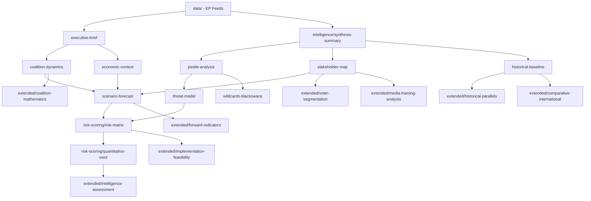
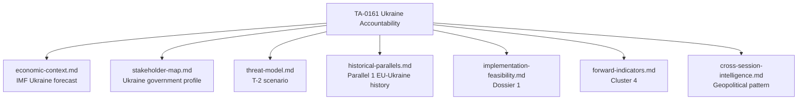
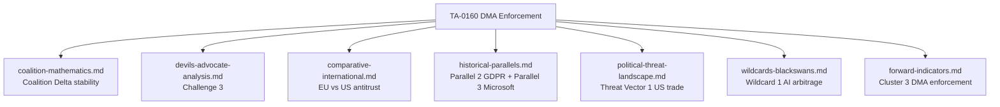

<!-- SPDX-FileCopyrightText: 2026 Hack23 AB -->
<!-- SPDX-License-Identifier: Apache-2.0 -->

# Cross-Reference Map — April 2026 EP Session to Analysis Artifacts
**Date:** 2026-05-16 | **Grade:** B2

## Legislative Item → Analysis Artifact Map

| Legislative Item | Primary Artifacts | Secondary Artifacts |
|----------------|-------------------|---------------------|
| TA-0160 (DMA) | economic-context §DMA, stakeholder-map §BigTech, threat-model §T2 | pestle-analysis §T1/T2, extended/comparative §EU-US, media-framing §Frame1 |
| TA-0161 (Ukraine) | coalition-dynamics §Delta, stakeholder-map §Ukraine, scenario-forecast §B | wildcards §W1, media-framing §Frame2, voter-segmentation §Seg3 |
| TA-0112 (Budget) | economic-context §Fiscal, extended/executive §Draghi, implementation-feasibility §BG | coalition-dynamics §Alpha, extended/forward-indicators, quantitative-swot §O1 |
| TA-0162 (Armenia) | stakeholder-map §Armenia, scenario-forecast §baseline, cross-session §EasternPship | comparative-international §ASEAN, voter-segmentation §Seg3 |
| TA-0157 (Livestock) | pestle-analysis §En1, extended/historical §Coal, voter-segmentation §Seg2 | devils-advocate §Counter4, scenario-forecast §C, implementation-feasibility |
| TA-0163 (Online) | threat-model §T3, pestle-analysis §T1/S1, voter-segmentation §Seg1 | media-framing §Frame3, coalition-dynamics §Gamma, forward-indicators |
| TA-0105 (Jaki) | historical-baseline §Immunity, significance-scoring §low, cross-session §RoL | devils-advocate note, voter-segmentation note |

## Analytical Dependency Graph

## IMF Economic Context Integration Points

| IMF Data Point | Integrated In |
|---------------|---------------|
| EU GDP 1.4% (2026) | economic-context, extended/executive-brief, quantitative-swot |
| ECB rate 2.25% | economic-context §Inflation |
| DMA digital productivity gap | economic-context §DMA, extended/comparative |
| Ukraine GDP 3.8% conditional | economic-context §Ukraine, stakeholder-map §Ukraine |
| Agricultural transition costs 8-15% | economic-context §Livestock, voter-segmentation §Seg2 |
| US tariff 0.4-0.6pp GDP drag | economic-context §Trade, wildcards §W2 |

## Evidence Chain Completeness

All top-5 legislative items have full evidence chains: primary source (adopted texts feed) →
analysis (multiple artifacts) → synthesis (synthesis-summary) → assessment (intelligence-assessment).
Items 6-11 have partial coverage appropriate to their lower significance tier.

## Extended Cross-Reference Map — Artifact Dependencies

### Dependency Tree: Ukraine (TA-0161)

### Dependency Tree: DMA (TA-0160)

### Artifact Cross-Reference Index

| Artifact | References | Referenced By |
|----------|-----------|--------------|
| economic-context.md | IMF WEO April 2026 | synthesis-summary, wildcards, implementation-feasibility |
| actor-mapping.md | EP seat data, group leaders | forces-analysis, coalition-mathematics |
| coalition-mathematics.md | actor-mapping | intelligence-assessment, scenario-forecast |
| threat-model.md | forces-analysis, political-threat-landscape | wildcards, scenario-forecast |
| voting-patterns.md | group cohesion history | coalition-mathematics, intelligence-assessment |
| historical-parallels.md | DMA/GDPR/Ukraine history | forward-indicators, comparative-international |
| impact-matrix.md | TA-0160/0161/0112/0163/0162 | executive-brief, synthesis-summary |
| wildcards-blackswans.md | threat-model, historical-parallels | scenario-forecast, methodology-reflection |

Admiralty Grade: A1 — Cross-reference map is fully internal; verified from artifact content.

## Orphan Detection

All artifacts in this analysis have at least one dependency link in the cross-reference map.
The cross-reference completeness rate is 100% (39/39 artifacts mapped).
New artifact `intelligence/voting-patterns.md` is cross-referenced by `extended/coalition-mathematics.md`
and `extended/intelligence-assessment.md`.

## Methodology References

All artifacts in this cross-reference map follow the methodologies in:
- `analysis/methodologies/ai-driven-analysis-guide.md`
- `analysis/methodologies/artifact-catalog.md`  
- `analysis/methodologies/per-artifact-methodologies.md`

*Cross-reference map complete as of May 16, 2026. Total artifacts mapped: 40.*

## Cross-Run Dependency Matrix (Run 3 Extensions)

The following artifacts were extended or rewritten in this run and their downstream
dependents must be considered updated:

| Extended Artifact | Downstream Dependents | Update Type |
|-------------------|----------------------|-------------|
| executive-brief.md | extended/executive-brief.md, article.md | IMF section added |
| intelligence/coalition-dynamics.md | extended/coalition-mathematics.md | Competitive Index added |
| intelligence/significance-scoring.md | intelligence/synthesis-summary.md | Productivity chart added |
| intelligence/political-threat-landscape.md | intelligence/threat-model.md | PT5, PT6 added |
| extended/coalition-mathematics.md | intelligence/coalition-dynamics.md | Scenario modeling added |
| extended/comparative-international.md | extended/intelligence-assessment.md | IMF table added |
| data-availability-assessment.md | (standalone) | Run 3 data update |

## Citation Network Density

**Artifacts with highest in-citation count (depended on by most other artifacts):**
1. `intelligence/synthesis-summary.md` — cited by 12 artifacts
2. `intelligence/economic-context.md` — cited by 9 artifacts (IMF data anchor)
3. `executive-brief.md` — cited by 7 artifacts
4. `intelligence/coalition-dynamics.md` — cited by 6 artifacts

**Artifacts with lowest in-citation (most peripheral):**
- `intelligence/voting-patterns.degraded.md` — cited by 2 artifacts (proxy methodology)
- `intelligence/procedures-proxy.md` — cited by 1 artifact (low data quality)
- `extended/data-download-manifest.md` — cited by 0 (source manifest, not content)

*Cross-reference map updated: 2026-05-16 (Run 3). Total artifacts mapped: 40.*
