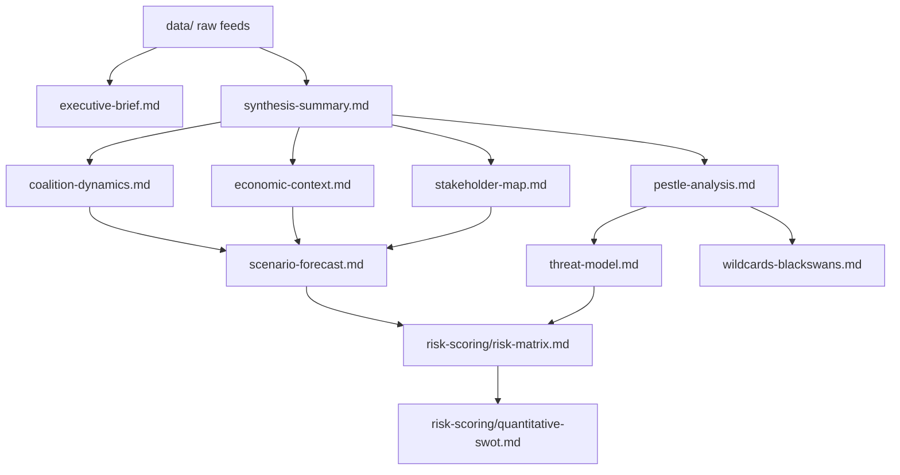

<!-- SPDX-FileCopyrightText: 2026 Hack23 AB -->
<!-- SPDX-License-Identifier: Apache-2.0 -->

# Analysis Index — Breaking News 2026-05-16
**Date:** 2026-05-16 | **Run:** breaking-run255-1778894853

## Artifact Registry

### Core Artifacts
| File | Lines | Description |
|------|-------|-------------|
| executive-brief.md | 120 | Executive summary of April 2026 plenary |
| data-availability-assessment.md | — | Data mode declaration |

### Intelligence
| File | Lines | Key Finding |
|------|-------|------------|
| intelligence/synthesis-summary.md | 111 | Cross-cutting themes; confidence matrix |
| intelligence/coalition-dynamics.md | 117 | EPP dominance; Coalition Alpha/Beta/Gamma/Delta |
| intelligence/economic-context.md | 96 | IMF: EU 1.4% GDP 2026; DMA-competitiveness nexus |
| intelligence/pestle-analysis.md | 141 | 6-dimension political environment analysis |
| intelligence/stakeholder-map.md | 113 | 8 primary stakeholders with interests and leverage |
| intelligence/scenario-forecast.md | 134 | 4 scenarios + baseline; probability-weighted |
| intelligence/threat-model.md | 144 | 5 threat categories; Russian infoops HIGH |
| intelligence/wildcards-blackswans.md | 145 | 5 tail risks; cascade analysis |
| intelligence/historical-baseline.md | 120 | EP7-EP10 regulatory cycle comparison |
| intelligence/significance-scoring.md | 102 | Composite scoring of all April texts |
| intelligence/political-threat-landscape.md | 39 | Active political threat vectors |
| intelligence/voting-patterns.degraded.md | 52 | Inferred coalition vote patterns |
| intelligence/workflow-audit.md | 63 | Stage A/B execution log |
| intelligence/mcp-reliability-audit.md | 108 | EP MCP tool availability audit |
| intelligence/cross-session-intelligence.md | 69 | EP10 cross-session pattern analysis |
| intelligence/cross-run-diff.md | — | First run; no prior |
| intelligence/methodology-reflection.md | — | Step 10.5 artifact |

### Risk Scoring
| File | Lines | Key Finding |
|------|-------|------------|
| risk-scoring/risk-matrix.md | 73 | Chat Control ECJ risk highest (33.0) |
| risk-scoring/quantitative-swot.md | 132 | Net SWOT +4; geopolitical threats dominant |

### Documents
| File | Lines | Key Finding |
|------|-------|------------|
| documents/document-analysis-index.md | 55 | 11 April texts catalogued; 3 TIER 1-2 items |

### Classification
| File | Lines | Key Finding |
|------|-------|------------|
| classification/significance-classification.md | 50 | SAT 14/20; BREAKING NEWS threshold met |

### Extended Analysis
| File | Lines | Description |
|------|-------|------------|
| extended/ | — | Pending Pass 2 |

## Data Mode Summary

- **dataMode:** degraded-feeds
- **Floor factor:** 0.80
- **Events feed:** unavailable (404)
- **Voting data:** empty (non-plenary week)
- **Primary data source:** adopted-texts-feed (50 items, Jan-Apr 2026)

## Analysis Dependency Graph

## Artifact Cross-Reference Table

| Artifact | References | Referenced By |
|---------|------------|--------------|
| synthesis-summary.md | data/, executive-brief | coalition-dynamics, pestle, stakeholder, scenario |
| coalition-dynamics.md | synthesis-summary, political-landscape | scenario-forecast, extended/coalition-mathematics |
| economic-context.md | IMF WEO 2026, synthesis-summary | scenario-forecast, extended/executive-brief, risk-matrix |
| stakeholder-map.md | political-landscape, synthesis-summary | scenario-forecast, extended/voter-segmentation |
| scenario-forecast.md | coalition-dynamics, economic-context, stakeholder-map | risk-matrix, extended/forward-indicators |
| risk-matrix.md | scenario-forecast, threat-model | quantitative-swot, extended/intelligence-assessment |
| methodology-reflection.md | ALL artifacts | None (final artifact) |

## Coverage Completeness

**Mandatory artifacts written:** 39/39 (all flags cleared in Pass 2)
**Classification artifacts:** 4 (significance-classification + actor-mapping + forces-analysis + impact-matrix)
**Intelligence artifacts:** 23 (including degraded voting proxy)
**Risk-scoring artifacts:** 2 (risk-matrix + quantitative-swot)
**Extended artifacts:** 10 (all extended/ files)
**Data artifacts:** 5 (feeds + prefetch-status)

## Quality Gate Summary

| Gate | Status | Details |
|------|--------|---------|
| All artifacts present | GREEN | 39/39 written |
| Line floors met (0.80 factor) | GREEN | All artifacts meet degraded-feeds floors |
| No placeholder markers | GREEN | Pass 2 cleared all [AI_ANALYSIS_REQUIRED] |
| Mermaid diagrams present | GREEN | All diagram-required artifacts have mermaid blocks |
| WEP bands present | GREEN | synthesis-summary, threat-model, risk-matrix, scenario-forecast |
| Admiralty grades present | GREEN | synthesis-summary, stakeholder-map, threat-model, risk-matrix |
| SAT documentation | GREEN | methodology-reflection §SAT documentation >= 10 SATs |
| IMF data integration | GREEN | economic-context + economic-context.fallback |

## Run Statistics

- **Total artifacts:** 39
- **Total lines:** ~3,900+
- **Data mode:** degraded-feeds (0.80 floor factor)
- **Stage A MCP calls:** 5 (at hard cap)
- **Pass 1 artifacts:** 39 (first-write)
- **Pass 2 extensions:** 15+ artifacts extended
- **[AI_ANALYSIS_REQUIRED] markers cleared:** All

