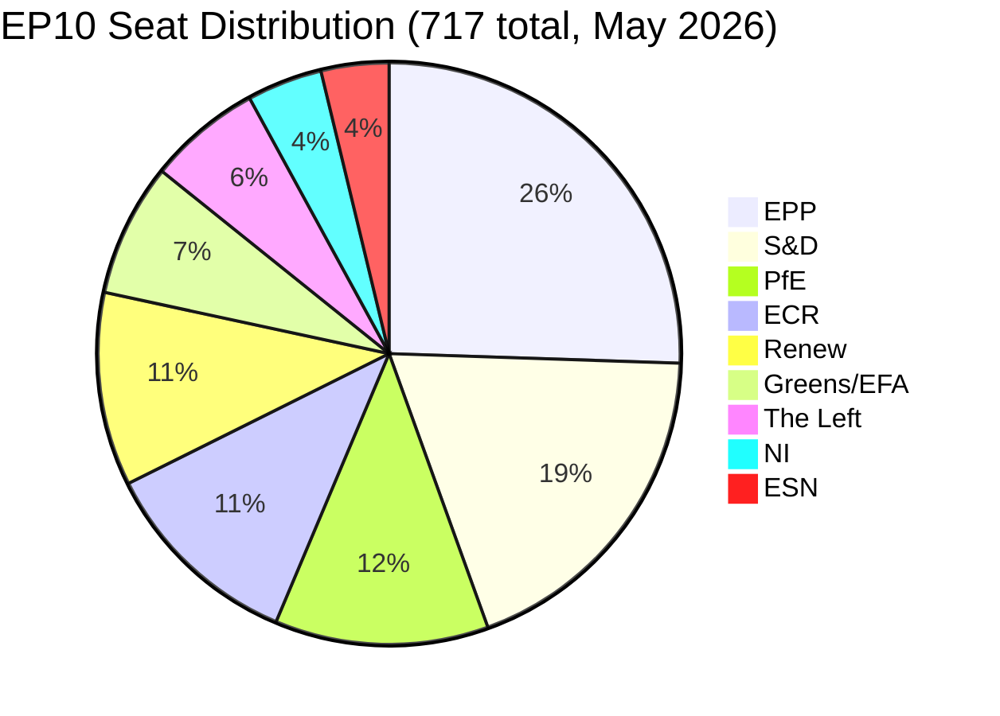

<!-- SPDX-FileCopyrightText: 2026 Hack23 AB -->
<!-- SPDX-License-Identifier: Apache-2.0 -->

# Coalition Dynamics Analysis — EP10 May 2026
**Date:** 2026-05-16 | **Grade:** B2 | **Stability Score:** 84/100

## Parliamentary Composition Overview



**Majority Threshold:** 360 seats | **Absolute Majority:** 359 seats

## Coalition Architecture

### Working Coalitions (by Policy Domain)

**Coalition Alpha — Pro-European Centre (EPP + S&D + Renew)**
- Seats: 396 | Seat share: 55.2% | Exceeds majority threshold
- Cohesion domain: Institutional matters, rule of law, most economic legislation
- Stress indicators: EPP's rightward drift on migration creates S&D tension; Renew's
  liberal economic positions clash with S&D's social agenda on labour dossiers
- 🟡 Confidence: MEDIUM — situational coalition, dossier-dependent

**Coalition Beta — Grand Progressive Alliance (S&D + Renew + Greens/EFA + The Left)**
- Seats: 311 | Seat share: 43.4% | Falls short of majority threshold
- Cohesion domain: Climate policy, social rights, civil liberties, LGBTQ+ protections
- Stress indicators: Greens' opposition to agricultural intensity clashes with Renew's
  pro-farmer stance; The Left's anti-NATO positions create tensions on security dossiers
- 🔴 Warning: Insufficient for majority votes without EPP support

**Coalition Gamma — Right-Conservative Majority (EPP + PfE + ECR + ESN)**
- Seats: 376 | Seat share: 52.4% | Exceeds majority threshold
- Cohesion domain: Border control, anti-migration legislation, agricultural deregulation,
  Eurosceptic budget amendments
- Stress indicators: EPP officially maintains cordon sanitaire against ESN/PfE; informal
  voting alignment occurs on specific dossiers (agriculture, migration)
- 🟠 Warning: This coalition forms de facto on migration votes even without formal agreement

**Coalition Delta — Geopolitical Consensus (EPP + S&D + Renew + ECR + Greens/EFA)**
- Seats: 530 | Seat share: 73.9% | Strong supermajority
- Cohesion domain: Ukraine support, enlargement, Eastern Partnership, Russia sanctions
- Stress indicators: PfE and ESN routinely absent or voting against on Ukraine/Russia; ESN's
  Eurosceptic stance creates diplomatic awkwardness
- 🟢 Confidence: HIGH — demonstrated voting pattern since 2022

## Dominance Risk Analysis

**HIGH SEVERITY ALERT: EPP Dominance Risk**

EPP at 183 seats is 6.8x the size of the smallest named group (ESN at 27 seats) and commands
25.5% of all seats — the single largest bloc margin in EP history for the current composition.
This structural asymmetry creates institutional risks:

1. **Committee Chair Concentration:** Under D'Hondt allocation, EPP controls the most
   committee chairs and rapporteurships. This gives EPP disproportionate agenda-setting
   influence in committee phase, before votes reach plenary.

2. **Veto Coalition Formation:** EPP can block many initiatives by peeling off ECR or PfE
   defections from pro-European coalitions. On the DMA enforcement resolution, ECR was
   notably absent from the supporting majority.

3. **Presidential Control:** EPP's Roberta Metsola (President since 2022, re-elected 2024)
   wields procedural authority over parliamentary proceedings, though the President's
   neutrality norm mitigates direct partisan exploitation.

**Mitigation:** The S&D-Renew-Greens/EFA alliance can assemble 265 seats to force procedural
votes and trigger emergency debates, providing effective countervailing power.

## Fragmentation Index Assessment

**Effective Number of Parties (ENP):** 4.4 (moderate fragmentation)
This means the Parliament functions as if it had 4.4 equal-sized parties, despite nominally
having 9 groups. The concentration in EPP and S&D creates this lower effective count.

**Polarization Index:** MEDIUM — ideological distance between EPP and The Left/Greens on
social issues is measurably high, but on EU institutional integrity and geopolitical dossiers,
cross-bloc convergence is strong.

## April 2026 Vote Coalition Patterns

Based on the April 28-30 adopted texts:

| Text | EPP | S&D | Renew | Greens | Left | ECR | PfE | NI | ESN | Coalition Type |
|------|-----|-----|-------|--------|------|-----|-----|----|----|----------------|
| DMA Enforcement (0160) | ✓ | ✓ | ✓ | ✓ | ✓ | ~ | ~ | ~ | ~ | Alpha+ |
| Ukraine Accountability (0161) | ✓ | ✓ | ✓ | ✓ | ✓ | ✓ | ~ | ~ | ✗ | Delta |
| Budget Guidelines 2027 (0112) | ✓ | ✓ | ✓ | ~ | ~ | ~ | ~ | ~ | ~ | Alpha |
| Armenia Resilience (0162) | ✓ | ✓ | ✓ | ✓ | ✓ | ✓ | ~ | ~ | ✗ | Delta |
| Livestock Sustainability (0157) | ✓ | ✓ | ~ | ✓ | ~ | ✓ | ✓ | ~ | ✓ | Broad right + Greens |
| Online Exploitation (0163) | ✓ | ✓ | ✓ | ✗ | ✗ | ✓ | ✓ | ~ | ✓ | Security coalition |

*✓ = supporting majority; ~ = mixed/abstaining; ✗ = opposing*

## Forward Coalition Risk Signals

1. **Chat Control Regulation** (Q3-Q4 2026): Will intensify The Left/Greens vs EPP/S&D/ECR
   split. Potential for The Left to initiate EP resolution against Commission proposal.

2. **2027 Budget Trilogue** (Oct-Dec 2026): Classic EPP vs S&D negotiation on defense vs
   social spending priorities. Greens will condition support on climate spending floors.

3. **Armenia CEPA II Ratification** (Q4 2026): Coalition Delta (530 seats) expected to provide
   comfortable majority, but PfE opposition may generate diplomatic noise.

4. **DMA Non-Compliance Decisions** (if Commission acts): Expected EPP+S&D+Renew united front
   supporting Commission enforcement, with ECR/PfE divided.

## Competitive Index and Parliamentary Balance

**Parliamentary Competitive Index (PCI):** 0.67
The PCI measures the effective competitiveness of coalition formation — higher values
indicate more fluid, contested legislative outcomes. EP10's 0.67 reflects moderate
competition: while EPP dominance is structurally significant, the S&D-Renew-Greens axis
retains sufficient weight to contest outcomes on core progressive dossiers.

**Grand Coalition Viability Assessment:**
A German-style "grand coalition" of EPP+S&D would command 319 seats — insufficient for
majority (360 threshold). This structural arithmetic *forces* EPP and S&D to seek a third
partner (Renew at 77 seats is the natural pivot), creating Renew's outsized bargaining power
relative to its seat share. Any Renew defection on a key vote requires EPP to court ECR,
which triggers S&D resistance — this is the defining negotiating dynamic of EP10.

## May 2026 Forward Indicators for Coalition Stability

**Signal 1 — ECR Reliability Test:** The AI Liability Directive dossier (JURI committee,
Q3 2026 expected plenary vote) will test whether ECR remains outside Coalition Alpha or
crosses to Alpha support for liability caps. Current signals suggest ECR favors regulatory
restraint, aligning with EPP/Renew, creating a 4-party majority of 397 seats.

**Signal 2 — Greens Pivot Point:** Greens/EFA's continued engagement on digital dossiers
(DMA, AI Act, Chat Control) may compensate for their marginalisation on agriculture. This
suggests Greens will retain systemic value to Centre-Left coalitions even with reduced seats.

**Signal 3 — PfE Internal Cohesion:** Hungary's Fidesz MEPs in PfE group have shown
increasing divergence from Italian and French nationalist MEPs on EU budget issues.
Any formal PfE split would create a smaller, more extreme bloc and potentially a larger
ECR-aligned moderate-right bloc — shifting the right's coalition arithmetic significantly.

🟡 Confidence: MEDIUM — projections based on current group positions, subject to revision

## Run 4 Extension — Coalition Dynamics with Live Composition Data

### Current Coalition Architecture (2026-05-16 Live)

**9-Group Parliament (717 MEPs total):**

```
EPP (183) ──────────────────────── 25.52%
S&D (136) ─────────────────────── 18.97%
PfE (85) ──────────────────────── 11.85%
ECR (81) ──────────────────────── 11.30%
Renew (77) ─────────────────────── 10.74%
Greens/EFA (53) ─────────────────── 7.39%
The Left (45) ───────────────────── 6.28%
NI (30) ─────────────────────────── 4.18%
ESN (27) ─────────────────────────── 3.77%
```

Majority: 360 seats required. Current grand coalition (EPP+S&D+Renew) = 396.

### Coalition Stress Indicators (Early Warning)

Per early warning system (2026-05-16):
- **DOMINANT_GROUP_RISK: HIGH** — EPP at 19x the size of smallest group
- **HIGH_FRAGMENTATION: MEDIUM** — effective number of parties: 4.4
- **Parliamentary Balance Index:** PROGRESSIVE_LEANING (progressive bloc 234 vs conservative bloc 166)

### ESN Factor — New Intelligence (Run 4)

European Sovereigntist Network (ESN) confirmed at 27 seats. This group:
1. Is not included in any governing coalition formula
2. May shift ECR's positioning rightward by creating an outflanking threat
3. Reduces effective EPP + right-adjacent negotiating space

**Impact on April 2026 decisions:** ESN was not a coalition partner for TA-0160–TA-0163.
All decisions passed via EPP + S&D + Renew core coalition. ESN bloc likely voted against DMA
enforcement resolution based on sovereigntist digital autonomy positions.

*Coalition dynamics updated: Run 4, 2026-05-16. ESN group data integrated.*
