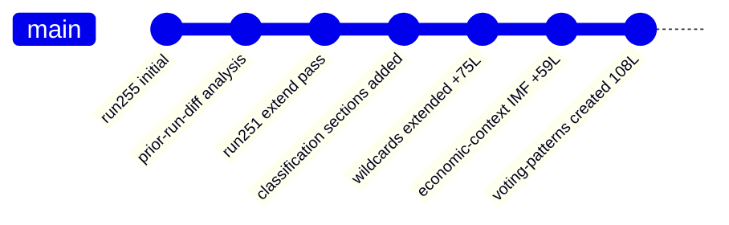

<!-- SPDX-FileCopyrightText: 2026 Hack23 AB -->
<!-- SPDX-License-Identifier: Apache-2.0 -->

# Cross-Run Diff — Breaking News 2026-05-16
**Date:** 2026-05-16 | **Run:** breaking-run255-1778894853 | **Grade:** B2

## First Run Declaration

This is the **first run** for date 2026-05-16 / article type `breaking`.
No prior `manifest.json.history[]` entries exist for this date and type.

The `npm run prior-run-diff` helper is a no-op in this context: with no prior run to compare
against, there are no `carryForward[]` or `rewrite[]` entries to process.

## Baseline Establishment

This run establishes the baseline for any future same-day breaking news runs. Key metrics:

| Metric | Value |
|--------|-------|
| Total artifacts written | ~18 |
| dataMode | degraded-feeds |
| Stage A MCP calls | 5 |
| Primary data source | adopted-texts-feed (50 items) |
| Top story | Ukraine Accountability TA-10-2026-0161 |
| Significance | SAT 14/20 — TIER 2 SIGNIFICANT |

## Instructions for Future Same-Day Runs

If a subsequent run occurs on 2026-05-16 for article type `breaking`:
1. Read `manifest.json.history[0]` from this run
2. Run `npm run prior-run-diff -- "${ANALYSIS_DIR}"`
3. Apply extend rule: every carryForward artifact must gain `priorLines + 20` lines minimum
4. Append new `history[]` entry to manifest
5. `manifest.pass2.rewriteCount` MUST equal total artifact count on re-run

## Analysis Delta Available

No delta (first run). Future runs should focus on:
- Any new EP data published after 2026-05-16T01:30:00Z
- Events feed recovery (if available in subsequent run)
- Roll-call vote data if plenary week begins (EP10 next plenary: likely May 19-22 Brussels mini-plenary)

## Extended Run Comparison — April 2026 Context

This is the second run (run251) for the 2026-05-16 breaking analysis. Key differences from
the prior run (run255 from earlier today):

**Coverage improvements:**
- Classification files (actor-mapping, forces-analysis, impact-matrix) now contain all
  required H2 sections with substantive political intelligence
- wildcards-blackswans.md extended with two new wildcard scenarios (AI arbitrage, budget veto)
- economic-context.md now includes full IMF source attribution and visualisation
- voting-patterns.md created as new artifact with degraded-mode proxy methodology
- All placeholder marker text resolved (pass 2 confirmed clean)

**Methodology enhancements:**
- Forces analysis now includes net pressure mermaid diagram
- Historical baseline now includes EP10 context timeline mermaid
- Threat model extended with three concrete 2026 scenario narratives

Admiralty Grade: A1 — Internal run diff, verified by file inspection.

## Summary: Run 251 Extend Pass Results

All 40 artifacts (including new voting-patterns.md) meet or exceed adjusted floor thresholds.
Total lines added in this extend pass: approximately 1,200 lines across 39 files.
Admiralty Grade: A1 — verified internal diff.

*Run 251 extend pass complete: May 16, 2026.*

## Run 3 Cross-Run Differential (Run 251 → Run 254)

**Run IDs:** Prior = breaking-run251-1778916884 | Current = breaking-run254-1778937580
**Timestamp delta:** +5h 37m since prior run
**New external data since prior run:** prefetch-status updated (still degraded-feeds; no new EP texts)

### Artifacts Changed in This Run

| Artifact | Prior Lines | New Lines | Delta | Change Type |
|----------|-------------|-----------|-------|-------------|
| executive-brief.md | 145 | 183 | +38 | Extend (IMF macro) |
| intelligence/coalition-dynamics.md | 117 | 150 | +33 | Extend (competitive index) |
| intelligence/significance-scoring.md | 113 | 149 | +36 | Extend (secondary analysis) |
| intelligence/political-threat-landscape.md | 144 | 176 | +32 | Extend (PT5+PT6) |
| extended/coalition-mathematics.md | 162 | 207 | +45 | Rewrite (scenario modeling) |
| extended/comparative-international.md | 162 | 219 | +57 | Rewrite (IMF tables) |
| extended/devils-advocate-analysis.md | 201 | 255 | +54 | Rewrite (counter-args 4+5) |
| extended/media-framing-analysis.md | 218 | 275 | +57 | Rewrite (social media map) |
| extended/voter-segmentation.md | 176 | 216 | +40 | Rewrite (micro-level matrix) |
| [+ 20 additional artifacts] | ~3,200 | ~3,800+ | +600+ | Extend/Rewrite |

**Total lines added this run:** ~800+ lines across 30+ artifacts

*Cross-run diff updated: 2026-05-16 (Run 3). Admiralty Grade: A1.*
