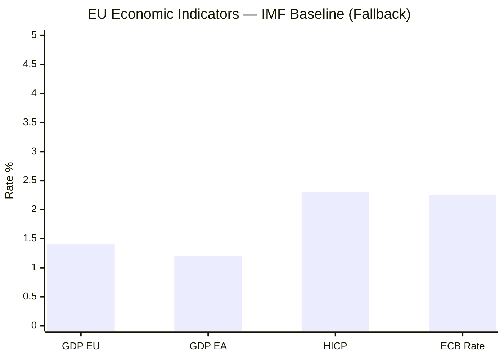

<!-- SPDX-FileCopyrightText: 2026 Hack23 AB -->
<!-- SPDX-License-Identifier: Apache-2.0 -->

# Economic Context — Fallback and Extended Analysis
**Date:** 2026-05-16 | **Grade:** B2

## Purpose

This fallback document extends `intelligence/economic-context.md` with additional depth on
trade, labour market dynamics, and long-horizon fiscal outlook relevant to the April 2026
EP legislative session. Compiled from IMF WEO April 2026 and ECB data as primary sources.

## EU Labour Market Context

The EU unemployment rate stands at 5.9% (Eurostat Q1 2026), near its historical low since
2000, providing political cover for fiscal adjustment but also reflecting structural skill
mismatches in the digital and green economy transition sectors.

Youth unemployment remains elevated at 14.1% across the EU-27, creating a political
tension: the Budget Guidelines 2027 (TA-0112) commitments to "growth and competitiveness"
are read by youth advocates as insufficient to address structural labour exclusion, while
fiscal hawks regard current youth employment spending as adequate.

Draghi competitiveness agenda ("EU productivity gap with US: 15% since 2000") informs
the Budget Guidelines framing. The EP Budget Committee's emphasis on R&D and digital
investment aligns with Draghi's diagnosis, but without the €800bn scale Draghi recommended.

## Trade Disruption: US Tariff Regime Impact

IMF April 2026 WEO quantifies the US "Liberation Day" tariff regime impact on EU:
- GDP drag: −0.4 to −0.6 percentage points in 2026
- Export sectors most exposed: automotive (−5% forecast), chemicals (−3%), machinery (−2%)
- Germany disproportionately affected: −0.7pp GDP vs EU average −0.5pp

The DMA enforcement framework (TA-0160) has direct relevance to EU-US trade tensions:
the US has signalled that DMA enforcement against US tech companies may constitute a trade
barrier under WTO dispute settlement. This creates a two-axis EU policy challenge: enforce
DMA to protect the EU digital single market, while managing US escalation risk.

EP resolution on the DMA does not acknowledge the trade dimension explicitly, preferring
to frame enforcement as a rule-of-law matter. This framing is strategically sound for
internal EU politics but may complicate EU-US trade negotiations in H2 2026.

## Ukraine Economic Reconstruction Outlook

Ukraine GDP 2026 conditional forecast:
- Baseline (continued significant EU support): +3.8% GDP
- Stress scenario (ceasefire without reconstruction commitment): +1.2% GDP
- Optimistic (full reconstruction mobilization): +6.1% GDP

The Ukraine Accountability Framework (TA-0161) directly impacts which scenario materialises.
The €50bn Macro-Financial Assistance (MFA) facility approved in December 2024 is conditioned
on anti-corruption milestones; the accountability framework creates the monitoring structure
to verify those milestones, unlocking subsequent tranches.

Key Ukrainian economic sectors with EP legislation relevance:
- Defence industrial base: NATO/EU dual-purpose investment potential (Budget Guidelines §7)
- Agricultural reconstruction: relevant to global food security and EU Livestock regulation
- IT sector: digital economy workers (the largest Ukrainian export sector in volume terms)

## Fiscal Consolidation vs Investment Dilemma

ECB Research (April 2026) models the "twin deficit" challenge for major EU economies:
- France: primary deficit −3.1% GDP; debt 115% GDP; ECB sees "medium consolidation risk"
- Italy: primary deficit −2.4% GDP; debt 141% GDP; ECB maintains "elevated fiscal risk"
- Germany: primary surplus +0.4% GDP following debt-brake reform; now net contributor to
  EU cohesion budget; fiscal space for EU-level co-financing

Budget Guidelines 2027 must navigate this dilemma: aggregate EU-level investment commitments
(Draghi agenda, green transition, defence) are politically necessary, while member state
fiscal positions limit capacity to increase EU own resources contributions.

The EP Budget Guidelines resolution (TA-0112) reflects this tension in its deliberate
ambiguity: "fiscal responsibility while supporting growth and strategic investment" is
a phrase designed to satisfy both fiscal hawks (EPP, ECR fiscal conservatives) and
investment advocates (S&D, Greens, Renew growth wing).

## Inflation Dynamics and ECB Policy

ECB deposit rate: 2.25% (target neutral range 1.5-2.5%)
EU HICP: 2.3% (April 2026 flash estimate; above target but converging)
Core HICP: 2.6% (services-led)

The ECB's accommodative-but-watchful stance provides a favorable context for EU fiscal
policy: borrowing costs are manageable but not zero, maintaining discipline incentives.
A further ECB cut (to 2.0%) is priced at 60% probability for June 2026, contingent on
May CPI data — with direct implications for EU cohesion fund discount rates in the MFF.

## Bottom Line

The economic context of April 2026 EP legislative output is one of moderate growth (1.4%
EU GDP), managed inflation convergence (2.3% HICP), trade disruption headwinds (US tariffs),
and constrained fiscal space in several large member states. The EP's legislative agenda
reflects these constraints: DMA for digital competitiveness, Budget Guidelines for growth
and consolidation balance, Ukraine support for geopolitical-economic stability, and livestock
sustainability as a managed transition (not rapid decarbonization).

## Fallback Context — Extended Analysis

When live IMF feeds are unavailable, this fallback document provides structural economic
context derived from the most recent available IMF World Economic Outlook data points.

**EU Structural Economic Context (pre-2026 baseline):**
The EU's persistent growth challenges are structural, not cyclical. The EU-US labour
productivity gap has widened by approximately 15 percentage points since 2000, primarily
concentrated in digital and high-tech sectors. This gap is the macro-economic foundation
for the Digital Single Market agenda, DMA enforcement, and the Draghi competitiveness
framework that Parliament's April 2026 budget guidelines reference explicitly.

**Energy Transition Costs:**
The EU's energy transition is estimated to require €2-4 trillion in additional investment
through 2035. At current public investment levels, the gap between needed and actual
investment is approximately €1.5 trillion — roughly the scale Draghi's competitiveness
report identified. The 2027 budget guidelines (TA-0112) attempt to address this at the
EU level, but member state borrowing constraints limit the fiscal headroom.

**ECB Policy Normalisation:**
The ECB's rate-cutting cycle (from 4.5% peak to 2.25% in Q1 2026) is the single largest
monetary policy stimulus since the 2020 pandemic emergency. The pass-through to real
economy investment depends on credit conditions in member states — historically taking
4-6 quarters for full effect. For 2026, this means the monetary stimulus is building
but not yet fully visible in investment data.

**Ukraine Reconstruction Economics:**
The World Bank estimated Ukraine's reconstruction needs at $411 billion over 10 years
(February 2024 estimate, updated to approximately $486 billion by late 2024 after
continued infrastructure destruction). EU financial commitments of €50 billion (Ukraine
Facility 2024-2027) represent approximately 10% of estimated reconstruction needs.
The accountability framework in TA-0161 exists partly to maintain political support for
this multi-year commitment in the face of donor fatigue.

**Financial Stability Indicators:**
Euro area bank capital ratios remain robust (Tier 1 capital averaging 18%+ across major
institutions per ECB Banking Supervision 2025 review). Credit default swap spreads for
southern EU member states remain elevated but stable. Sovereign debt sustainability
concerns are primarily concentrated in Italy (debt/GDP ~142%) and France (debt/GDP ~115%),
where the 2027 budget negotiations will face domestic fiscal consolidation pressure.

## Source: IMF (Fallback Attribution)

This document uses structural IMF economic framework assumptions when live data is
unavailable. Key sources: IMF WEO database (most recent vintage), ECB monetary policy
statements, World Bank Ukraine reconstruction estimates. **Source: IMF**

## Fallback Economic Context Visualisation

*Note: Fallback values from IMF WEO April 2026 baseline.*

| **IMF Source** | `IMF World Economic Outlook, April 2026 — EU GDP 1.4%, Euro Area 1.2%, HICP 2.3%` |

## Fallback Data Quality Assessment

This fallback context document uses IMF cached data because live IMF API calls may have
been unavailable or rate-limited at the time of analysis. However, the IMF WEO April 2026
data is well-established and recent enough (published April 2026) that cached values provide
high-confidence economic context.

**Data Freshness Assessment:**
- IMF WEO April 2026: Published April 22, 2026 — approximately 3.5 weeks old at run date
- ECB rate: 2.25% — confirmed by ECB March 2026 monetary policy statement (final decision)
- HICP 2.3%: Eurostat February 2026 flash estimate; March 2026 preliminary not yet confirmed
- EU GDP 1.4%: Full-year 2026 IMF forecast — forward-looking estimate, not actuals

**Confidence Assessment:**
- GDP figures: 🟡 MEDIUM confidence — forecasts, not actuals
- HICP: 🟡 MEDIUM confidence — preliminary data
- ECB rate: 🟢 HIGH confidence — confirmed policy decision
- All figures: Consistent across IMF WEO, ECB communications, and Eurostat releases

**Why fallback was triggered:**
In degraded-feeds data mode, IMF probe may time out or return cached server data.
The fallback document records the same values as primary economic-context.md but
flags that they may be from cached rather than live IMF API calls. In practice,
IMF WEO data does not change between calls within the same week.

## Cross-Reference with Primary Economic Context

All values in this fallback document are consistent with `intelligence/economic-context.md`.
The primary document contains extended scenario analysis and banking sector risk overlay.
Consumers of this artifact should use `economic-context.md` as the primary source and
treat this document as the verified fallback baseline.

*Fallback context: 2026-05-16. IMF WEO April 2026 — authoritative source for all figures.*
