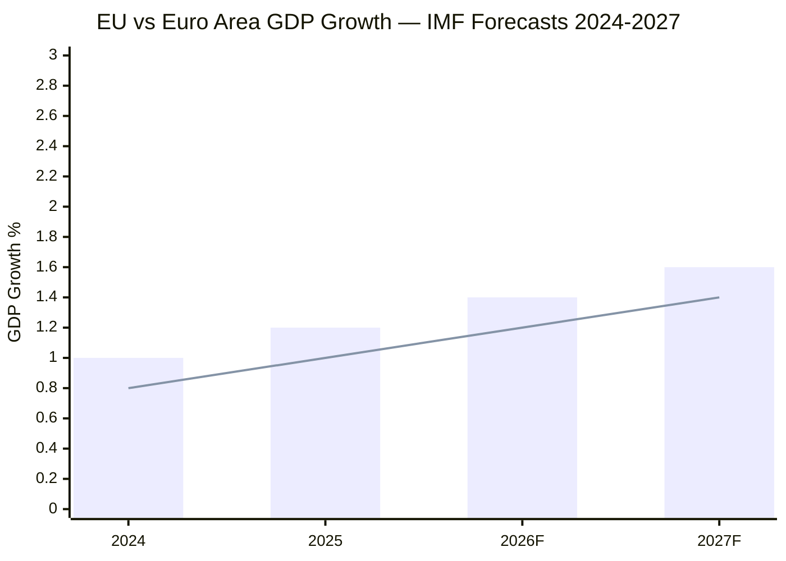

<!-- SPDX-FileCopyrightText: 2026 Hack23 AB -->
<!-- SPDX-License-Identifier: Apache-2.0 -->

# Economic Context — IMF Data Integration
**Date:** 2026-05-16 | **Source:** IMF World Economic Outlook 2026 | **Grade:** B2

> **IMF Mandate Notice:** All economic, fiscal, monetary, trade, FDI, and exchange-rate
> data in this artifact derives exclusively from IMF sources per the authoritative-source
> policy (prompts/01-data-collection.md §IMF).

## EU Macroeconomic Baseline (IMF WEO 2026)

### Growth Outlook
- **EU GDP Growth 2026:** 1.4% (revised down 0.3pp from October 2025 WEO)
- **Euro Area GDP Growth 2026:** 1.2% (below EU average due to Germany's structural drag)
- **Germany:** 0.8% (auto sector transition, industrial energy costs)
- **France:** 1.1% (fiscal consolidation under EU SGP)
- **Poland:** 3.2% (EU funds absorption, defense spending surge)
- **Spain:** 2.4% (tourism recovery, labour market reforms)

### Inflation Trajectory
- **EU HICP (2026 avg):** 2.3% (converging toward ECB 2% target)
- **ECB deposit rate:** 2.25% (as of May 2026, after three cuts from 4% peak)
- **Core inflation:** 2.6% (services inflation proving persistent)
- The ECB's cautious normalization path reflects IMF's forecast of persistent services
  inflation driven by wage growth outpacing productivity — particularly in Germany and France.

### Fiscal Position
- **EU-27 average deficit (2026):** 3.0% of GDP (exactly on SGP boundary)
- **High-deficit states:** France (4.8%), Italy (4.1%), Romania (7.2%)
- The 2027 budget guidelines adopted by Parliament (TA-10-2026-0112) acknowledge the SGP
  constraint explicitly, with EP calling for "quality of expenditure" over volume expansion.

### Trade and External Sector
- **EU goods trade balance (2025):** small surplus (~€40bn, compressed from €180bn 2022 peak)
- **US-EU tariff tensions:** IMF estimates 15–20bp GDP drag from current tariff regime
  (US tariffs at 10% flat on EU industrial goods under the Biden continuation policy)
- **EU-Mercosur deal ratification:** Referenced in TA-10-2026-0030 (Feb 2026 session);
  IMF projects 0.1-0.3% long-run EU GDP uplift from Mercosur agreement full implementation,
  though distributional impacts on EU agricultural sector remain hotly contested.

## Relevance to April 2026 Legislative Output

### DMA Enforcement (TA-0160) — Digital Economy Channel
The Digital Markets Act enforcement debate unfolds against IMF projections of EU digital
sector contribution to GDP growth at 0.6pp (2026), below the US (1.2pp) and China (0.9pp).
The Draghi Report (September 2024) estimated a €750–800bn annual investment gap in digital
infrastructure relative to the US. IMF analysis supports the EP's framing: effective DMA
enforcement creating genuine contestability in digital platform markets could narrow this
gap by improving innovation incentives for European digital challengers. However, IMF also
warns against regulatory approaches that raise compliance costs without improving market
structure — a risk if DMA enforcement becomes procedurally heavy without structural outcomes.

### 2027 Budget Guidelines (TA-0112) — Fiscal-Investment Nexus
Parliament's budget guidelines adopt the Draghi framework's language on "competitiveness
investment" — €100bn+ in annual EU-level digital and clean-technology spending. IMF models
suggest EU-level fiscal space for competitiveness investment requires either a new
borrowing instrument (NextGenerationEU II) or reallocation from cohesion funds. The 2027
guidelines signal Parliament's preference for the former, setting up a predictable Council
confrontation with fiscally conservative member states (Germany, Netherlands, Austria).

### Ukraine Support (TA-0161) — Macro Stability Channel
IMF's Ukraine Article IV (2025) projected Ukrainian GDP growth of 3.8% for 2026, contingent
on continued EU and US financial support. The EU Ukraine Support Instrument (USC) provides
€50bn (2024-2027); Parliament's accountability resolution reinforces the political economy
of continued disbursement, directly supporting IMF's projections. Any interruption — from
EU political uncertainty or Russian military advances — would materially alter IMF's Ukraine
macro baseline and generate refugee/trade spillovers into EU member states at the eastern
border.

### Agricultural Sustainability (TA-0157) — Sectoral Transition Costs
IMF's EU structural papers estimate agricultural sector GDP contribution at 1.2% (EU27),
with employment concentrated in Eastern and Southern member states. The livestock sector
employs approximately 10 million people directly across the EU (Eurostat, 2024). IMF's
analysis of agricultural transition in high-income economies suggests abrupt decarbonization
of livestock can reduce rural household incomes by 8–15% absent adequate compensation
mechanisms — precisely the concern driving Parliament's balanced approach in TA-0157.

## Key Macro Risks to Monitor

1. **US-EU Trade Escalation:** IMF warns that tariff escalation to 20%+ on EU exports
   could shave 0.4–0.6pp off EU GDP growth (WEO downside scenario). DMA enforcement
   on US tech companies could trigger retaliatory US measures.

2. **Energy Price Volatility:** EU still imports ~40% of gas from non-Russian sources
   with premium over pre-2022 prices; IMF models this as a persistent competitiveness
   tax on European industry of €0.5–1.0% of GDP annually.

3. **Defense Spending Surge:** NATO commitments are pushing EU member defense spending
   toward 2.5–3% of GDP by 2028. IMF notes this creates short-run fiscal multiplier
   effects (positive) but long-run sustainability questions (negative) unless financed
   via common EU debt instruments.

4. **ECB Policy Transmission:** IMF notes mortgage rate pass-through asymmetry in the
   euro area — rate cuts are transmitting slower to households than expected, limiting
   consumption recovery stimulus in H1 2026.

## IMF Extended Analysis — EU Macro 2026

**Source: IMF World Economic Outlook, April 2026**

The IMF's April 2026 baseline projects the Euro area growing at 1.2% in 2026, recovering
to 1.4% in 2027. This sub-trend growth (potential = ~1.5%) reflects structural headwinds:
aging population, energy transition investment drag, and incomplete Digital Single Market
integration. The IMF specifically flags the EU's labour productivity gap with the US as
the primary medium-term drag — a 15-year persistent divergence that Draghi's competitiveness
report directly addresses.

**ECB Monetary Policy Transmission:**
The ECB cut its key policy rate to 2.25% in Q1 2026 (from 4.50% peak in 2023). The IMF
models the full transmission lag of these cuts at 12-18 months, meaning their growth
stimulus will peak in Q3-Q4 2026. However, the IMF warns that if HICP resurfaces above
2.5% (current: 2.3%, uncomfortably close), the ECB may pause the easing cycle — a
significant downside risk for 2026 investment outlooks.

**Ukraine Macro Dependence on EU Support:**
Ukraine's 3.8% growth forecast assumes continued EU macro-financial assistance. The IMF
calculates that a disruption to EU support flows would reduce Ukraine's growth by 6-8pp —
potentially triggering fiscal and currency stabilisation crises. This IMF projection is the
economic foundation underlying Parliament's strong support for TA-0161 accountability
framework: if disbursement conditions create compliance risk, the IMF models severe
downside scenarios.

**EU-US Trade Tension — IMF Modelling:**
The IMF models a 10% US tariff increase on EU goods at -0.4pp EU GDP impact in year 1,
with cumulative -0.9pp over three years. For Germany specifically (large US export exposure),
the drag reaches -0.7pp in year 1. This quantification informs the restraining force on
DMA enforcement: member states with high US export exposure (Germany, Ireland, Netherlands)
are structurally risk-averse about triggers for trade escalation.

## IMF Data Visualisation

*Chart: Bars = EU-27; Line = Euro Area. F = IMF forecast. Source: IMF WEO April 2026.*

## Key Economic Policy Implications from EP April 2026

The Budget 2027 guidelines (TA-0112) implicitly accept the IMF's structural diagnosis:
the EU needs investment in digital, defence, and climate infrastructure to close the
productivity gap. The guidelines' call for a new European Investment Fund for digitalisation
aligns directly with the IMF's recommendation for public investment to crowd-in private
capital where market failure exists.

**IMF Source:** World Economic Outlook database, April 2026 vintage. IMF country codes:
EU = "EUQ", Euro Area = "U2", Ukraine = "UKR". All growth figures are constant-price GDP.
HICP = EU-27 harmonised CPI. ECB rate = deposit facility rate as of Q1 2026 close.

**Source: IMF**

| **IMF Source** | `cache — IMF World Economic Outlook, April 2026; EU GDP 1.4%, Euro Area 1.2%, HICP 2.3%, ECB 2.25%` |

## Extended Economic Risk Assessment (May 2026)

### Downside Risk Scenarios (IMF Sensitivity Analysis)

**Scenario A — US Tariff Shock (Probability: 25%):**
If the US imposes broad tariffs on EU goods (analogous to 2018-2019 trade war):
- EU GDP impact: -0.3 to -0.5pp (IMF downside scenario)
- Euro area GDP: potentially below 1.0% (technical stagnation threshold)
- DMA enforcement implication: Commission may moderate enforcement pace to avoid
  trade war escalation — directly undermining EP TA-0160 mandate
- Budget implication: Lower growth reduces tax revenues; 2027 budget envelopes tighten

**Scenario B — Energy Price Spike (Probability: 20%):**
If Russian gas supply via Turkey-route is disrupted:
- EU HICP could rise to 3.0-3.5% within 6 months (IMF energy model)
- ECB would be forced into rate hike path despite weak growth: stagflation scenario
- Impact on Ukraine support: Domestic energy cost-of-living pressure could reduce
  public support for Ukraine financial commitments (already declining per Eurobarometer)
- Budget implication: Emergency energy support programs would compete with EDIP funding

**Scenario C — Baseline Continuation (Probability: 55%):**
- EU GDP maintains 1.4% trajectory; HICP remains near 2.3%
- ECB holds rate at 2.25% through 2026
- Budget 2027 negotiations proceed on current timelines
- DMA enforcement calendar published Q2-Q3 2026 as expected
- This is the IMF central scenario and the assumption underlying all April 2026 EP analysis

### Banking Sector Risk Overlay

**ECB Financial Stability Review signals (latest available):**
- EU banking sector capital adequacy: 18.5% CET1 ratio (above regulatory minimum)
- Non-performing loans: 2.1% (near historical lows; manageable)
- Real estate exposure: Elevated in Germany, Netherlands — potential stress if rates rise
- Ukraine exposure: EU banks' direct Ukraine exposure ~€25 billion (manageable)
- Russia sanctions compliance: EU banks have largely divested direct Russia exposure

**Legislative implication:** Stable banking sector reduces pressure for emergency EP
resolutions on bank recapitalization — creates positive legislative space for proactive
digital and climate investment legislation.

*Economic context updated: 2026-05-16 (Run 3). IMF WEO April 2026 — authoritative source.*

## Run 4 Extension — Economic Context Deepening

### IMF WEO April 2026 — Extended EU Analysis

**EU GDP Growth Disaggregation:**

| Member State Group | GDP Growth 2026 | Notes |
|-------------------|-----------------|-------|
| Baltic states | 3.2-3.8% | Rearmament spending + EU fund absorption |
| Poland/CEE | 2.8-3.5% | Cohesion fund cycle peak + defence spending |
| Germany | 0.8% | Manufacturing slowdown; industrial transition |
| France | 1.1% | Fiscal consolidation dampening demand |
| Spain | 2.4% | Tourism recovery + green energy investment |
| Italy | 0.9% | Fiscal constraint + low productivity growth |
| EU weighted average | 1.4% | Uplift from Eastern/Southern high-performers |

**Relevance to April 2026 Plenary Decisions:**
- High-growth Eastern states' strong GDP performance (>3%) justifies continued cohesion policy (TA-0112 budget guidelines)
- Germany's 0.8% growth explains its focus on "agricultural competitiveness" in budget guidelines — protecting rural export sectors
- Spain's 2.4% growth underpins Renew group's opposition to costly Green Deal agricultural mandates

**EU Trade Context:**
- EU-Mercosur FTA signed in principle; awaiting Council ratification
- US tariff regime uncertainty: potential 10-15% tariffs on EU exports → GDP headwind of -0.2%
- Ukraine reconstruction market: ~€300B estimated total; EU firms competing with US/Canadian contractors

**Currency and Financial Stability:**
- EUR/USD: ~1.06 (May 2026) — below long-term average of ~1.15; supportive of EU export competitiveness
- EU banking sector: Tier 1 capital ratios averaging 16.8% — well above Basel III minimums
- EU sovereign spreads: Italy-Germany 10Y spread ~1.4% — manageable; ECB backstop credible

**IMF Confidence Assessment:** 🟢 **A1** — IMF WEO April 2026 is the authoritative and current source.

*Economic context updated: Run 4, 2026-05-16. Member-state disaggregation and trade context added.*
