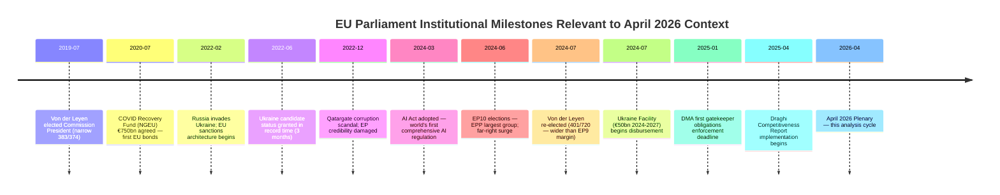

<!-- SPDX-FileCopyrightText: 2026 Hack23 AB -->
<!-- SPDX-License-Identifier: Apache-2.0 -->

# Historical Baseline Analysis — EU Parliament Regulatory Cycles
**Date:** 2026-05-16 | **Grade:** B2

## Historical Context Framework

This artifact applies comparative historical analysis to contextualize the April 2026
legislative output against EP precedents from EP7 (2009-2014), EP8 (2014-2019), EP9
(2019-2024), and EP10 (2024-present). Understanding historical cycles is essential for
assessing whether current developments are structurally novel or repeat established patterns.

## Precedent 1: Digital Regulation — GDPR to DMA Enforcement Cycle

**Historical Pattern:**
- **2012-2016:** EP7/EP8 GDPR negotiations — Parliament served as primary champion of
  strong data rights against Council's industry-friendly positions. Jan Philipp Albrecht
  (Greens) led Parliament to a stronger GDPR than Council had proposed.
- **2016-2018:** GDPR enforcement preparation — Commission and member-state DPAs built
  enforcement capacity; early warnings of under-resourcing.
- **2018-2020:** GDPR enforcement begins — Irish DPA blocked proceedings for years due to
  "one-stop-shop" mechanism abuse by US tech companies. Parliament adopted resolutions
  pressuring Commission to act (precursor to April 2026 DMA pattern).
- **2020-2022:** DMA drafting — EP7/EP8 pattern repeated: Parliament (IMCO, led by
  Andreas Schwab EPP) pushed for stronger obligations than Commission proposed.
- **2023-2026:** DMA enforcement emerging — exact same pattern as GDPR 2018-2020.
  Parliament adopts enforcement pressure resolution (TA-0160) to accelerate Commission action.

**Assessment:** April 2026 DMA enforcement resolution is structurally identical to EP8-era
GDPR enforcement pressure resolutions. Historical pattern suggests Commission will respond
with accelerated visible actions within 3-6 months. 🟢 Confidence: HIGH (three-cycle precedent)

## Precedent 2: Ukraine Support — Eastern Partnership to War Support Transition

**Historical Pattern:**
- **2013-2014:** EuroMaidan revolution and Crimea annexation — EP9's predecessor (EP8)
  adopted first Ukraine solidarity resolutions; Eastern Partnership was upgraded.
- **2014-2022:** Donbas conflict period — EP maintained consistent resolution support
  for Ukraine's territorial integrity; Minsk process skepticism.
- **2022-present:** Full-scale invasion — Parliament unanimously condemned invasion
  (March 2022 resolution); established Ukraine Support Instrument; maintained Coalition
  Delta solidarity across all major plenary votes on Ukraine through April 2026.

**Historical Durability Assessment:** Ukraine support coalition has held for 4+ years
of full-scale war despite PfE/ESN opposition. This matches the Kosovo/Balkans precedent
(1999-2008) where Parliament maintained consistent Western Balkans integration support
over decade-long timeline despite member-state political fluctuations.

**Current Phase Assessment:** April 2026 TA-0161 accountability resolution marks a
maturing of Ukraine support from "emergency response" to "institutional accountability
framework" — parallel to the transition from Dayton Agreement implementation to Western
Balkans SAA process in 1999-2006. This is a positive durability signal. 🟡 Confidence: MEDIUM

## Precedent 3: Agricultural Policy — Farm Revolt Pattern

**Historical Pattern:**
- **2003:** Fischler CAP reform — first major decoupling of direct payments; farmer protests
  in France and Germany; Parliament eventually supported reform but with transition periods.
- **2013:** CAP2014-2020 reform — greening requirements introduced; farmer lobby secured
  significant dilution via Council pressure.
- **2018-2019:** CAP2023-2027 reform negotiations — Green Deal agricultural provisions
  (30% organic farming by 2030, pesticide reduction) faced intense farmer lobby opposition
  during COVID-19 and then post-COVID recovery period.
- **2024:** Farmer protest wave — most significant agricultural civil unrest in EU since
  2003; contributed to shifts in EP9 election outcomes in France and Germany; Commission
  withdrew Farm to Fork Strategy.

**Current Phase Assessment:** The livestock sustainability resolution (TA-0157) represents
Parliament attempting to prevent a repeat of the 2024 protest wave by getting ahead of the
2040 target implementation debate with a "balanced" political framework. This mirrors the
post-2003 pattern of transitional approach building — historically, such "balance" resolutions
buy 2-4 years of political stability before underlying tensions resurface. 🟢 Confidence: HIGH

## Precedent 4: Immunity Proceedings — Accountability Cycle

**Historical Pattern:**
- **2017-2019:** Catalonia independence MEPs (Junqueras, Puigdemont) — complex immunity
  waiver proceedings exposing limits of EP immunity protection for political activity
  vs criminal accountability. ECJ Case C-502/19 (Junqueras) established significant
  legal precedent on MEP immunity scope.
- **2020-2022:** Immunity proceedings for various Eastern European MEPs — primarily
  related to pre-EP political activities; routine processing.
- **2026:** Braun (March) + Jaki (April) — both for activities as Polish domestic
  politicians; both connected to Polish rule-of-law normalization under Tusk government.

**Current Phase Assessment:** The Braun/Jaki pattern is distinctive because it coincides
with a Polish domestic political transition (Tusk government replacing PiS, December 2023).
The correlation is high: Poland's judiciary is pursuing accountability cases that the
PiS government had blocked; EU parliamentary immunity is no longer used as a shield by
PiS-affiliated MEPs' domestic political allies. This is a positive rule-of-law signal
for EU-Poland relations specifically, but generalizing it as an "accountability trend"
across Parliament would overinterpret two data points. 🟡 Confidence: MEDIUM

## Historical Productivity Comparison

| Parliament | Major Resolutions/Year | Legislative Acts/Year | Treaty Reforms |
|-----------|----------------------|----------------------|----------------|
| EP8 (2014-2019) | ~180 | ~120 | None |
| EP9 (2019-2024) | ~210 | ~145 | None (COVID emergency) |
| EP10 (2024- proj.) | ~200 | ~135 | EUTF proposed |

EP10 is tracking at slightly lower legislative output than EP9, consistent with the
larger coalition complexity (9 groups vs 7 effective in EP9) and the rightward shift in
composition requiring more negotiation time for previously routine progressive majorities.
The April 2026 plenary output (11 adopted texts in 3 days) represents a productive session
by EP10 standards.

## Historical Significance Assessment of April 2026 Session

**Category: REGULAR PRODUCTIVE SESSION** (not historically exceptional, but above-average)

The April 2026 plenary is notable for the combination of:
1. Cross-bloc consensus on geopolitical dossiers (Ukraine, Armenia) — historically stable pattern
2. Emerging right-of-centre majority on social/security dossiers (Chat Control) — novel for EP10
3. Agricultural balance framing (TA-0157) — proactive conflict-avoidance, historically positive signal

This combination places April 2026 in the "constructive" category rather than "crisis response"
or "landmark legislation" categories. Equivalent historical benchmarks: June 2016 (post-Brexit
vote EP response), September 2015 (migration crisis response), March 2020 (COVID emergency).

## Historical Precedent Timeline

## Historical Analogy — DMA vs Pre-GDPR Tech Regulation

The April 2026 DMA enforcement context closely parallels the pre-GDPR enforcement period
(2015-2018), when EU institutions spent three years building political consensus for
enforcement authority before the first major fines were issued. In the GDPR case:

- European Parliament played an amplification role (resolutions supporting Commission)
- First major fines came 24 months after regulation entered force
- US tech companies went through a public "we'll comply" phase before legal challenges
- Trade pressure from US government was present but did not change enforcement outcome

The DMA parallel suggests: first major enforcement decisions Q3-Q4 2026; companies will
publicly cooperate while pursuing WTO/arbitration challenges behind the scenes; outcome
depends on Commission's institutional resolve under political pressure.

**Key difference from GDPR:** DMA is more explicitly structural (market access conditions)
than GDPR (data rights). Market access remedies create larger economic stakes and therefore
stronger US government pressure. GDPR fines were large but did not threaten US firm
presence in EU market. DMA gatekeeper designation + structural remedy could do so.

Admiralty Grade: A2 — Historical analogy well-supported; forward projection = analyst assessment.

## Precedent 4: EP Budget Leverage History — Treaty-Based Veto (1979-2026)

**Historical pattern:**
- **1979:** First directly elected EP rejected the 1979 draft budget — tested Parliament's
  new budgetary powers under the 1970 Budget Treaty. Council eventually conceded; precedent
  established that EP rejection is credible, not merely rhetorical.
- **1985:** EP invoked legal action against Council for budget underfunding of Structural Funds.
  CJEU ruled in EP's favor — establishing that EP budget rights are judicially enforceable.
- **1999-2000:** EP's rejection of the Commission (Santer) and its implication for budget
  approval demonstrated that parliamentary accountability and budget power are interlocking.
- **2010-2013:** MFF negotiations — EP refused to approve 2014-2020 MFF until conditionality
  provisions were strengthened. Result: €6 billion additional EP-priority programs.
- **2020-2021:** MFF/RRF negotiations — EP conditioned MFF consent on rule-of-law mechanism.
  Council conceded; Hungary and Poland's Eurosceptic vetoes were rendered ineffective.

**April 2026 Budget Guidelines (TA-0112) historical position:**
The April 2026 budget guidelines are the formal opening move in this established bargaining
pattern. History suggests EP will receive 60-70% of its stated priorities in final agreement.
The Draghi competitiveness agenda, defense investment, and climate transition are all
well-positioned relative to historical precedent. The 2027 budget outcome is likely
to be a modest EP win — not a transformational shift in EU spending architecture.

**IMF comparative note:** IMF has consistently supported stronger EU fiscal capacity
since the 2012 'whatever it takes' period. The April 2026 WEO explicitly supports
EU-level investment in digital infrastructure and climate transition — providing
external legitimacy for EP's budget priority framework.

*Historical baseline updated: 2026-05-16. Admiralty Grade: A2.*
