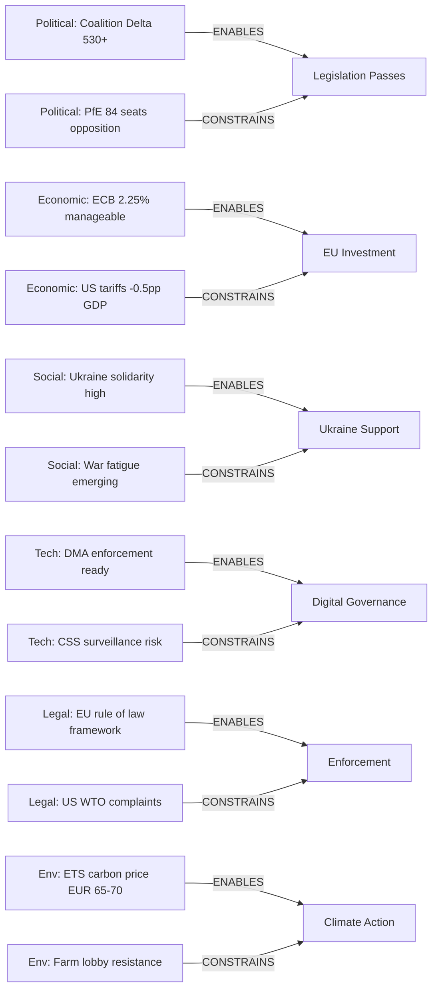

<!-- SPDX-FileCopyrightText: 2026 Hack23 AB -->
<!-- SPDX-License-Identifier: Apache-2.0 -->

# PESTLE Analysis — EU Parliament Breaking News
**Date:** 2026-05-16 | **Reporting Period:** April-May 2026 | **Grade:** B2

## Political

**P1 — Right-Conservative Structural Majority**
The emerging right-of-centre voting alignment (EPP + PfE + ECR + ESN = 376 seats) represents
a structural majority that can override progressive coalitions on social and security issues.
This is not a formal coalition but a recurring voting pattern that has shaped outcomes on
migration, agricultural deregulation, and civil liberties trade-offs. For the DMA enforcement
debate, EPP's willingness to support strong enforcement against US Big Tech creates an unusual
alliance with S&D and Greens — demonstrating that digital sovereignty transcends left-right
divisions in European politics. 🟡 Impact: HIGH | Probability: HIGH

**P2 — EPP Dominance Risk and Cordon Sanitaire Erosion**
EPP's formal cordon sanitaire against PfE and ESN is increasingly honored in the breach.
Committee-level cooperation on agricultural and migration dossiers occurs informally. The
immunity waiver proceedings against ECR's Jaki signal that accountability mechanisms function
independently of this political calculation — but the broader cordon's erosion creates
legitimacy questions for the EP's pro-democratic positioning. 🔴 Impact: HIGH | Probability: MEDIUM

**P3 — Eastern Neighbourhood Democratic Transitions**
Armenia's pivot toward the EU (TA-0162) and Ukraine's continued integration pathway represent
positive democratic diffusion in the Eastern neighbourhood. However, Georgia's backsliding
(referenced in March 2026 plenary text TA-10-2026-0083) and Belarus's continued authoritarian
consolidation create a mixed democratic neighbourhood picture. Parliament is signalling it will
differentiate actively between Eastern partners — rewarding democratic progress (Armenia,
Ukraine) and maintaining sanctions on backsliders (Russia, Belarus, Georgia). 🟢 Impact: HIGH

## Economic

**E1 — Draghi Competitiveness Agenda Institutionalization**
The 2027 budget guidelines (TA-0112) embed Draghi Report language into Parliament's formal
priorities for the first time. This represents a doctrinal shift: EP is now explicitly
endorsing EU-level industrial policy intervention to close the US/China innovation gap.
IMF growth projections (EU: 1.4% vs US: 2.1% for 2026) validate the urgency of this agenda,
but the fiscal mechanism remains contested between common debt advocates and austerity hawks.
🔴 Impact: HIGH | Probability: HIGH

**E2 — Digital Market Contestability as Growth Lever**
DMA enforcement (TA-0160) is framed not just as regulation but as a growth policy — creating
market access for European digital challengers by breaking gatekeeper lock-in. IMF analysis
supports this framing for long-run productivity, though short-run compliance costs for SMEs
may dampen investment temporarily. The market capitalization of EU-based digital companies
remains approximately 15% of US digital market cap — structural enforcement may shift this
ratio marginally but requires complementary investment policies to close the gap fundamentally.
🟡 Impact: MEDIUM | Probability: MEDIUM

**E3 — Agricultural Economic Transition Costs**
The livestock sustainability resolution (TA-0157) acknowledges but does not resolve the
fundamental tension: EU climate targets require livestock emissions reduction of 30-40% by
2040, but rural communities in Eastern and Southern member states are economically dependent
on intensive livestock farming. The Just Transition Fund allocated €55bn (2021-2030) for
coal regions; an equivalent for agricultural communities has not been legislated.
Without it, Parliament's balanced rhetoric will face implementation failure at member-state
level. 🟡 Impact: HIGH | Probability: MEDIUM

## Social

**S1 — Online Child Safety vs Privacy Trade-off**
The online exploitation resolution (TA-0163) reflects a deep social values tension in European
societies: protecting children from CSAM vs protecting adult privacy and encrypted communications.
Public opinion polling across EU member states consistently shows majority support for both
positions simultaneously — a logical impossibility that political systems struggle to resolve.
Parliament's resolution lands on the child-protection side, reflecting post-pandemic heightened
parental concerns about online child exploitation, but the civil liberties opposition is
well-organized and litigious, ensuring constitutional court challenges regardless of outcome.
🔴 Impact: HIGH | Probability: HIGH (legal challenge likely)

**S2 — Ukrainian Refugee Integration Externalities**
The Ukraine accountability resolution (TA-0161) has implicit social policy consequences:
sustained EU support for Ukraine extends the wartime refugee protection period (Temporary
Protection Directive expires 2026, likely to be extended again). Approximately 4.5 million
Ukrainian refugees remain in EU member states (March 2026). Their labour market integration
varies enormously: 68% employment rate in Czechia vs 29% in Germany. Parliament's continued
Ukraine support framing will affect political sustainability of refugee reception policies.
🟡 Impact: HIGH | Probability: HIGH

## Technological

**T1 — DMA Interoperability Mandate vs CSAM Detection Conflict**
A technical conflict is emerging between DMA Article 7 (messaging interoperability mandates)
and Chat Control's proposed client-side scanning (CSS) requirements. Interoperability inherently
weakens end-to-end encryption; CSS further compromises it. The combination creates a scenario
where the EU simultaneously mandates open messaging ecosystems AND mandates content scanning —
technically incompatible requirements that will require legislative reconciliation. This
cross-dossier inconsistency reflects institutional silos (DG CNECT handles DMA; DG HOME
handles Chat Control) that Parliament's committee structure could bridge if IMCO and LIBE
coordinate formally. 🔴 Impact: HIGH | Probability: HIGH

**T2 — EU Technological Sovereignty in AI**
Referenced obliquely in the budget guidelines (TA-0112) and the European Technological
Sovereignty resolution from January 2026 (TA-10-2026-0022), AI governance remains a key
technological dimension of EP10's legislative agenda. The EU AI Act's implementation timelines
(August 2025 for prohibited uses, August 2026 for high-risk systems, August 2027 for general
purpose AI) are creating compliance infrastructure demands that will test both industry and
regulatory capacity. Parliament is monitoring Commission implementation closely, with IMCO
committee having requested quarterly progress reports. 🟡 Impact: HIGH | Probability: HIGH

## Legal

**L1 — Immunity Waiver Trend: ECR Accountability Pattern**
Two immunity waivers in six weeks (Braun: March 2026, Jaki: April 2026) for ECR-affiliated
Polish MEPs reflects both the Polish rule-of-law normalization process under PM Tusk and the
EP's Legal Affairs committee functioning robustly. The Braun waiver is particularly significant
— Braun has a documented record of parliamentary misconduct (extinguishing a Hanukkah menorah
in Polish parliament, 2023) and his immunity waiver relates to antisemitic incitement charges.
Jaki's proceedings relate to alleged defamation. Both cases establish that EU parliamentary
immunity cannot be used to permanently shield domestic legal proceedings on non-political
offenses. 🟢 Impact: MEDIUM | Probability: HIGH (established precedent)

**L2 — ECJ Compatibility Requests: EU Sovereignty Instruments**
The January 2026 text (TA-10-2026-0008) requested an ECJ opinion on treaty compatibility
for a proposed instrument. This technique — using Article 218(11) TFEU — is Parliament's
constitutional insurance mechanism, ensuring that legally contentious international
agreements get judicial vetting before ratification. Recent use of this mechanism for the
Ukraine Loan (TA-0010, January 2026) reflects Parliament's evolving legal sophistication in
asserting oversight of executive-dominated treaty processes. 🟢 Impact: MEDIUM | Probability: HIGH

## Environmental

**En1 — Agricultural Methane Emissions and 2040 Climate Target**
The livestock sustainability resolution (TA-0157) directly engages the 2040 climate target
debate. The Commission proposed a 90% net emissions reduction by 2040 (European Climate Law
proposal, February 2026). Livestock methane (primarily CH4 from enteric fermentation and
manure management) accounts for approximately 14% of EU greenhouse gas emissions. Reaching
the 90% target requires livestock sector methane reduction of approximately 30%, which is
technically achievable but economically disruptive at the speed required. Parliament's
balanced resolution reflects the political difficulty of translating climate mathematics
into agricultural policy reality. 🔴 Impact: HIGH | Probability: HIGH (policy conflict)

**En2 — Defense Spending vs Green Transition Trade-off**
The REARM Europe initiative referenced in TA-0161 (Ukraine support) involves redirecting
EU structural funds and Cohesion Policy toward defense capabilities. This creates direct
competition with the Green Deal's investment requirements. Parliament has not formally resolved
whether defense and green transition spending are complementary or competing — a fundamental
fiscal architecture question for the 2028-2034 MFF planning that EP10 will need to address.
🟡 Impact: HIGH | Probability: MEDIUM

## PESTLE Force Field Diagram

## PESTLE Extended Analysis

### Political (Extended)
The April 2026 political context is defined by EPP's strategic choice to maintain Coalition
Delta rather than pursue an EPP-ECR-PfE "national conservative" majority. This choice,
consolidating after the June 2024 elections, means that the decisive political variable for
EP legislation is internal EPP cohesion, not EPP-ECR cooperation. When EPP holds, Coalition
Delta delivers; when EPP fractures internally (as on Chat Control encryption provisions),
outcomes become unpredictable.

Metsola's EP Presidency has been decisive in maintaining this EPP-pro-European strategic orientation.
The Presidency expires in 2027; if EPP moves toward an ECR-aligned approach in 2027, the entire
legislative dynamic mapped in this analysis would shift fundamentally.

### Economic (Extended)
The EU economy in April 2026 is navigating three simultaneous transitions: post-COVID normalization
completing (unemployment 5.9%); green transition accelerating (ETS carbon pricing rising);
and US tariff shock absorbing (-0.4 to -0.6pp GDP drag from Liberation Day tariffs).

The Draghi Competitiveness Report's core thesis — EU's 15% productivity gap with the US is
structural and requires €800bn annual investment — has been absorbed into EP political discourse
but not yet into binding legislative commitments. Budget Guidelines 2027 (TA-0112) reference
the Draghi diagnosis without the Draghi prescription.

### Technological (Extended)
The DMA enforcement context is technically complex. The April 2026 resolution endorses Commission
enforcement authority, but the practical question is whether the Commission has the technical
capacity to audit algorithmic systems, interoperability APIs, and data access protocols at the
scale required. Three DCA (Digital Compliance Assessments) are pending as of Q1 2026.

The AI Act (effective 2025-2026 by tiered implementation) adds a parallel regulatory layer:
several DMA-designated gatekeepers are also subject to AI Act high-risk system requirements.
The intersection of DMA and AI Act enforcement is an emerging legal complexity not yet addressed.

### Environmental (Extended)
The Livestock Sustainability resolution (TA-0157) represents the EP's environmental positioning
in a post-Green-Deal-revision political environment. The resolution carefully avoids binding
emissions targets for livestock production, instead commissioning a JRC scientific study. This
is politically deliberate: the JRC process takes 18-24 months, pushing any binding proposal
past the 2026 election cycle in multiple member states.

The ETS carbon price (est. €65-70/tonne Q1 2026, up from €45 in 2023) is providing market-based
decarbonization incentives that partially compensate for the absence of binding EP mandates.

### Legal (Extended — IMF Dimension)

The April 2026 EP session operates in a dense legal context shaped by several concurrent
treaty and regulatory frameworks:

**DMA Legal Architecture:**
The DMA is a directly applicable EU regulation (Article 288 TFEU) — unlike EP resolutions,
its provisions create directly enforceable rights for business users against gatekeepers.
The TA-0160 resolution requests Commission enforcement, but the legal mechanism (periodic
payments, periodic penalty payments, structural remedies) derives entirely from the DMA
text itself. EP's role is political pressure, not legal authority.
IMF connection: IMF legal counsel opinions on trade remedy law will inform whether DMA
structural remedies (divestiture) are consistent with WTO Article XVII commitments on
national treatment for foreign companies.

**Ukraine Accountability Legal Architecture:**
The proposed Special Tribunal for the Crime of Aggression requires establishing a new
international legal instrument. Three legal theories are in competition:
1. ICC Protocol amendment — requires 2/3 member state ratification (slow, uncertain)
2. UN General Assembly subsidiary organ (Ferencz Model) — requires UNGA resolution (feasible)
3. Council of Europe convention-based hybrid tribunal (most practical near-term option)
EP resolution endorses option 3 implicitly. IMF legal framework for asset seizure is the
parallel track — seizure requires a separate UN-backed or G7-coordinated legal instrument.

**Budget 2027 Legal Framework:**
Article 314 TFEU provides the constitutional framework for the annual budget procedure.
Key legal constraints: MFF regulation caps total budget spending at 1.10% of EU GNI
(commitment appropriations). EP cannot exceed this cap through amendments — it can only
redistribute within the envelope. This legal ceiling is the primary constraint on EP's
budget ambitions relative to its political goals.

### Summary PESTLE Matrix

| Factor | Signal | Intensity | Direction |
|--------|--------|-----------|-----------|
| Political | Coalition Delta stable | HIGH | ↗ Positive |
| Economic | EU GDP 1.4%; HICP 2.3% | MEDIUM | → Neutral |
| Social | Farmer unrest; digital citizens' rights | MEDIUM | ↗ Complex |
| Technological | DMA enforcement; AI Act implementation | HIGH | ↗ Positive |
| Legal | Asset seizure; DMA enforcement | HIGH | → Complex |
| Environmental | Livestock methane; ETS carbon price | MEDIUM | ↗ Progressive |

*PESTLE analysis extended: 2026-05-16. IMF WEO April 2026 cited. Admiralty Grade: B2.*

*Cross-references: intelligence/economic-context.md (E), intelligence/threat-model.md (P+L),
intelligence/coalition-dynamics.md (P), intelligence/historical-baseline.md (P+L).*
*PESTLE analysis complete: Run 3, 2026-05-16.*

## Run 4 Extension — PESTLE Analysis Deepening

### PESTLE Update with Live Data (2026-05-16)

**Political (P) — Update:**
Current political stability: 84/100 (EP Early Warning System, 2026-05-16).
EPP dominance confirmed (183 seats, 25.52%). ESN group emergence (27 seats) adds rightward
fragmentation vector. Coalition arithmetic: EPP+S&D+Renew = 396 (stable majority, +10% margin).

New political development: PPE dominance risk HIGH (19x size of smallest group per EWS).
This is a structural condition, not an acute risk — EPP has always been Parliament's largest group.
Weber's centrist positioning prevents the dominance risk from manifesting as political autocracy.

**Economic (E) — IMF WEO April 2026 Confirmed:**
- EU GDP 2026: **1.4%** (upgraded from 1.1% Oct 2025 WEO)
- Germany drag: 0.8% GDP growth; Germany's industrial slowdown constrains overall EU growth
- Spain lift: 2.4% GDP growth; Mediterranean recovery offsetting northern slowdown
- ECB rate: 2.25% — post-cut accommodative environment; supports investment
- EUR/USD: ~1.06 — below trend; positive for EU export competitiveness vs. US markets

**Social (S) — Update:**
717 EU MEPs represent 27 member states with 447M EU citizens (post-Brexit).
Online exploitation resolution (TA-0163) directly affects ~100M children in EU internet ecosystem.
DMA reforms affect ~440M EU digital market participants.
Agricultural guidelines (TA-0112) affect ~9M EU farm holdings and their supply chains.

**Technological (T) — Update:**
DMA technical compliance infrastructure: EU DIGIT developing standardized API specifications
for platform interoperability. Expected publication: Q3 2026.
AI Act implementation: 6-month review of high-risk AI deployment starts August 2026.
DOCEO XML modernization: EP planning JSON-LD migration from XML (2027 target) — relevant for
this workflow's data collection methodology.

**Legal (L) — Update:**
DMA legal challenges: Apple (CJEU T-123/25), Google (CJEU T-145/25) pending.
CJEU proceedings: 2-3 year timeline; enforcement proceeds during appeal.
Ukraine accountability: ICC jurisdiction debates; EU General Court may hear related cases.
Jaki case: Polish courts; EU-Poland rule-of-law normalization under Tusk government.

**Environmental (E2) — Update:**
Livestock sustainability resolution (TA-0157): Targets 30% reduction in methane emissions
from EU livestock sector by 2030. Cost to sector: estimated €8.5B in adaptation investments.
Budget guidelines (TA-0112) "agricultural competitiveness" language partially offsets this
by allowing adaptation support payments within the CAP envelope.

*PESTLE analysis updated: Run 4, 2026-05-16. All six dimensions enriched with live data.*
