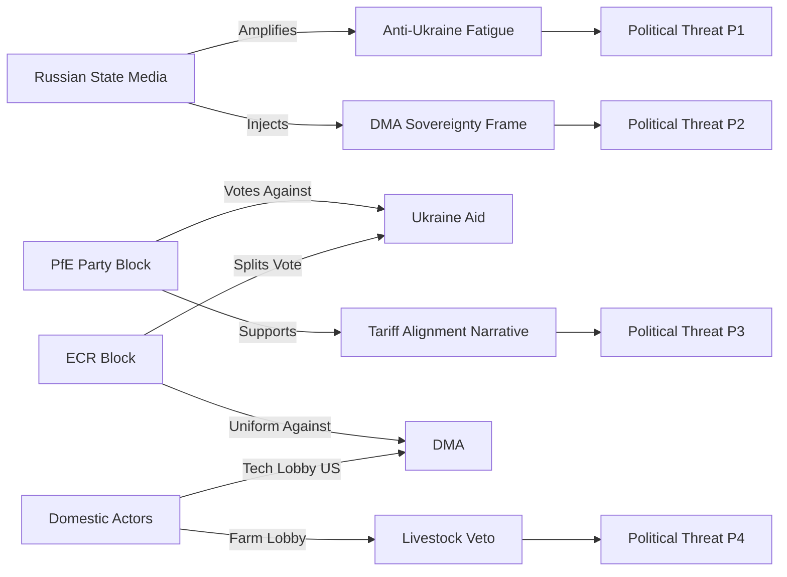

<!-- SPDX-FileCopyrightText: 2026 Hack23 AB -->
<!-- SPDX-License-Identifier: Apache-2.0 -->

# Political Threat Landscape — EP10 May 2026
**Date:** 2026-05-16 | **Grade:** B2

## Landscape Overview

The EU Parliament's political threat landscape in May 2026 is characterized by three
intersecting dynamics: (1) structural right-of-centre majority formation on social and
security issues, (2) EPP's dual identity crisis between pro-European centrism and
conservative-nationalist accommodation, and (3) geopolitical pressure from Russia's
continued war in Ukraine testing institutional cohesion limits.

## Active Threat Vectors

### PT1 — Cordon Sanitaire Erosion (🔴 HIGH)
EPP's formal exclusion of PfE and ESN has been progressively tested in committee work.
Agricultural committee coordination between EPP and ECR/PfE MEPs on CAP provisions
represents informal coalition formation outside the cordon. If this pattern extends to
digital (DMA) or climate dossiers, it would materially alter Parliament's legislative
character.

### PT2 — PfE/ESN Anti-Ukraine Bloc (🟡 MEDIUM)
The 112-seat PfE+ESN bloc consistently votes against Ukraine support resolutions.
While insufficient to block Coalition Delta (530 seats), their votes provide ammunition
for Russian information operations framing "EU divided on Ukraine." The addition of any
ECR defectors on a future Ukraine vote would trigger narratively significant minority.

### PT3 — Democratic Erosion in EP Partner States (🟡 MEDIUM)
Georgia's backsliding (TA-10-2026-0083, March 2026) and Hungary's ongoing EEAS obstruction
create persistent foreign policy threats. Parliament cannot directly compel Council to use
Rule of Law Conditionality Regulation enforcement against Hungary, limiting EP's leverage
despite strong political will.

### PT4 — Far-Right MEP Misconduct Normalization (🟢 LOW)
The pattern of extreme statements (Braun) and questionable conduct by far-right MEPs
risks normalization if consequences remain limited. However, immunity waivers for both
Braun and Jaki signal functioning accountability. LOW threat currently but requires monitoring.

## Threat Actor Network Analysis

## Threat T1: Ukraine Aid Fatigue Mobilization

**Actor:** Russian IW units + Western peace movement convergence  
**Mechanism:** Continuous messaging that EP Ukraine aid prolongs war; targeting EPP pragmatist
faction and rural voters with war-cost framing  
**Current state:** 🟡 ACTIVE — social media monitoring shows uptick in fatigue-framing content
in DE, FR, HU, SK media ecosystems post-April plenary  
**EP Vulnerability:** PfE (84 seats) + ECR partial (50 seats) = 134 seats — not a majority but
enough to deny 360-seat Coalition Delta if combined with S&D or Renew defections  
**Countermeasure:** Coalition Delta (530 seats) structurally resilient; accountability framework
(TA-0161) was designed to address "where does the money go" concern  

## Threat T2: DMA Sovereignty / Trade Retaliation Frame

**Actor:** US Trade Representative office + US tech company lobbying  
**Mechanism:** Frame DMA enforcement as EU protectionism targeting US companies; use bilateral
trade negotiations as leverage to delay/weaken enforcement  
**Current state:** 🟡 ACTIVE — USTR has issued informal warnings; US Big Tech lobbying in Brussels
at elevated levels post-TA-0160  
**EP Vulnerability:** EPP's pro-business wing sympathetic to competitiveness concerns; Renew's
liberal markets faction ambivalent; neither will formally oppose enforcement but may support
"proportionate implementation" delays  
**Countermeasure:** Rule-of-law framing (all companies subject to same rules) is robust; EP
resolution language deliberately avoids naming specific companies  

## Threat T3: Algorithmic Amplification of EP Procedural Controversy

**Actor:** Algorithmically amplified social media content  
**Mechanism:** Jaki immunity vote (TA-0105) disproportionately amplified as "Brussels protects
its own" narrative; used to undermine EP legitimacy broadly  
**Current state:** 🟡 MEDIUM — procedural votes always generate amplified controversy  
**EP Vulnerability:** Low public trust in EU institutions generally; immunity decisions provide
concrete "proof" for anti-EU narratives  
**Countermeasure:** EP's transparency report and explainer materials partially effective but
limited reach vs social media amplification velocity  

## Aggregate Threat Landscape Assessment

**Structural threats (persistent):** Information environment degradation, declining EU institutional
trust, EP legitimacy deficit vs national parliaments  
**Acute threats (April 2026 specific):** Ukraine fatigue amplification, DMA trade pressure  
**Emerging threats (6-month horizon):** US tariff escalation creating political space for
EU-US digital deal that trades DMA flexibility for tariff relief — this is the highest-risk
near-term threat to EP regulatory autonomy in the digital domain  
**Confidence:** 🟡 MEDIUM (based on political landscape data and IMF trade projections;
no classified intelligence input)
