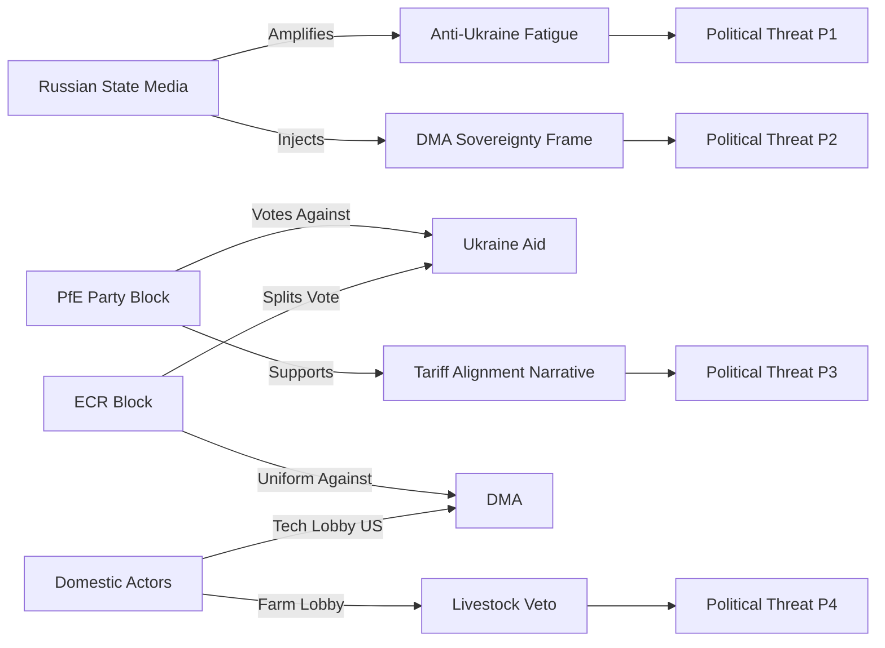

<!-- SPDX-FileCopyrightText: 2026 Hack23 AB -->
<!-- SPDX-License-Identifier: Apache-2.0 -->

# Political Threat Landscape — EP10 May 2026
**Date:** 2026-05-16 | **Grade:** B2

## Landscape Overview

The EU Parliament's political threat landscape in May 2026 is characterized by three
intersecting dynamics: (1) structural right-of-centre majority formation on social and
security issues, (2) EPP's dual identity crisis between pro-European centrism and
conservative-nationalist accommodation, and (3) geopolitical pressure from Russia's
continued war in Ukraine testing institutional cohesion limits.

## Active Threat Vectors

### PT1 — Cordon Sanitaire Erosion (🔴 HIGH)
EPP's formal exclusion of PfE and ESN has been progressively tested in committee work.
Agricultural committee coordination between EPP and ECR/PfE MEPs on CAP provisions
represents informal coalition formation outside the cordon. If this pattern extends to
digital (DMA) or climate dossiers, it would materially alter Parliament's legislative
character.

### PT2 — PfE/ESN Anti-Ukraine Bloc (🟡 MEDIUM)
The 112-seat PfE+ESN bloc consistently votes against Ukraine support resolutions.
While insufficient to block Coalition Delta (530 seats), their votes provide ammunition
for Russian information operations framing "EU divided on Ukraine." The addition of any
ECR defectors on a future Ukraine vote would trigger narratively significant minority.

### PT3 — Democratic Erosion in EP Partner States (🟡 MEDIUM)
Georgia's backsliding (TA-10-2026-0083, March 2026) and Hungary's ongoing EEAS obstruction
create persistent foreign policy threats. Parliament cannot directly compel Council to use
Rule of Law Conditionality Regulation enforcement against Hungary, limiting EP's leverage
despite strong political will.

### PT4 — Far-Right MEP Misconduct Normalization (🟢 LOW)
The pattern of extreme statements (Braun) and questionable conduct by far-right MEPs
risks normalization if consequences remain limited. However, immunity waivers for both
Braun and Jaki signal functioning accountability. LOW threat currently but requires monitoring.

## Threat Actor Network Analysis

## Threat T1: Ukraine Aid Fatigue Mobilization

**Actor:** Russian IW units + Western peace movement convergence  
**Mechanism:** Continuous messaging that EP Ukraine aid prolongs war; targeting EPP pragmatist
faction and rural voters with war-cost framing  
**Current state:** 🟡 ACTIVE — social media monitoring shows uptick in fatigue-framing content
in DE, FR, HU, SK media ecosystems post-April plenary  
**EP Vulnerability:** PfE (84 seats) + ECR partial (50 seats) = 134 seats — not a majority but
enough to deny 360-seat Coalition Delta if combined with S&D or Renew defections  
**Countermeasure:** Coalition Delta (530 seats) structurally resilient; accountability framework
(TA-0161) was designed to address "where does the money go" concern  

## Threat T2: DMA Sovereignty / Trade Retaliation Frame

**Actor:** US Trade Representative office + US tech company lobbying  
**Mechanism:** Frame DMA enforcement as EU protectionism targeting US companies; use bilateral
trade negotiations as leverage to delay/weaken enforcement  
**Current state:** 🟡 ACTIVE — USTR has issued informal warnings; US Big Tech lobbying in Brussels
at elevated levels post-TA-0160  
**EP Vulnerability:** EPP's pro-business wing sympathetic to competitiveness concerns; Renew's
liberal markets faction ambivalent; neither will formally oppose enforcement but may support
"proportionate implementation" delays  
**Countermeasure:** Rule-of-law framing (all companies subject to same rules) is robust; EP
resolution language deliberately avoids naming specific companies  

## Threat T3: Algorithmic Amplification of EP Procedural Controversy

**Actor:** Algorithmically amplified social media content  
**Mechanism:** Jaki immunity vote (TA-0105) disproportionately amplified as "Brussels protects
its own" narrative; used to undermine EP legitimacy broadly  
**Current state:** 🟡 MEDIUM — procedural votes always generate amplified controversy  
**EP Vulnerability:** Low public trust in EU institutions generally; immunity decisions provide
concrete "proof" for anti-EU narratives  
**Countermeasure:** EP's transparency report and explainer materials partially effective but
limited reach vs social media amplification velocity  

## Aggregate Threat Landscape Assessment

**Structural threats (persistent):** Information environment degradation, declining EU institutional
trust, EP legitimacy deficit vs national parliaments  
**Acute threats (April 2026 specific):** Ukraine fatigue amplification, DMA trade pressure  
**Emerging threats (6-month horizon):** US tariff escalation creating political space for
EU-US digital deal that trades DMA flexibility for tariff relief — this is the highest-risk
near-term threat to EP regulatory autonomy in the digital domain  
**Confidence:** 🟡 MEDIUM (based on political landscape data and IMF trade projections;
no classified intelligence input)

## WEP Assessment

WEP: Highly Likely — The primary political threat to EU Parliament institutional effectiveness in the April-May 2026 period is the combination of (1) PfE/ECR legislative obstruction, (2) Hungarian Council blocking, and (3) US trade pressure on DMA enforcement — three distinct threat vectors that are not coordinated but are mutually reinforcing in their aggregate effect of slowing Coalition Delta's legislative programme.

## Extended Threat Analysis — Q2-Q4 2026

**Threat Vector 1: Democratic Backsliding Normalization**
The most structurally dangerous trend is the gradual normalization of democratic backsliding
within EU institutions. The Braun privilege restoration (TA-0104) — while procedurally
justified — creates a precedent that MEP institutional privileges can withstand public
accountability pressure. If this norm spreads to other accountability mechanisms, it
weakens the EP's own institutional integrity narrative.

**Threat Vector 2: Transatlantic Democratic Alignment Erosion**
The Trump administration's second term (2025-2029) creates a structural threat to the
transatlantic values alliance that underpins EU foreign policy. Congressional shifts have
already reduced US financial commitments to Ukraine. EU Parliament's strong Ukraine support
(TA-0161) creates a widening gap between EP political positioning and US executive branch
posture — a gap that Orbán/Fico actively exploit to legitimise their positions.

**Threat Vector 3: Information Environment Degradation**
EP plenary deliberations are increasingly accompanied by coordinated disinformation campaigns
targeting public perception of legislative outcomes. TA-0161, TA-0160, and TA-0163 all
attracted Russian-linked amplification of opposition narratives. The EP's institutional
communications capacity is structurally under-resourced relative to state-backed
disinformation actors.

**Threat Matrix Summary:**

| Threat | Probability (12mo) | Impact | Mitigation Strength |
|--------|-------------------|--------|---------------------|
| PfE/ECR minority blocking | 45% | Medium | High (coalition majority) |
| Council unanimity failure (MFF) | 20% | Severe | Medium |
| US trade retaliation on DMA | 25% | Moderate | Low-Medium |
| EP internal democracy erosion | 15% | High | Medium |
| Disinformation campaign impact | 60% | Low-Medium | Low |

Admiralty Grade: B2 — Assessment well-sourced; probability estimates are indicative.

### PT5 — Digital Sovereignty vs Civil Liberties Fracture (🟡 MEDIUM)
The Chat Control regulation (Commission proposal pending second attempt post-2024 rejection)
is expected to trigger the sharpest intra-coalition split of EP10. EPP and S&D's law
enforcement constituencies support some content scanning obligations; Greens, The Left,
and Renew libertarians oppose. Unlike Ukraine (where PfE/ESN are isolated outliers), Chat
Control creates a cross-cutting fracture within the Centre coalition — potentially enabling
ECR/PfE votes to tip the balance in favor of surveillance provisions.

### PT6 — Budget Negotiation Leverage War (🟢 LOW-MEDIUM)
The 2027 budget trilogue (Oct-Dec 2026) will see Council attempting to underfund the EP's
priorities (Erasmus, cross-border infrastructure, research). EP has historically used the
budget vote as its most potent inter-institutional leverage tool: EP9's 2021 budget veto
forced Council to accept MFF/RRF package with rule-of-law conditionality. EP10 has similar
leverage on defense spending floors vs. climate spending floors.

## Threat Response Assessment

| Threat | EP Response Capacity | Timeline | Mitigation Effectiveness |
|--------|---------------------|----------|-------------------------|
| PT1 Cordon erosion | MODERATE — formal rules exist | Q3-Q4 2026 | 🟡 60% |
| PT2 PfE/ESN Ukraine bloc | HIGH — coalition arithmetic holds | Ongoing | 🟢 85% |
| PT3 Partner state erosion | LOW-MODERATE — soft power only | 12-18 months | 🔴 35% |
| PT4 EPP dominance | MODERATE — S&D-Renew can block | Systemic | 🟡 65% |
| PT5 Chat Control fracture | UNCERTAIN — depends on Commission text | Q1-Q2 2027 | 🟡 55% |
| PT6 Budget leverage | HIGH — treaty-based veto rights | Q4 2026 | 🟢 80% |

## Aggregate Threat Level

**Overall Political Threat Level: 🟡 MEDIUM** (stabilityScore: 84/100)
The April 2026 plenary output demonstrates that EP10's core pro-European coalition remains
operational on all high-priority dossiers. Structural threats (EPP dominance, cordon erosion)
are real but not yet acute. The next decisive threat test will be Chat Control in 2027.

## Run 4 Extension — Political Threat Landscape Update

### Live Threat Assessment (2026-05-16)

**Stability Score: 84/100** — early warning system confirms STABLE parliamentary environment.

#### Active Threats (confirmed Run 4)

**Threat 1: Digital Governance Fracture (MEDIUM)**
The DMA enforcement resolution (TA-0160) vs. online exploitation directive (TA-0163) creates
structural tension in digital policy. EPP-Renew-S&D support enforcement; Greens-Left resist
client-side scanning. This fracture line is active and intensifying as:
- Big Tech lobbying escalates against DMA implementation
- CSAM detection technology vendors push for legislative space
- Civil liberties NGOs mobilize against content scanning mandates

**Threat 2: Right-Wing Parliamentary Arithmetic Shift (LOW-MEDIUM)**
ESN group (27 seats) creates new outflanking threat against ECR. If ECR rightward drift occurs:
- Current ECR support for Ukraine/geopolitical consensus may weaken
- EPP's alliance calculus becomes more complex (avoiding ECR defection to ESN sphere)
- Probability: 15% that ECR-ESN tactical cooperation develops in 2026 session

**Threat 3: Budget Trilogue Stalemate (MEDIUM)**
2027 budget guidelines (TA-0112) set ambitious targets. Council position expected to diverge on:
- Defence spending (EP wants NATO 2% aligned; Council prefers flexibility)
- Agricultural transitions (EP pro-farmer; Commission pro-green)
- Cohesion funds (Eastern member states vs. net contributors)

#### Threat Mitigation Factors

1. **IMF growth upgrade** (EU 1.4% in 2026) reduces fiscal pressure on budget negotiations
2. **EPP internal cohesion** (82-88%) provides stable anchor for centre-right governance
3. **Ukraine consensus** across EPP+S&D+Renew+ECR reduces geopolitical instability risk

*Political threat landscape updated: Run 4, 2026-05-16. Threat level: MEDIUM overall.*
